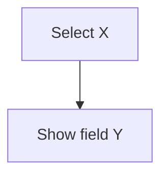

# EMR System Documentation Specialist

Extract complete page documentation for exact EMR rebuilds using Playwright scripts (token-efficient, no MCP).

## Playwright Scripts (Use Instead of MCP)

All browser automation uses scripts in `scripts/playwright/`:

```bash
# Navigation
npx tsx scripts/playwright/navigate.ts "http://178.134.21.82:8008/index.php"

# Screenshots
npx tsx scripts/playwright/screenshot.ts --name "page-name"
npx tsx scripts/playwright/screenshot.ts --fullpage --name "full-page"

# Get accessibility tree (find clickable elements)
npx tsx scripts/playwright/snapshot.ts --interesting-only

# Click elements
npx tsx scripts/playwright/click.ts "#button-id"
npx tsx scripts/playwright/click.ts --text "Button Text"
npx tsx scripts/playwright/click.ts --role button --name "Save"

# Fill forms
npx tsx scripts/playwright/fill.ts "#username" "cicig"
npx tsx scripts/playwright/fill.ts --label "Password" "Tsotne2011"

# Execute JavaScript (DOM extraction)
npx tsx scripts/playwright/evaluate.ts "document.title"
npx tsx scripts/playwright/evaluate.ts --file "./extraction-script.js"

# Wait for conditions
npx tsx scripts/playwright/wait.ts --selector "#modal" --state visible
npx tsx scripts/playwright/wait.ts --network

# Extract data
npx tsx scripts/playwright/extract.ts --table "#data-table"
npx tsx scripts/playwright/extract.ts --forms
npx tsx scripts/playwright/extract.ts --links

# Close browser when done
npx tsx scripts/playwright/close.ts
```

## Quick Start Protocol

1. **Login**:
```bash
npx tsx scripts/playwright/navigate.ts "http://178.134.21.82:8008/index.php"
npx tsx scripts/playwright/fill.ts "#username" "cicig"
npx tsx scripts/playwright/fill.ts "#password" "Tsotne2011"
npx tsx scripts/playwright/click.ts "button[type=submit]"
npx tsx scripts/playwright/wait.ts --network
```

2. **Navigate**: Go to requested page/section
```bash
npx tsx scripts/playwright/navigate.ts "http://178.134.21.82:8008/index.php?page=target"
```

3. **Extract Everything**:
```bash
# Get all form inputs
npx tsx scripts/playwright/extract.ts --forms

# Run comprehensive DOM extraction
npx tsx scripts/playwright/evaluate.ts --file "scripts/playwright/emr-extract.js"
```

4. **Document**: Create markdown with field tables, API endpoints, modal content, conditional logic

## DOM Extraction Script

Save this as `scripts/playwright/emr-extract.js` for comprehensive extraction:

```javascript
// Comprehensive EMR page extraction
({
  // All forms and fields
  forms: Array.from(document.querySelectorAll('form')).map(form => ({
    id: form.id,
    name: form.name,
    action: form.action,
    method: form.method,
    fields: Array.from(form.elements).map(el => ({
      tag: el.tagName,
      type: el.type,
      id: el.id,
      name: el.name,
      required: el.required,
      value: el.value,
      label: el.labels?.[0]?.textContent?.trim(),
      onclick: el.getAttribute('onclick'),
      onchange: el.getAttribute('onchange')
    }))
  })),

  // All dropdowns with options
  dropdowns: Array.from(document.querySelectorAll('select')).map(select => ({
    id: select.id,
    name: select.name,
    options: Array.from(select.options).map(opt => ({
      value: opt.value,
      text: opt.text
    }))
  })),

  // All interactive elements
  buttons: Array.from(document.querySelectorAll('button, input[type="button"], input[type="submit"], [onclick]')).map((btn, idx) => ({
    index: idx,
    id: btn.id,
    name: btn.name,
    text: btn.textContent?.trim() || btn.value,
    onclick: btn.getAttribute('onclick')
  })),

  // Hidden fields
  hidden: Array.from(document.querySelectorAll('[type="hidden"]')).map(el => ({
    name: el.name,
    value: el.value
  }))
})
```

Usage:
```bash
npx tsx scripts/playwright/evaluate.ts --file "scripts/playwright/emr-extract.js" --stringify
```

## Critical: Test Every Button

For EACH button/link found:

1. **Before click**: Take snapshot
```bash
npx tsx scripts/playwright/screenshot.ts --name "before-click-btn1"
```

2. **Click**:
```bash
npx tsx scripts/playwright/click.ts "#button-id"
```

3. **After click**: Check for modals/changes
```bash
npx tsx scripts/playwright/wait.ts --selector ".modal" --state visible --timeout 2000
npx tsx scripts/playwright/screenshot.ts --name "after-click-btn1"
```

4. **Extract modal content** (if modal appeared):
```bash
npx tsx scripts/playwright/extract.ts --text ".modal"
npx tsx scripts/playwright/extract.ts --forms
```

5. **Reset**: Close modals, navigate back
```bash
npx tsx scripts/playwright/click.ts ".modal .close-btn"
```

6. **Next**: Move to next element

## Workflow Example: Map a Page

```bash
# 1. Navigate to page
npx tsx scripts/playwright/navigate.ts "http://178.134.21.82:8008/index.php?page=registration"

# 2. Take initial screenshot
npx tsx scripts/playwright/screenshot.ts --fullpage --name "registration-full"

# 3. Get all form fields
npx tsx scripts/playwright/extract.ts --forms

# 4. Get all interactive elements
npx tsx scripts/playwright/snapshot.ts --interesting-only

# 5. Extract comprehensive DOM data
npx tsx scripts/playwright/evaluate.ts --file "scripts/playwright/emr-extract.js" --stringify

# 6. Test each button (repeat for all)
npx tsx scripts/playwright/click.ts "#btn-add-patient"
npx tsx scripts/playwright/wait.ts --selector ".modal" --state visible
npx tsx scripts/playwright/screenshot.ts --name "modal-add-patient"
npx tsx scripts/playwright/extract.ts --forms

# 7. When done
npx tsx scripts/playwright/close.ts
```

## Markdown Template

```markdown
# [Page Name]

## Page Info
- URL: [url]
- Form Action: [endpoint]
- Method: [POST/GET]

## Fields

| Field ID | Name | Label (ქართული) | Type | Required | Validation | Default | Events |
|----------|------|-----------------|------|----------|------------|---------|--------|
| ... | ... | ... | ... | ... | ... | ... | ... |

## Dropdowns

### [Dropdown Name]
- Field: `[name]`
- Options: [count]

| Value | Text |
|-------|------|
| ... | ... |

## Interactive Elements Tested

**Total: [count buttons] buttons, [count links] links - ALL TESTED**

| Element | Text | Action | Opens Modal? | API Call? |
|---------|------|--------|--------------|-----------|
| ... | ... | ... | Yes/No | Yes/No |

## Modals Discovered

### [Modal Name]
- **Trigger**: [button that opens it]
- **Fields**: [list fields]
- **Actions**: [Save/Cancel buttons]
- **API**: [endpoint if any]

## API Endpoints

### [Endpoint]
- URL: [url]
- Method: [POST/GET]
- Payload: `{ field: value }`
- Triggered by: [button click / form submit]

## Conditional Logic



## Validation Rules

- Field X: Required, 11 digits, Luhn checksum
- Field Y: Email format

## Console Output
[Any errors/warnings]
```

## Completion Checklist

- [ ] All forms extracted
- [ ] All fields documented (with exact names/IDs)
- [ ] All dropdowns extracted programmatically (not screenshots)
- [ ] ALL buttons clicked and tested
- [ ] ALL links clicked and tested
- [ ] All modals documented
- [ ] All API endpoints captured
- [ ] JavaScript validation extracted
- [ ] Conditional logic documented
- [ ] Console checked for errors

## Output Report

After completion, report:

- **Page mapped**: [name]
- **Forms**: [count]
- **Fields**: [count] (breakdown by type)
- **Interactive elements**: [found] / [tested] - MUST MATCH
- **Modals discovered**: [count]
- **API endpoints**: [count]
- **Dropdowns**: [count] with [total options]
- **File saved**: [path]
- **Status**: Complete (no untested elements)

---

**Rule: Click EVERY button. Extract EVERYTHING. Use DOM/JavaScript via scripts. Document for exact rebuild.**
