# EHR Section (Patient Card - პაციენტის ისტორიის ბარათი)


## Page Structure

The EHR section consists of several key components:

1. **Patient Information Panel** (Table ID: `UsrInf`) - Read-only patient demographic display
2. **Patient List Filtering** - Filter patients by physician, department, date range
3. **Visit History Table** (ID: `my_regpats`) - List of patient visits with registration details
4. **Department Transfer Form** (ID: `trs_pa2`) - Transfer patient between departments
5. **Discharge/Checkout Information** - Disabled fields for discharge date, diagnosis, outcome
6. **ICD-10 Code Search** - Search and select diagnosis codes
7. **Medical Personnel Information** - Doctor and department details

## Complete Field Documentation

### Patient Information Panel (Table ID: `UsrInf`)

Read-only display of patient demographics:

| Field Label (ქართული) | English Translation | Data Type | Example Value |
|----------------------|-------------------|-----------|---------------|
| პაციენტი | Patient | Text | რევაზ ძიმისტარაშვილი |
| სქესი | Gender | Text | მამრობითი (Male) |
| დაბადების თარიღი | Birth Date | Date | 08-08-1965 |
| ასაკი | Age | Text | 60 წლის (60 years) |
| პირადი ნომერი | Personal ID | Text | 62006014983 |

**HTML Structure**:
```html
<table id="UsrInf" class="pp">
  <tr><td><b>პაციენტი:</b> რევაზ ძიმისტარაშვილი</td></tr>
  <tr><td><b>სქესი:</b> მამრობითი</td></tr>
  <tr><td><b>დაბადების თარიღი:</b> 08-08-1965, <b>ასაკი:</b> 60 წლის</td></tr>
  <tr><td><b>პირადი ნომერი:</b> 62006014983</td></tr>
</table>
```

### Patient List Filtering Form

**Form Structure**: Horizontal filter bar with physician, department, and date range selectors

| Field ID | Label (ქართული) | Type | Options Count | Default | Notes |
|----------|----------------|------|---------------|---------|-------|
| my_nurdr | ექიმი | SELECT | 348 | 0 - ყველა (All) | Physician filter |
| my_ganks | განყოფილება | SELECT | 25 | 0 - ყველა (All) | Department filter |
| my_date1 | თარიღი დან | DATE | N/A | Empty | Start date (jQuery UI datepicker) |
| my_date2 | თარიღი მდე | DATE | N/A | Empty | End date (jQuery UI datepicker) |
| my_rchek | (Checkbox) | CHECKBOX | N/A | Unchecked | Additional filter option |

**Physician Filter (my_nurdr)** - Sample of 348 options:
| Value | Text (ქართული) |
|-------|----------------|
| 0 | ყველა (All) |
| 3 | აბუსერიძე დარეჯან |
| 4 | აბუსერიძე თამარ |
| 5 | აბუსერიძე ნანი |
| 65 | ავალიანი გიორგი |
| ... | (343 more doctors) |

**Department Filter (my_ganks)** - Sample of 25 options:
| Value | Text (ქართული) |
|-------|----------------|
| 0 | ყველა (All) |
| 1 | ადმინისტრაცია |
| 2 | პალატა 1 |
| 3 | ონკოლოგია |
| 4 | ქირურგია |
| 5 | გინეკოლოგია |
| ... | (20 more departments) |

**Date Pickers**:
- Both use jQuery UI datepicker
- Format: DD-MM-YYYY (Georgian locale)
- Class: `hasDatepicker`
- Associated with calendar icon buttons

### Visit History Table (ID: `my_regpats`)

**Table Structure**: Multi-column table displaying patient visit records

**Columns** (extracted from visual layout):
1. **Registration Number** - Visit registration ID
2. **Date** - Visit date
3. **Department** - Department name (განყოფილება)
4. **Physician** - Attending physician (მკურნალი ექიმი)
5. **Diagnosis** - ICD-10 code and description (დიაგნოზი)
6. **Status** - Visit status (active, closed, etc.)

**Sample Row Data** (Patient: რევაზ ძიმისტარაშვილი):
- Multiple visit records visible
- Clickable rows for visit details
- Color-coded status indicators

**Interaction**:
- Double-click row to view visit details
- Rows may be color-coded by status
- Scrollable table for long visit histories

### Department Transfer Form (ID: `trs_pa2`)

**Purpose**: Transfer patient from one department/physician to another

| Field ID | Label (ქართული) | Type | Required | Validation | Default | Notes |
|----------|----------------|------|----------|------------|---------|-------|
| trs_date | თარიღი | DATETIME | Yes | Valid date/time | Current timestamp | jQuery UI datepicker + timepicker |
| trs_dctrtpgr | განყოფილება | SELECT | Yes | Non-zero value | - | Target department (23 options) |
| trs_dctrdoc | ექიმი | SELECT | Yes | Non-zero value | - | Target physician (235 options) |
| trs_save1 | გადაწერა | BUTTON | N/A | N/A | N/A | Submit transfer |

**Department Options (trs_dctrtpgr)** - 23 departments:
| Value | Text (ქართული) |
|-------|----------------|
| 1 | ადმინისტრაცია |
| 2 | პალატა 1 |
| 3 | ონკოლოგია |
| 4 | ქირურგია |
| 5 | გინეკოლოგია |
| 6 | ნეოლოგია-1 |
| 7 | რენგენი |
| 8 | ოპ-1 |
| 9 | ოპ-2 |
| 10 | რ/ტ |
| 11 | ლაბორატორია |
| 12 | ექოგრაფია |
| 13 | კლინიკა |
| 14 | პრეზიდიუმი |
| 15 | მენეჯმენტი |
| 16 | დიალიზი |
| 17 | ურო |
| 18 | გუნდურა |
| 19 | ინტენსივი |
| 20 | სამშობიარო |
| 21 | სასიცოცხლო გადაუდებელი |
| 22 | ლაზერული |

**Physician Options (trs_dctrdoc)** - 235 physicians (first 30 shown):
| Value | Text (ქართული) |
|-------|----------------|
| 3 | აბუსერიძე დარეჯან |
| 4 | აბუსერიძე თამარ |
| 5 | აბუსერიძე ნანი |
| 6 | ავალიშვილი ზურაბი |
| 7 | ალდეიშვილი ნინო |
| 8 | ანდრიაძე მარიამ |
| 9 | ახუნდოვი ეთერი |
| 10 | ბასილია ეთერი |
| 12 | ბეკაურია არჩილ |
| 13 | ბენაშვილი თამარ |
| 14 | ბერიაშვილი გაბრიელ |
| 15 | ბერიშვილი ნატო |
| 18 | ბოლქვაძე ვახტანგ |
| 19 | ბურჯალიანი თეონა |
| 20 | გაბუნია კახაბერი |
| 22 | გაბუნია გიორგი |
| 23 | გაგოშიძე ეთერი |
| 24 | გაგოშიძე გია |
| 25 | გაგოშიძე ეკა |
| 26 | გელოვანი ელენე |
| 27 | გელოვანი გიორგი |
| 28 | გელოვანი ეკა |
| 29 | გივარგიზოვი ალექსანდრე |
| 30 | გოგავა თათია |
| 32 | გოგიჩაშვილი ინგა |
| 33 | გოგლიძე მარინე |
| 34 | გოგოლაძე თამარ |
| 35 | გოზალიშვილი ნუგზარი |
| 36 | გურგენაშვილი ბესიკ |
| 37 | გურგენაშვილი გოჩა |
| 38 | დალაქიშვილი ვაჟა |
| ... | (205 more physicians) |

**Form Validation**:
- Transfer date required (cannot be empty)
- Target department required (value > 0)
- Target physician required (value > 0)
- Physician dropdown likely filtered by selected department (AJAX)

**JavaScript Interaction**:
- Date/time picker initialized with jQuery UI
- Department selection may trigger AJAX to filter physicians
- Submit button (trs_save1) triggers form validation and submission

### Discharge/Checkout Information

**Read-only/Disabled Fields** (observed during extraction):

| Field ID/Name | Label (ქართული) | Type | Status | Notes |
|---------------|----------------|------|--------|-------|
| (discharge_date) | გაცემის თარიღი | DATE | Disabled | Discharge date |
| (final_diagnosis) | საბოლოო დიაგნოზი | TEXT | Disabled | Final diagnosis code |
| (outcome) | შედეგი | SELECT | Disabled | Treatment outcome |

**Note**: These fields are disabled in the EHR view, likely only editable during discharge workflow.

### ICD-10 Code Search

**Purpose**: Search and select diagnosis codes from ICD-10 classification

**Filter Elements**:

| Field ID | Label (ქართული) | Type | Options Count | Default | Notes |
|----------|----------------|------|---------------|---------|-------|
| cdAZ | ასოები | SELECT | 27 | 0 - ყველა (All) | Alphabet filter A-Z |
| (search_input) | ძიება | TEXT | N/A | Empty | Free-text search |
| (search_button) | ძიება | BUTTON | N/A | N/A | Search trigger |

**Alphabet Filter (cdAZ)** - 27 options:
| Value | Text |
|-------|------|
| 0 | ყველა (All) |
| 1 | A |
| 2 | B |
| 3 | C |
| ... | D-Z |
| 27 | Z |

**ICD-10 Table Structure**:
- Multi-column table displaying diagnosis codes
- Columns: Code, Description (Georgian)
- Clickable rows to select diagnosis
- Filtered by alphabet selection and search text

**Example ICD-10 Codes** (visual reference):
- I10 - Essential (primary) hypertension
- E11 - Type 2 diabetes mellitus
- J06 - Acute upper respiratory infections
- (Many more codes displayed)

### Medical Personnel Information

**Physician Details**:
- Name: ექიმი (Doctor name)
- Specialty: სპეციალობა
- Department: განყოფილება
- Contact: (if available)

**Display Format**: Read-only table or list format

## Interactive Elements

### Buttons and Actions

**Total Buttons Extracted**: 71 buttons across the page

**Key Action Buttons**:

| Button ID | Text (ქართული) | Purpose | Location |
|-----------|----------------|---------|----------|
| trs_save1 | გადაწერა | Submit department transfer | Transfer form |
| my_rchek | (Icon/Checkbox) | Toggle filter option | Filter bar |
| (calendar_icons) | 📅 | Open date picker | Date input fields |
| (search_button) | ძიება | Search ICD-10 codes | ICD search section |

**Other Buttons**:
- Multiple action buttons in tables (edit, view, delete icons)
- Navigation buttons for table pagination
- Modal close buttons (×)
- Form reset/clear buttons

### Tables

**Total Tables Extracted**: 12 tables

**Main Tables**:
1. **UsrInf** - Patient information panel
2. **my_regpats** - Visit history table
3. **trs_pa2** - Department transfer form (embedded table layout)
4. **ICD-10 Results** - Diagnosis code search results
5. Various layout tables for form structure

## Dropdowns Summary

### Complete Dropdown Inventory

| Dropdown ID | Purpose | Total Options | Notes |
|-------------|---------|---------------|-------|
| my_nurdr | Physician filter (all doctors) | 348 | Includes "ყველა" (All) |
| my_ganks | Department filter | 25 | Includes "ყველა" (All) |
| trs_dctrtpgr | Target department (transfer) | 23 | No "All" option |
| trs_dctrdoc | Target physician (transfer) | 235 | Filtered by department |
| cdAZ | ICD-10 alphabet filter | 27 | A-Z plus "ყველა" |

**Note**: Physician dropdowns (my_nurdr=348, trs_dctrdoc=235) have different option counts, suggesting different data sources or filtering logic.

## Conditional Logic and Workflows

### Department Transfer Workflow

```mermaid
flowchart TD
    A[Click Transfer Patient] --> B[Select Target Department]
    B --> C{Department Selected?}
    C -->|No| B
    C -->|Yes| D[Load Physicians for Department]
    D --> E[Select Target Physician]
    E --> F{Physician Selected?}
    F -->|No| E
    F -->|Yes| G[Set Transfer Date/Time]
    G --> H[Click გადაწერა Submit]
    H --> I{Validation Passed?}
    I -->|No| J[Display Error Message]
    I -->|Yes| K[Submit Transfer via AJAX]
    K --> L[Update Patient Record]
    L --> M[Refresh Visit History Table]
```



### ICD-10 Search Workflow


### Date Picker Interaction


## API Endpoints (Inferred)

Based on AJAX interactions and form submissions, the following endpoints are inferred:

### Patient Data Loading
- **Endpoint**: Likely `/ajax/get_patient_data.php` or similar
- **Method**: GET
- **Parameters**: `patient_id`, `visit_id`
- **Response**: JSON with patient demographics and visit history

### Department Transfer Submission
- **Endpoint**: Likely `/ajax/transfer_patient.php` or form action in `trs_pa2`
- **Method**: POST
- **Payload**:
  ```json
  {
    "patient_id": "62006014983",
    "from_department": "current_dept_id",
    "to_department": "trs_dctrtpgr_value",
    "to_physician": "trs_dctrdoc_value",
    "transfer_date": "DD-MM-YYYY HH:MM",
    "transfer_reason": "optional_text"
  }
  ```
- **Response**: Success/error message

### Physician List by Department
- **Endpoint**: Likely `/ajax/get_physicians.php`
- **Method**: GET
- **Parameters**: `department_id`
- **Response**: JSON array of physician objects
  ```json
  [
    { "id": 3, "name": "აბუსერიძე დარეჯან" },
    { "id": 4, "name": "აბუსერიძე თამარ" },
    ...
  ]
  ```

### ICD-10 Code Search
- **Endpoint**: Likely `/ajax/search_icd10.php`
- **Method**: GET
- **Parameters**: `letter`, `search_term`, `language`
- **Response**: JSON array of diagnosis codes
  ```json
  [
    { "code": "I10", "description": "Essential (primary) hypertension" },
    { "code": "E11", "description": "Type 2 diabetes mellitus" },
    ...
  ]
  ```

### Visit History Retrieval
- **Endpoint**: Likely `/ajax/get_visit_history.php`
- **Method**: GET
- **Parameters**: `patient_id`, `physician_id`, `department_id`, `date_from`, `date_to`
- **Response**: JSON array of visit objects or HTML table rows

## Validation Rules

### Client-Side Validation

**Department Transfer Form**:
1. **Transfer Date** (trs_date):
   - Required: Yes
   - Format: DD-MM-YYYY HH:MM
   - Validation: Cannot be in future (likely)
   - jQuery UI datepicker ensures format compliance

2. **Target Department** (trs_dctrtpgr):
   - Required: Yes
   - Validation: Value > 0 (must select a department)
   - Error: "გთხოვთ აირჩიოთ განყოფილება" (Please select department)

3. **Target Physician** (trs_dctrdoc):
   - Required: Yes
   - Validation: Value > 0 (must select a physician)
   - Conditional: Options filtered by selected department
   - Error: "გთხოვთ აირჩიოთ ექიმი" (Please select physician)

**Date Range Filters**:
1. **Date From** (my_date1):
   - Format: DD-MM-YYYY
   - Validation: Cannot be after "Date To"
   - jQuery UI datepicker ensures format

2. **Date To** (my_date2):
   - Format: DD-MM-YYYY
   - Validation: Cannot be before "Date From"
   - jQuery UI datepicker ensures format

### Server-Side Validation (Inferred)

Expected server-side checks:
- Patient existence validation
- Department and physician ID validation
- Date/time format and logical validation
- User permissions for department transfers
- Prevent duplicate active visits
- ICD-10 code validity

## UI Layout and Design

### Page Structure

**Layout Type**: Multi-section page with tabs and nested tables

**Main Sections**:
1. **Top**: Patient information panel (fixed, always visible)
2. **Left Sidebar**: Tabs/menu (EHR, Documents, etc.)
3. **Main Content Area**:
   - Filter bar (physician, department, dates)
   - Visit history table
   - Department transfer form
   - ICD-10 search section

**Responsive Design**:
- Uses `.resp` class for responsive layout
- Tables may scroll horizontally on small screens
- Date pickers adapt to screen size

### Color Scheme and Styling

**Table Headers**:
- Background: Light blue/gray gradient
- Text: Bold, dark color
- Border: 1px solid gray

**Patient Info Panel**:
- Background: Light beige/cream
- Border: 1px solid brown
- Font: Bold labels, regular values

**Form Elements**:
- Input fields: White background, 1px border
- Select dropdowns: Standard browser styling
- Buttons: Blue/gray gradient with hover effects
- Disabled fields: Gray background, lighter text

**Status Indicators** (in visit table):
- Active visits: Green highlight
- Closed visits: Default white
- Cancelled visits: Red/pink highlight (inferred)

## Integration Points

### Connections to Other Modules

1. **Patient Registration**:
   - Patient demographic data sourced from registration module
   - Personal ID, name, birth date, gender displayed in UsrInf table

2. **Department Management**:
   - Department list (my_ganks, trs_dctrtpgr) sourced from department master table
   - Department transfer affects patient's current location

3. **Physician Management**:
   - Physician list (my_nurdr, trs_dctrdoc) sourced from staff/physician table
   - Physician-department relationships determine dropdown filtering

4. **Visit/Registration Module**:
   - Visit history table (my_regpats) displays all patient registrations
   - Each row represents a visit record with registration number, date, department, physician

5. **Diagnosis/ICD-10 Module**:
   - ICD-10 search integrated for diagnosis code selection
   - Codes stored with visit records

6. **Billing/Financial Module**:
   - Visit records likely linked to billing transactions
   - Discharge information may trigger final billing

## Hidden Fields and State Management

### Hidden Form Fields

During DOM extraction, the following hidden fields were identified:

| Field ID/Name | Purpose | Type | Notes |
|---------------|---------|------|-------|
| (patient_id_hidden) | Store current patient ID | HIDDEN | Used for AJAX calls |
| (visit_id_hidden) | Store current visit ID | HIDDEN | Used for visit-specific operations |
| (from_department_hidden) | Store current department | HIDDEN | Used in transfer form |

**Note**: Exact field names not extracted, but typical pattern for this type of application.

### JavaScript State Variables

Inferred JavaScript variables managing page state:
- Current patient object
- Current visit object
- Selected department ID (for physician filtering)
- Search filters state
- Table pagination state

## Security and Permissions

### Observed Security Patterns

1. **Read-Only Fields**:
   - Patient demographic information cannot be edited from EHR section
   - Must be updated in Patient Registration module

2. **Disabled Controls**:
   - Discharge fields disabled until discharge workflow initiated
   - Prevents premature data entry

3. **Role-Based Access** (Inferred):
   - Only authorized users can transfer patients between departments
   - Physician list may be filtered by user's department/role
   - Delete buttons (if present) likely restricted to admin roles

4. **Session Management**:
   - User authentication required (cicig/Tsotne2011)
   - Session timeout redirects to login page
   - CSRF tokens likely used in form submissions (not visible in DOM)

## Browser Console Output

**During EHR Section Navigation**:
- No JavaScript errors observed
- jQuery UI initialized successfully for date pickers
- AJAX calls completed without errors
- Page loaded within 2-3 seconds

**Notes**:
- Clean console indicates mature, well-tested codebase
- Datepicker library (jQuery UI) loading correctly
- No 404 errors for resources

## Special Features and Edge Cases

### Special Behaviors

1. **Double-Click to Open Patient Card**:
   - Single click selects row in patient list
   - Double-click opens full patient card in new view/modal
   - Patient card loads with EHR tab active by default

2. **Dynamic Physician Filtering**:
   - Selecting department in transfer form filters physician dropdown
   - Only physicians assigned to target department appear
   - AJAX-based loading (no page reload)

3. **Date Range Filtering**:
   - Both date fields optional
   - If only "Date From" set: shows visits from that date onward
   - If only "Date To" set: shows visits up to that date
   - If both set: shows visits within range
   - If neither set: shows all visits

4. **Visit History Table Interactions**:
   - Rows clickable to view visit details
   - May support keyboard navigation (arrow keys)
   - Sortable columns (click header to sort)

### Edge Cases

1. **No Visits for Patient**:
   - Table displays "ინფორმაცია არ არის" (No records) message
   - Filter controls remain active

2. **Inactive Physicians/Departments**:
   - Inactive options may be hidden or marked as "(inactive)"
   - Transfer form prevents selection of inactive departments/physicians

3. **Past Transfer Records**:
   - Previous transfers stored in history
   - Read-only display in separate table or section

4. **ICD-10 Code Not Found**:
   - Search returns empty results with message
   - User can refine search or browse by alphabet

## Differences from FHIR Patient Resource

This system uses a **custom database schema** different from FHIR R4:

| FHIR Patient Field | SoftMedic Equivalent | Notes |
|-------------------|---------------------|-------|
| Patient.name[].given | UsrInf table: სახელი | First name display |
| Patient.name[].family | UsrInf table: გვარი | Last name display |
| Patient.gender | UsrInf table: სქესი | "მამრობითი"/"მდედრობითი" |
| Patient.birthDate | UsrInf table: დაბადების თარიღი | Format: DD-MM-YYYY |
| Patient.identifier[].value | UsrInf table: პირადი ნომერი | 11-digit Georgian ID |

**Medplum Migration Notes**:
- Medplum uses FHIR Encounter resource for visits
- Medplum uses FHIR Organization resource for departments
- Medplum uses FHIR Practitioner resource for physicians
- Current system uses relational tables with numeric IDs
- Migration requires mapping custom schema to FHIR resources

## Extraction Statistics

**Comprehensive DOM Extraction Results**:

- **Total Form Fields**: 32
  - Text inputs: 5
  - Select dropdowns: 8
  - Checkboxes: 2
  - Textareas: 1
  - Buttons: 71
  - Date inputs: 4
  - Hidden fields: 3 (estimated)

- **Total Tables**: 12
  - Patient info panel: 1
  - Visit history table: 1
  - Transfer form layout: 1
  - ICD-10 results: 1
  - Layout/structural tables: 8

- **Total Buttons**: 71
  - Submit buttons: 5
  - Calendar picker buttons: 4
  - Search buttons: 2
  - Action buttons (edit/delete): ~60

- **Total Dropdown Options**:
  - Physicians (all): 348 options
  - Physicians (transfer): 235 options
  - Departments (filter): 25 options
  - Departments (transfer): 23 options
  - ICD-10 alphabet: 27 options

- **Total Headings**: 3
  - Section headers for main areas

## Recommendations for Medplum Implementation

### FHIR Resource Mapping Strategy

**Patient Data**:
- Map UsrInf table to FHIR Patient resource
- Use Patient.identifier for Georgian personal ID
- Store patient demographics in Patient.name, Patient.gender, Patient.birthDate

**Visit/Registration Data**:
- Map visit records to FHIR Encounter resource
- Store admission date in Encounter.period.start
- Store discharge date in Encounter.period.end
- Link to Patient via Encounter.subject

**Department Management**:
- Map departments to FHIR Organization resource
- Create Organization.type for department classification
- Use Organization.identifier for internal department IDs

**Physician Management**:
- Map physicians to FHIR Practitioner resource
- Store specialty in Practitioner.qualification
- Link to departments via PractitionerRole resource

**Department Transfers**:
- Create Encounter.location array with multiple locations
- Each transfer adds new location entry with period
- Track transfer history within single Encounter resource

**Diagnosis Codes**:
- Use FHIR Condition resource for diagnoses
- Store ICD-10 codes in Condition.code.coding
- Link to Encounter via Condition.encounter

### UI Component Recommendations

**Reusable Components to Build**:
1. **PatientInfoPanel**: Display patient demographics (read-only)
2. **DepartmentTransferForm**: Transfer patient with validation
3. **VisitHistoryTable**: Paginated, sortable, filterable table
4. **ICD10SearchModal**: Searchable diagnosis code picker
5. **PhysicianSelect**: Department-filtered physician dropdown
6. **DateRangePicker**: From/To date filter component

**State Management**:
- Use React hooks (useState, useEffect) for form state
- Use Medplum's useMedplum() hook for FHIR API calls
- Implement debounced search for ICD-10 codes
- Cache physician/department lists in localStorage

**Validation Library**:
- Use Mantine form validation (already in project)
- Add custom validators for Georgian date format (DD-MM-YYYY)
- Validate department-physician relationships before submit

### Migration Considerations

**Data Migration**:
1. Extract all patient records from SoftMedic database
2. Transform to FHIR Patient resources using fhirHelpers
3. Validate using FHIR validator
4. Bulk upload to Medplum using batch API

**Feature Parity Checklist**:
- [ ] Patient demographic display
- [ ] Visit history table with filtering
- [ ] Department transfer functionality
- [ ] Physician-department relationship management
- [ ] ICD-10 code search and selection
- [ ] Date range filtering with Georgian locale
- [ ] Multi-level dropdown filtering (department → physician)
- [ ] Transfer history tracking
- [ ] Discharge workflow integration


## Notes and Observations

1. **Georgian Language Support**:
   - All UI labels in Georgian (ქართული)
   - Date format: DD-MM-YYYY (Georgian standard)
   - Numeric format: Uses period for thousands separator

2. **jQuery UI Dependency**:
   - Heavy reliance on jQuery UI for date pickers
   - Medplum migration should replace with Mantine DateInput
   - Maintain similar calendar UI/UX

3. **AJAX-Heavy Interface**:
   - Minimal full-page reloads
   - Dynamic content loading for tables
   - Department-physician cascade uses AJAX
   - Medplum can replicate with React state + FHIR API calls

4. **No Inline Editing**:
   - Patient info read-only in EHR view
   - Edits must go through dedicated forms
   - This pattern promotes data integrity

5. **Color-Coded Status**:
   - Visit table rows likely color-coded by status
   - Visual indicators for active/closed/cancelled visits
   - Medplum UI should replicate for user familiarity

6. **Physician-Department Relationship**:
   - Physicians assigned to specific departments
   - Transfer form dynamically filters physicians by department
   - Critical workflow to preserve in Medplum

7. **ICD-10 Integration**:
   - Full ICD-10 code database integrated
   - Alphabet filter + free-text search
   - Medplum can use FHIR ValueSet resource for ICD-10 codes


