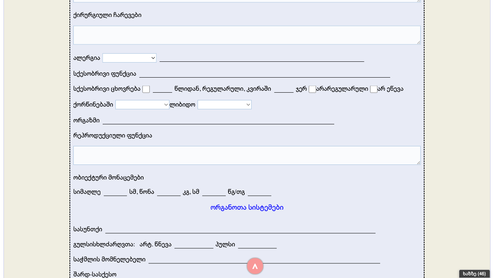

# Form 200-/ბ მამაკაცი (Male Examination Form) - Complete Mapping

## Form Info
- **Form Name**: 200-/ბ მამაკაცი (Male Examination Form)
- **Georgian Title**: გასინჯვის ფურცელი (Examination Sheet)
- **Form Category**: ამბულატორიული (Ambulatory)
- **URL**: http://178.134.21.82:8008/clinic.php (accessed via Forms menu)
- **Form Type**: Patient examination/clinical assessment form for male patients

## Screenshots

### Section 1: Header and Basic Info


### Section 2: Medical History and Sexual Function


### Section 3: Objective Data and Organ Systems


### Section 4: Additional Systems and Signature


---

## Form Fields

### Section 1: Patient Identification
| Order | Field Label (Georgian) | Field Label (English) | Type | Required | Binding |
|-------|------------------------|----------------------|------|----------|---------|
| 1 | სახელი გვარი | Full Name | text (readonly) | Yes | Patient.name |
| 2 | ბარათის # | Card Number | text (readonly) | Yes | Encounter.identifier |

### Section 2: Chief Complaints
| Order | Field Label (Georgian) | Field Label (English) | Type | Required |
|-------|------------------------|----------------------|------|----------|
| 3 | ჩივილები | Complaints | textarea | No |

### Section 3: Medical History (Anamnesis)
| Order | Field Label (Georgian) | Field Label (English) | Type | Required |
|-------|------------------------|----------------------|------|----------|
| 4 | დაავადების ანამნები | Disease History | textarea | No |
| 5 | მემკვიდრულ დაავადებებს | Hereditary Diseases | select + text | No |
| 6 | გადატანილი დაავადებები | Past Diseases | textarea | No |
| 7 | ქირურგიული ჩარევები | Surgical Interventions | textarea | No |
| 8 | ალერგია | Allergies | select + text | No |

### Section 4: Sexual Function (სქესობრივი ფუნქცია)
| Order | Field Label (Georgian) | Field Label (English) | Type | Required |
|-------|------------------------|----------------------|------|----------|
| 9 | სქესობრივი ფუნქცია | Sexual Function | text | No |
| 10 | სქესობრივი ცხოვრება | Sexual Life | text + checkboxes | No |
| 10a | წლიდან | From year | text | No |
| 10b | რეგულარული | Regular | checkbox | No |
| 10c | კირიაში | Per week | text | No |
| 10d | ჯერ | Times | text | No |
| 10e | არარეგულარული | Irregular | checkbox | No |
| 10f | არ ეწევა | Does not engage | checkbox | No |
| 11 | ქორწინებაში | Marital Status | select | No |
| 12 | ლიბიდო | Libido | select | No |
| 13 | ორგაზმი | Orgasm | text | No |

### Section 5: Reproductive Function
| Order | Field Label (Georgian) | Field Label (English) | Type | Required |
|-------|------------------------|----------------------|------|----------|
| 14 | რეპროდუქციული ფუნქცია | Reproductive Function | textarea | No |

### Section 6: Objective Data (ობიექტური მონაცემები)
| Order | Field Label (Georgian) | Field Label (English) | Type | Units |
|-------|------------------------|----------------------|------|-------|
| 15 | სიმაღლე | Height | text | სმ (cm) |
| 16 | წონა | Weight | text | კგ (kg) |
| 17 | კგ, სმ | BMI calculation | text | კგ/სმ² |
| 18 | წგ/თვ | Blood Pressure | text | mmHg |

### Section 7: Organ Systems (ორგანოთა სისტემები)
| Order | Field Label (Georgian) | Field Label (English) | Type | Required |
|-------|------------------------|----------------------|------|----------|
| 19 | სასუნთქი | Respiratory System | text | No |
| 20 | გულსისხლძარღვოათა | Cardiovascular System | compound | No |
| 20a | არტ. წნევა | Arterial Pressure | text | No |
| 20b | პულსი | Pulse | text | No |
| 21 | საჭმლის მომნელებელი | Digestive System | text | No |
| 22 | შარდ-სასქესო | Urogenital System | text | No |
| 23 | ნერვული | Nervous System | text | No |
| 24 | შინაგანი სეკრეციის ჯირკვლები | Endocrine Glands | text | No |
| 25 | ყელ-ყურ-ცხვირი | ENT (Ear-Nose-Throat) | text | No |

### Section 8: Signature
| Order | Field Label (Georgian) | Field Label (English) | Type | Required |
|-------|------------------------|----------------------|------|----------|
| 26 | ექიმი | Doctor | text | Yes |
| 27 | თარიღი | Date | date | Yes |

---

## Dropdowns with Options

### 1. Hereditary Diseases (მემკვიდრულ დაავადებებს)
| Value | Georgian Text | English Translation |
|-------|---------------|---------------------|
| 905 | არ აღნიშნავს | Not noted/No |
| 906 | აღნიშნავს | Noted/Yes |

### 2. Allergies (ალერგია)
| Value | Georgian Text | English Translation |
|-------|---------------|---------------------|
| 907 | არის | Present/Yes |
| 908 | არ არის | Not present/No |

### 3. Marital Status (ქორწინებაში)
| Value | Georgian Text | English Translation |
|-------|---------------|---------------------|
| 909 | არის | Married |
| 910 | არ არის | Not married |

### 4. Libido (ლიბიდო)
| Value | Georgian Text | English Translation |
|-------|---------------|---------------------|
| 911 | დაქვეითებული | Decreased |
| 912 | ზომიერი | Moderate |
| 913 | გაძლიერებული | Increased |

---

## FHIR Questionnaire Mapping

### Recommended FHIR Field Types

| Form Field | FHIR Questionnaire Item Type | Notes |
|------------|------------------------------|-------|
| სახელი გვარი | display | Read-only, bound to Patient.name |
| ბარათის # | display | Read-only, bound to Encounter.identifier |
| ჩივილები | text | Multi-line textarea |
| დაავადების ანამნები | text | Multi-line textarea |
| მემკვიდრულ დაავადებებს | choice + text | Dropdown with "other" option |
| გადატანილი დაავადებები | text | Multi-line textarea |
| ქირურგიული ჩარევები | text | Multi-line textarea |
| ალერგია | choice + text | Dropdown with "other" option |
| სქესობრივი ცხოვრება | group | Contains nested items |
| წლიდან | integer | Year started |
| რეგულარული | boolean | Checkbox |
| კირიაში | integer | Times per week |
| ჯერ | integer | Times |
| არარეგულარული | boolean | Checkbox |
| არ ეწევა | boolean | Checkbox |
| ქორწინებაში | choice | Yes/No dropdown |
| ლიბიდო | choice | 3-option dropdown |
| ორგაზმი | text | Text input |
| რეპროდუქციული ფუნქცია | text | Multi-line textarea |
| სიმაღლე | decimal | Height in cm |
| წონა | decimal | Weight in kg |
| არტ. წნევა | string | Blood pressure reading |
| პულსი | integer | Pulse rate |
| სასუნთქი | text | Free text |
| გულსისხლძარღვოათა | group | Contains BP and pulse |
| საჭმლის მომნელებელი | text | Free text |
| შარდ-სასქესო | text | Free text |
| ნერვული | text | Free text |
| შინაგანი სეკრეციის ჯირკვლები | text | Free text |
| ყელ-ყურ-ცხვირი | text | Free text |
| ექიმი | display | Read-only, bound to Practitioner |
| თარიღი | date | Examination date |

---

## Form Layout Structure

```
┌─────────────────────────────────────────────────────────────┐
│                    გასინჯვის ფურცელი                         │
│                 (Examination Sheet)                          │
├─────────────────────────────────────────────────────────────┤
│ სახელი გვარი: _____________ ბარათის #: _____________        │
├─────────────────────────────────────────────────────────────┤
│ ჩივილები (Complaints):                                      │
│ ┌─────────────────────────────────────────────────────────┐ │
│ │                                                         │ │
│ │                       [textarea]                        │ │
│ │                                                         │ │
│ └─────────────────────────────────────────────────────────┘ │
├─────────────────────────────────────────────────────────────┤
│ დაავადების ანამნები (Disease History):                      │
│ ┌─────────────────────────────────────────────────────────┐ │
│ │                       [textarea]                        │ │
│ └─────────────────────────────────────────────────────────┘ │
├─────────────────────────────────────────────────────────────┤
│ მემკვიდრულ დაავადებებს: [▼ dropdown] ____________           │
├─────────────────────────────────────────────────────────────┤
│ გადატანილი დაავადებები:                                     │
│ ┌─────────────────────────────────────────────────────────┐ │
│ │                       [textarea]                        │ │
│ └─────────────────────────────────────────────────────────┘ │
├─────────────────────────────────────────────────────────────┤
│ ქირურგიული ჩარევები:                                        │
│ ┌─────────────────────────────────────────────────────────┐ │
│ │                       [textarea]                        │ │
│ └─────────────────────────────────────────────────────────┘ │
├─────────────────────────────────────────────────────────────┤
│ ალერგია: [▼ dropdown] ________________________              │
├─────────────────────────────────────────────────────────────┤
│ სქესობრივი ფუნქცია: ________________________________         │
├─────────────────────────────────────────────────────────────┤
│ სქესობრივი ცხოვრება: _____ წლიდან,                          │
│   რეგულარული □  კირიაში ____ ჯერ                            │
│   არარეგულარული □  არ ეწევა □                               │
├─────────────────────────────────────────────────────────────┤
│ ქორწინებაში: [▼]  ლიბიდო: [▼]                               │
├─────────────────────────────────────────────────────────────┤
│ ორგაზმი: _______________________                            │
├─────────────────────────────────────────────────────────────┤
│ რეპროდუქციული ფუნქცია:                                      │
│ ┌─────────────────────────────────────────────────────────┐ │
│ │                       [textarea]                        │ │
│ └─────────────────────────────────────────────────────────┘ │
├─────────────────────────────────────────────────────────────┤
│               ობიექტური მონაცემები                          │
├─────────────────────────────────────────────────────────────┤
│ სიმაღლე: _____ სმ  წონა: _____ კგ  სმ: _____ წგ/თვ: _____  │
├─────────────────────────────────────────────────────────────┤
│                  ორგანოთა სისტემები                         │
├─────────────────────────────────────────────────────────────┤
│ სასუნთქი: ________________________________________________  │
│ გულსისხლძარღვოათა: არტ.წნევა _______ პულსი _______         │
│ საჭმლის მომნელებელი: _____________________________________  │
│ შარდ-სასქესო: _____________________________________________ │
│ ნერვული: __________________________________________________ │
│ შინაგანი სეკრეციის ჯირკვლები: ____________________________  │
│ ყელ-ყურ-ცხვირი: ___________________________________________  │
├─────────────────────────────────────────────────────────────┤
│ ექიმი: _____________________  თარიღი: ___________________   │
└─────────────────────────────────────────────────────────────┘
```

---

## Field Count Summary

| Field Type | Count |
|------------|-------|
| Text Input | 15 |
| Textarea | 6 |
| Select/Dropdown | 4 |
| Checkbox | 3 |
| Date | 1 |
| Display (readonly) | 2 |
| **Total Fields** | **31** |

---

## Notes for Form Builder Recreation

1. **Patient Binding**: Fields 1-2 (name, card#) should be read-only and auto-populated from Patient/Encounter context
2. **Dropdowns**: All dropdown values have numeric IDs (905-913) - maintain these for data compatibility
3. **Sexual Function Section**: This is male-specific content - there's likely a female version (200-/ბ ქალი)
4. **Organ Systems**: Standard medical examination categories - can be reused across forms
5. **Layout**: Uses dashed border container with light blue (#e6f3ff) input backgrounds
6. **Signature Section**: Doctor name may be auto-filled from logged-in practitioner

---

## Implementation Priority

1. **High Priority**: Patient ID fields, Complaints, Medical History
2. **Medium Priority**: Sexual Function section, Objective Data
3. **Lower Priority**: Individual organ system fields (standard examination)

---

*Document generated: 2025-11-23*
*Source: SoftMedic EMR at http://178.134.21.82:8008/*
