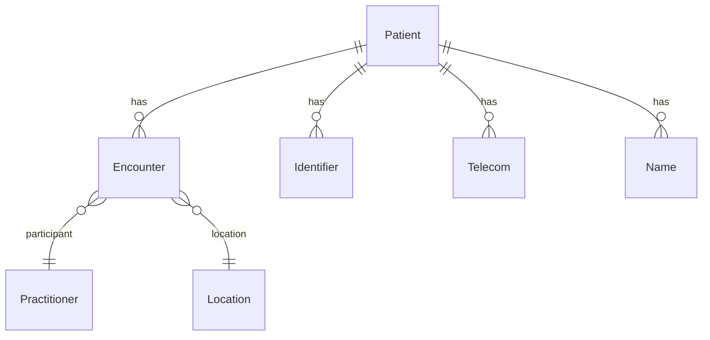

# My Patients - FHIR Field Mappings

## Overview
This document maps the fields and data structures from the original EMR "My Patients" page to FHIR R4 resources for implementation in the Medplum-based system.

**Extraction Date**: 2025-11-14
**FHIR Version**: R4
**Primary Resources**: Patient, Encounter, Practitioner, Location

---

## Page Purpose & Scope

### Business Function
The "My Patients" page displays a filtered list of patients assigned to the currently logged-in healthcare provider (doctor, nurse, etc.). It enables:
- Viewing patients under the provider's care
- Filtering by doctor (for admins), department, transfer status
- Quick access to patient records
- Searching by registration number

### FHIR Implementation Strategy
- Use **Patient** resource as primary data source
- Use **Encounter** resource to track current admissions and department assignments
- Use **Practitioner** resource for doctor relationships
- Use **Location** resource for department/ward information
- Use **CarePlan** resource (optional) to track "my patients" assignments

---

## Data Model Overview



---

## Table Column Mappings

### Column 1: პორად # (Portal/Registration Number)

**Original Field**:
- Name: Portal Number / Personal ID
- Data Type: String (11 digits)
- Example: `31001036644`

**FHIR Mapping**:
```json
{
  "resourceType": "Patient",
  "identifier": [
    {
      "system": "http://medimind.ge/identifiers/personal-id",
      "value": "31001036644",
      "use": "official",
      "type": {
        "coding": [{
          "system": "http://terminology.hl7.org/CodeSystem/v2-0203",
          "code": "NI",
          "display": "National unique individual identifier"
        }]
      }
    }
  ]
}
```

**Implementation Notes**:
- This appears to be Georgian Personal ID (11-digit with Luhn checksum)
- Use system URI: `http://medimind.ge/identifiers/personal-id`
- Validate using Luhn algorithm on input
- Unique constraint on this identifier

**Search Parameter**:
```
GET /Patient?identifier=http://medimind.ge/identifiers/personal-id|31001036644
```

---

### Column 2: საწოლი (First Name) ✅ VERIFIED

**Original Field**:
- Name: First Name (Note: column header incorrectly says "საწოლი" meaning "Bed")
- Data Type: String (Georgian text)
- Example: `ზაქარია` (Zakaria)

**FHIR Mapping**:
```json
{
  "resourceType": "Patient",
  "name": [
    {
      "use": "official",
      "family": "ბექაურია",
      "given": ["ზაქარია"],
      "text": "ზაქარია ბექაურია"
    }
  ]
}
```

**Implementation Notes**:
- **VERIFIED**: Column displays patient first names (given names), NOT bed numbers
- The column header "საწოლი" (Bed) is a UI labeling error in the legacy EMR system
- Maps to: `Patient.name[0].given[0]`
- In the new Medplum implementation, the column header should be corrected to "სახელი" (First Name)

**Search Parameter**:
```
GET /Patient?given=ზაქარია
```

---

### Column 3: გვარი (Last Name)

**Original Field**:
- Name: Last Name / Surname
- Data Type: String (Georgian text)
- Example: `ბექაურია` (Bekauria)

**FHIR Mapping**:
```json
{
  "resourceType": "Patient",
  "name": [
    {
      "use": "official",
      "family": "ბექაურია",
      "given": ["ზაქარია"],
      "text": "ზაქარია ბექაურია"
    }
  ]
}
```

**Implementation Notes**:
- Maps to `Patient.name[0].family`
- Use `official` as name use code
- Store full name in `text` field for display purposes
- Georgian collation needed for alphabetical sorting

**Search Parameter**:
```
GET /Patient?family=ბექაურია
```

---

### Column 4: სქესი (Gender)

**Original Field**:
- Name: Gender / Sex
- Data Type: Enum
- Values: `მამრობითი` (Male), `მდედრობითი` (Female)

**FHIR Mapping**:
```json
{
  "resourceType": "Patient",
  "gender": "male" // or "female"
}
```

**Value Translation**:
| Georgian | English | FHIR Code |
|---------|---------|-----------|
| მამრობითი | Male | `male` |
| მდედრობითი | Female | `female` |

**Implementation Notes**:
- FHIR `gender` field uses codes: `male`, `female`, `other`, `unknown`
- Store Georgian display text in translation files
- UI displays localized text, API stores FHIR codes

**Search Parameter**:
```
GET /Patient?gender=male
```

---

### Column 5: დაბ. თარიღი (Date of Birth)

**Original Field**:
- Name: Date of Birth
- Data Type: Date
- Format: DD-MM-YYYY
- Example: `17-10-1958`

**FHIR Mapping**:
```json
{
  "resourceType": "Patient",
  "birthDate": "1958-10-17"
}
```

**Format Conversion**:
- **Original**: DD-MM-YYYY (17-10-1958)
- **FHIR**: YYYY-MM-DD (1958-10-17)
- Convert on input/output

**Implementation Notes**:
- FHIR requires ISO 8601 format (YYYY-MM-DD)
- UI displays in Georgian/European format (DD-MM-YYYY)
- Calculate age from birthDate: `today - birthDate`
- Age extension (optional):
  ```json
  "extension": [{
    "url": "http://medimind.ge/extensions/age",
    "valueInteger": 66
  }]
  ```

**Search Parameter**:
```
GET /Patient?birthdate=1958-10-17
GET /Patient?birthdate=ge1958-01-01&birthdate=le1958-12-31  // Year range
```

---

### Column 6: ტელეფონი (Phone)

**Original Field**:
- Name: Phone / Telephone
- Data Type: String
- Format: Mixed (9-digit or 12-digit with country code)
- Examples: `593131300;`, `995568762861`

**FHIR Mapping**:
```json
{
  "resourceType": "Patient",
  "telecom": [
    {
      "system": "phone",
      "value": "+995593131300",
      "use": "mobile"
    }
  ]
}
```

**Format Standardization**:
| Original Format | Standardized FHIR Format | Notes |
|----------------|-------------------------|-------|
| `593131300` | `+995593131300` | Add country code +995 |
| `995593131300` | `+995593131300` | Add + prefix |
| `593131300;` | `+995593131300` | Remove semicolon |
| `555258730; 598765432;` | Multiple telecom entries | Split by semicolon |

**Multiple Phone Numbers**:
```json
{
  "telecom": [
    {
      "system": "phone",
      "value": "+995555258730",
      "use": "mobile",
      "rank": 1
    },
    {
      "system": "phone",
      "value": "+995598765432",
      "use": "home",
      "rank": 2
    }
  ]
}
```

**Implementation Notes**:
- Always store with country code +995 (Georgia)
- Remove semicolons and extra characters
- Multiple numbers: Create separate telecom entries
- Use `rank` to indicate primary phone

**Search Parameter**:
```
GET /Patient?telecom=+995593131300
```

---

### Column 7: რეგ.# (Registration Number)

**Original Field**:
- Name: Registration Number (visit/encounter)
- Data Type: String (alphanumeric)
- Examples: (Empty in screenshot - needs verification)
- Expected formats: `10357-2025` or `a-6871-2025`

**FHIR Mapping** (if this is encounter registration):
```json
{
  "resourceType": "Encounter",
  "identifier": [
    {
      "system": "http://medimind.ge/identifiers/registration-number",
      "value": "10357-2025",
      "use": "official",
      "type": {
        "coding": [{
          "system": "http://terminology.hl7.org/CodeSystem/v2-0203",
          "code": "VN",
          "display": "Visit number"
        }]
      }
    }
  ]
}
```

**Alternative Mapping** (if this is patient identifier):
```json
{
  "resourceType": "Patient",
  "identifier": [
    {
      "system": "http://medimind.ge/identifiers/hospital-registration-number",
      "value": "10357-2025",
      "use": "secondary"
    }
  ]
}
```

**Implementation Notes**:
- **Empty in screenshot** - needs clarification on purpose
- If encounter registration: Link to Encounter resource
- If patient registration: Add to Patient.identifier array
- Format: May be stationary (`XXXXX-YYYY`) or ambulatory (`a-XXXX-YYYY`)

**Search Parameter**:
```
GET /Encounter?identifier=http://medimind.ge/identifiers/registration-number|10357-2025
```

---

## Filter Mappings

### Filter 1: Treating Doctor (მკურნალი ექიმი)

**Original Field**:
- Dropdown with doctor names
- Default: "-" (all doctors)

**FHIR Mapping**:

**Option A: Using Encounter.participant**
```
GET /Encounter?participant:practitioner=Practitioner/doctor-123&status=in-progress
GET /Patient?_has:Encounter:patient:participant=Practitioner/doctor-123
```

**Option B: Using Patient.generalPractitioner**
```
GET /Patient?general-practitioner=Practitioner/doctor-123
```

**Practitioner Resource** (for dropdown):
```json
{
  "resourceType": "Practitioner",
  "id": "doctor-123",
  "name": [{
    "family": "ჯავახიშვილი",
    "given": ["გიორგი"],
    "text": "დოქტორი გიორგი ჯავახიშვილი"
  }],
  "qualification": [{
    "code": {
      "coding": [{
        "system": "http://terminology.hl7.org/CodeSystem/v2-0360",
        "code": "MD",
        "display": "Doctor of Medicine"
      }]
    }
  }]
}
```

**Implementation Notes**:
- Populate dropdown from active Practitioner resources
- Filter: `GET /Practitioner?active=true&role=doctor`
- Display: `name.text` or `family, given`
- Current user context: If logged-in user is doctor, default to their ID
- If admin: Show all doctors

---

### Filter 2: Department (განყოფილება)

**Original Field**:
- Dropdown with department names
- Default: "-" (all departments)

**FHIR Mapping**:

**Using Encounter.location**:
```
GET /Encounter?location=Location/cardiology&status=in-progress
GET /Patient?_has:Encounter:patient:location=Location/cardiology
```

**Location Resource** (for department):
```json
{
  "resourceType": "Location",
  "id": "cardiology",
  "status": "active",
  "name": "კარდიოლოგია",
  "alias": ["Cardiology", "Кардиология"],
  "type": [{
    "coding": [{
      "system": "http://terminology.hl7.org/CodeSystem/v3-RoleCode",
      "code": "CARD",
      "display": "Cardiology clinic"
    }]
  }],
  "physicalType": {
    "coding": [{
      "system": "http://terminology.hl7.org/CodeSystem/location-physical-type",
      "code": "wa",
      "display": "Ward"
    }]
  }
}
```

**Implementation Notes**:
- Populate dropdown from Location resources with type=department/ward
- Filter: `GET /Location?status=active&type=wa`
- Display: `name` field (Georgian)
- Support multilingual aliases: `alias` array for EN/RU

**Department List** (examples):
| Georgian | Location ID | Type Code |
|---------|------------|-----------|
| კარდიოლოგია | cardiology | CARD |
| ქირურგია | surgery | SURG |
| თერაპია | therapy | GIM |
| პედიატრია | pediatrics | PEDC |
| რეანიმაცია | icu | ICU |

---

### Filter 3: Not Discharged (გაუწერელი) ✅ VERIFIED

**Original Field**:
- Label: გაუწერელი (Not Discharged)
- Type: Checkbox
- Purpose: Show only patients still admitted (not yet discharged)
- Default: Unchecked (show all patients)

**FHIR Mapping**:

**Primary Approach: Using Encounter.period.end**:
```json
{
  "resourceType": "Encounter",
  "status": "in-progress",
  "period": {
    "start": "2025-11-14T10:00:00Z",
    "end": null  // NULL = patient not discharged
  }
}
```

**Search for Not Discharged Patients**:
```
GET /Encounter?status=in-progress
GET /Encounter?date=ge2025-11-14&_missing=end
GET /Patient?_has:Encounter:patient:status=in-progress
```

**Alternative: Using Encounter.status**:
- `in-progress` = Patient currently admitted
- `finished` = Patient discharged
- `planned` = Future admission

**Implementation Notes**:
- **VERIFIED**: "გაუწერელი" means "Not Discharged" (patients still admitted)
- Filter logic: Show patients where active Encounter has `period.end = null`
- When checkbox is checked: Filter to `Encounter.status=in-progress`
- When unchecked: Show all patients (both active and discharged)
- Use appropriate FHIR field based on business meaning
- May require custom search parameter

---

### Filter 4: Registration Number (ისხ #)

**Original Field**:
- Text input
- Partial match likely supported

**FHIR Mapping**:

**If searching Patient personal ID**:
```
GET /Patient?identifier=http://medimind.ge/identifiers/personal-id|31001036644
```

**If searching Encounter registration number**:
```
GET /Encounter?identifier=http://medimind.ge/identifiers/registration-number|10357-2025
GET /Patient?_has:Encounter:patient:identifier=10357-2025
```

**Partial Match** (using `:contains` modifier):
```
GET /Patient?identifier:contains=310010
```

**Implementation Notes**:
- Support both exact and partial matching
- Search both Patient and Encounter identifiers
- Return patients with matching identifiers

---

## "My Patients" Logic

### Defining "My Patients"

**Business Rule**: Patients assigned to the currently logged-in practitioner as their treating doctor.

**FHIR Implementation Options**:

#### Option 1: Encounter-Based (Recommended)
Use active/in-progress Encounters where logged-in practitioner is a participant:

```
GET /Encounter?participant:practitioner=Practitioner/{current-user-id}&status=in-progress
GET /Patient?_has:Encounter:patient:participant=Practitioner/{current-user-id}&_has:Encounter:patient:status=in-progress
```

**Explanation**:
- Find all in-progress Encounters where current user is a participant
- Get Patients from those Encounters
- This shows patients currently under care

#### Option 2: Patient.generalPractitioner
Use Patient.generalPractitioner field:

```
GET /Patient?general-practitioner=Practitioner/{current-user-id}
```

```json
{
  "resourceType": "Patient",
  "generalPractitioner": [{
    "reference": "Practitioner/doctor-123",
    "display": "დოქტორი გიორგი ჯავახიშვილი"
  }]
}
```

**Explanation**:
- Patients explicitly assigned to this doctor
- Good for primary care relationships
- May not reflect current inpatient assignments

#### Option 3: CarePlan-Based
Use CarePlan resources to track patient assignments:

```
GET /CarePlan?performer=Practitioner/{current-user-id}&status=active
GET /Patient?_has:CarePlan:patient:performer=Practitioner/{current-user-id}&_has:CarePlan:patient:status=active
```

```json
{
  "resourceType": "CarePlan",
  "status": "active",
  "subject": {
    "reference": "Patient/patient-123"
  },
  "performer": [{
    "reference": "Practitioner/doctor-123"
  }],
  "period": {
    "start": "2025-11-01"
  }
}
```

**Explanation**:
- Explicit care assignments with start/end dates
- Most flexible and traceable
- Recommended for complex care team scenarios

**Recommendation**: Use **Option 1 (Encounter-Based)** for simplicity in hospital setting. Patients appear in "My Patients" when they have an active Encounter with the practitioner as participant.

---

## Complete FHIR Query Examples

### Example 1: Get All My Patients (Basic)

**Request**:
```
GET /Patient?_has:Encounter:patient:participant=Practitioner/doctor-123&_has:Encounter:patient:status=in-progress&_sort=family
```

**Response** (Bundle):
```json
{
  "resourceType": "Bundle",
  "type": "searchset",
  "total": 44,
  "entry": [
    {
      "resource": {
        "resourceType": "Patient",
        "id": "patient-123",
        "identifier": [{
          "system": "http://medimind.ge/identifiers/personal-id",
          "value": "31001036644"
        }],
        "name": [{
          "family": "ბექაურია",
          "given": ["ზაქარია"],
          "text": "ზაქარია ბექაურია"
        }],
        "gender": "male",
        "birthDate": "1958-10-17",
        "telecom": [{
          "system": "phone",
          "value": "+995593131300"
        }]
      }
    }
    // ... more patients
  ]
}
```

---

### Example 2: Filter by Department

**Request**:
```
GET /Patient?_has:Encounter:patient:participant=Practitioner/doctor-123&_has:Encounter:patient:status=in-progress&_has:Encounter:patient:location=Location/cardiology&_sort=family
```

**Query Parameters**:
- `_has:Encounter:patient:participant=Practitioner/doctor-123` - My patients
- `_has:Encounter:patient:status=in-progress` - Active encounters only
- `_has:Encounter:patient:location=Location/cardiology` - In cardiology department
- `_sort=family` - Sort by last name

---

### Example 3: Search by Registration Number

**Request**:
```
GET /Patient?identifier=http://medimind.ge/identifiers/personal-id|31001036644&_has:Encounter:patient:participant=Practitioner/doctor-123
```

**Query Parameters**:
- `identifier=...` - Match personal ID
- `_has:Encounter:patient:participant=...` - Ensure patient is assigned to me

---

### Example 4: Filter by Transferred Status

**Request**:
```
GET /Patient?_has:Encounter:patient:participant=Practitioner/doctor-123&_has:Encounter:patient:admit-source=hosp-trans&_sort=family
```

**Query Parameters**:
- `_has:Encounter:patient:admit-source=hosp-trans` - Transferred from another hospital

---

### Example 5: Complex Filter (All Filters Applied)

**Request**:
```
GET /Patient?
  _has:Encounter:patient:participant=Practitioner/doctor-123
  &_has:Encounter:patient:status=in-progress
  &_has:Encounter:patient:location=Location/cardiology
  &_has:Encounter:patient:admit-source=hosp-trans
  &identifier:contains=3100
  &_sort=family
  &_count=50
```

**Query Parameters**:
- Current doctor's patients
- Active encounters
- In cardiology
- Transferred status
- Registration number contains "3100"
- Sorted by last name
- Max 50 results per page

---

## Performance Optimization

### Indexing Strategy
Ensure database indexes on:
- `Patient.identifier` (for quick registration number lookups)
- `Patient.name.family` (for sorting)
- `Encounter.participant` (for filtering by practitioner)
- `Encounter.location` (for filtering by department)
- `Encounter.status` (for filtering active encounters)

### Caching
- Cache doctor list (Practitioner resources)
- Cache department list (Location resources)
- Cache patient list for current user (5-10 minute TTL)
- Invalidate cache on updates

### FHIR Search Optimization
- Use `_elements` parameter to fetch only needed fields:
  ```
  GET /Patient?...&_elements=identifier,name,gender,birthDate,telecom
  ```
- Use `_summary=true` for even faster results (summary view only)
- Implement pagination with `_count` and `_offset`

---

## Data Integrity & Validation

### Required Fields
- `Patient.identifier` - At least one identifier (personal ID)
- `Patient.name.family` - Last name required
- `Patient.gender` - Required
- `Patient.birthDate` - Required (may be approximate if unknown)

### Validation Rules
- **Personal ID**: 11 digits, Luhn checksum
- **Phone**: Georgian format (+995 followed by 9 digits)
- **Birth Date**: Not in future, not more than 120 years ago
- **Gender**: Only `male` or `female` (per Georgian EMR requirements)

### Data Quality Checks
- Duplicate personal ID detection
- Phone number format standardization
- Name character set validation (Georgian Unicode)

---

## Migration Strategy

### Data Migration from Old EMR

**Step 1: Extract Patient Data**
- Export patient table from old EMR database
- Map fields to FHIR Patient structure

**Step 2: Create FHIR Patients**
```javascript
const patients = oldData.map(row => ({
  resourceType: 'Patient',
  identifier: [{
    system: 'http://medimind.ge/identifiers/personal-id',
    value: row.personal_id
  }],
  name: [{
    family: row.last_name,
    given: [row.first_name],
    text: `${row.first_name} ${row.last_name}`
  }],
  gender: row.gender === 'მამრობითი' ? 'male' : 'female',
  birthDate: convertToFHIRDate(row.birth_date), // DD-MM-YYYY -> YYYY-MM-DD
  telecom: row.phone ? [{
    system: 'phone',
    value: formatGeorgianPhone(row.phone) // +995XXXXXXXXX
  }] : []
}));

// Batch upload to Medplum
await medplum.executeBatch({
  resourceType: 'Bundle',
  type: 'transaction',
  entry: patients.map(p => ({
    request: { method: 'POST', url: 'Patient' },
    resource: p
  }))
});
```

**Step 3: Create Active Encounters**
- For each patient currently in hospital:
  - Create Encounter with status=in-progress
  - Link to current department (Location)
  - Link to treating doctor (Practitioner participant)

**Step 4: Verification**
- Query "My Patients" for each doctor
- Compare counts with old EMR
- Verify all filter combinations return correct results

---

## Testing Scenarios

### Test Case 1: View My Patients
**Setup**: Doctor "გიორგი" has 10 active patients
**Action**: Navigate to My Patients page
**Expected**: Table displays 10 patients sorted by last name
**FHIR Query**: `GET /Patient?_has:Encounter:patient:participant=Practitioner/doctor-1&_sort=family`

### Test Case 2: Filter by Department
**Setup**: 10 patients, 5 in Cardiology, 5 in Surgery
**Action**: Select "კარდიოლოგია" from department dropdown
**Expected**: Table displays 5 patients in Cardiology
**FHIR Query**: `GET /Patient?...&_has:Encounter:patient:location=Location/cardiology`

### Test Case 3: Search by Personal ID
**Setup**: Patient with ID "31001036644" exists
**Action**: Enter "31001036644" in registration number field
**Expected**: Table displays 1 patient
**FHIR Query**: `GET /Patient?identifier=...personal-id|31001036644`

### Test Case 4: Multiple Filters
**Setup**: Complex filter scenario
**Action**: Select doctor, department, check transferred, enter partial ID
**Expected**: Table displays only patients matching ALL filters (AND logic)
**FHIR Query**: Multiple `_has` parameters combined

### Test Case 5: Empty Results
**Setup**: Filter combination that matches no patients
**Action**: Apply filters
**Expected**: Empty table with "მონაცემები არ მოიძებნა" message
**FHIR Query**: Returns Bundle with total=0

---

## Summary

### Key FHIR Resources Used
1. **Patient** - Primary patient demographics
2. **Encounter** - Current admission/visit tracking
3. **Practitioner** - Healthcare provider information
4. **Location** - Department/ward information
5. **CarePlan** (optional) - Care assignments

### Critical Mappings
- Personal ID → `Patient.identifier` (system: personal-id)
- First Name → `Patient.name.given`
- Last Name → `Patient.name.family`
- Gender → `Patient.gender` (male/female)
- Birth Date → `Patient.birthDate` (YYYY-MM-DD format)
- Phone → `Patient.telecom` (standardized +995 format)
- "My Patients" → Encounter-based filtering by practitioner

### Implementation Priorities
1. ✅ Set up Patient resource with all identifier systems
2. ✅ Create Practitioner resources for all doctors
3. ✅ Create Location resources for all departments
4. ✅ Implement Encounter-based "My Patients" logic
5. ✅ Build search functionality with all 4 filters
6. ✅ Add table sorting and display
7. ✅ Implement multilingual support (ka/en/ru)
8. ✅ Add performance optimizations (caching, indexing)

### Next Steps
1. Verify column 2 ("საწოლი") - is it bed or first name?
2. Clarify "Transferred" business logic
3. Extract doctor and department lists from live system
4. Test search performance with large datasets
5. Implement pagination if needed
