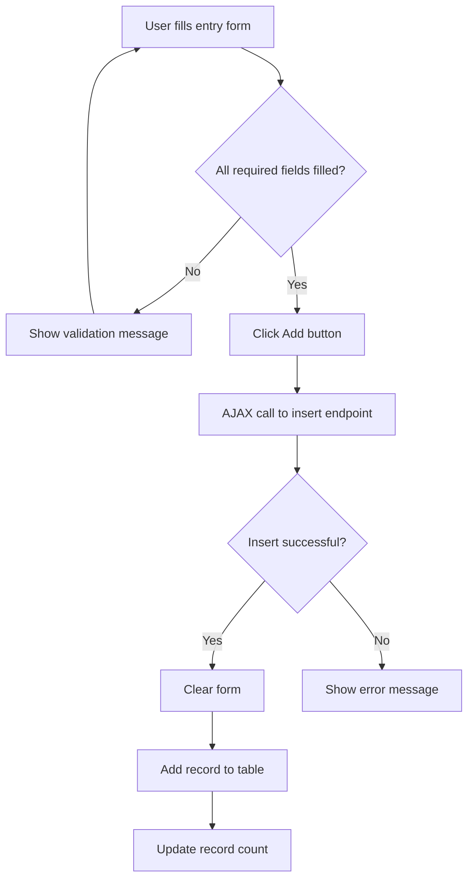
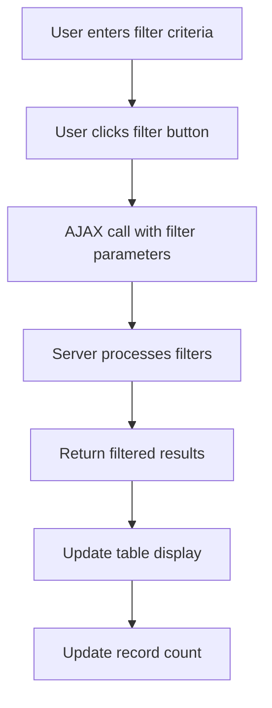
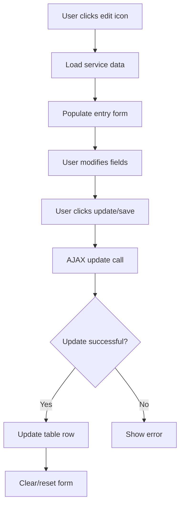
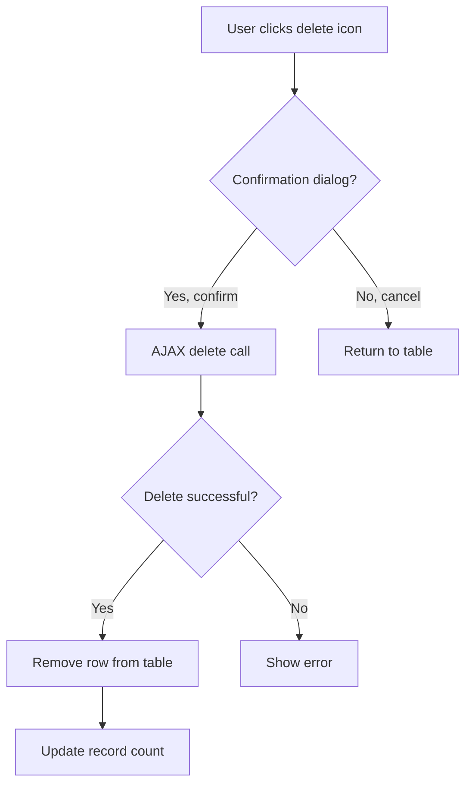
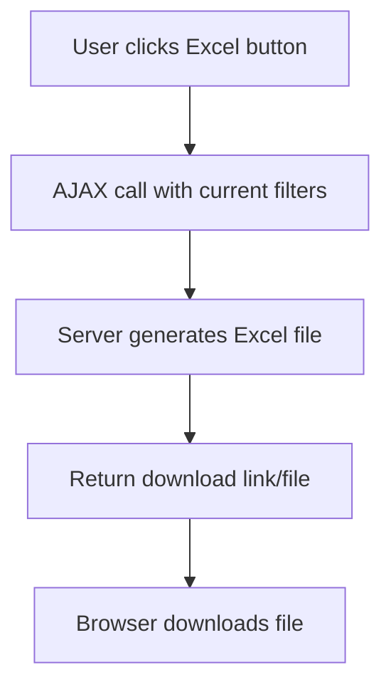
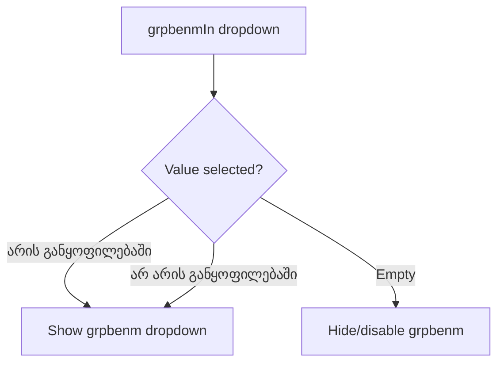
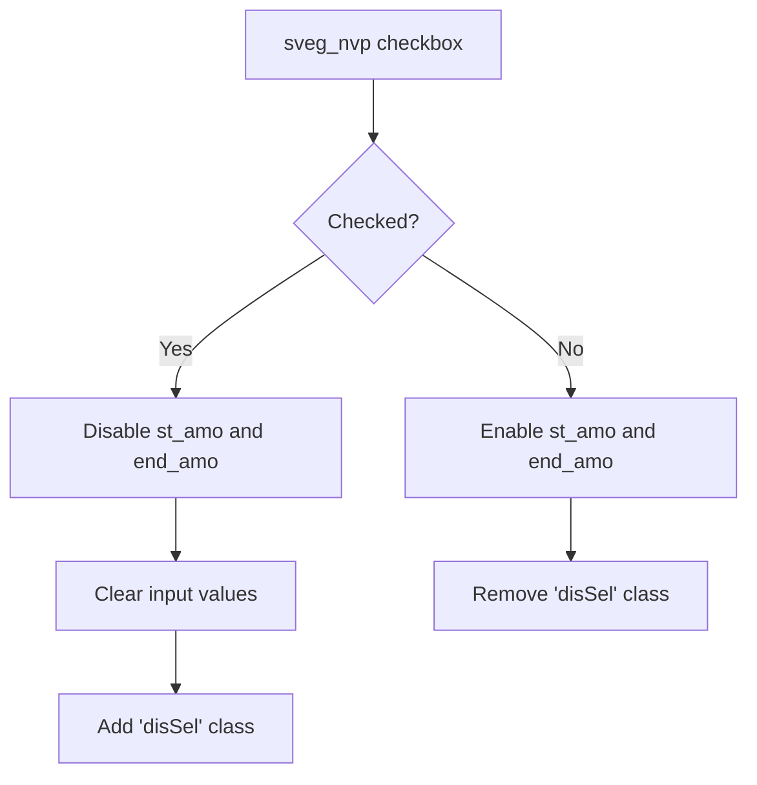
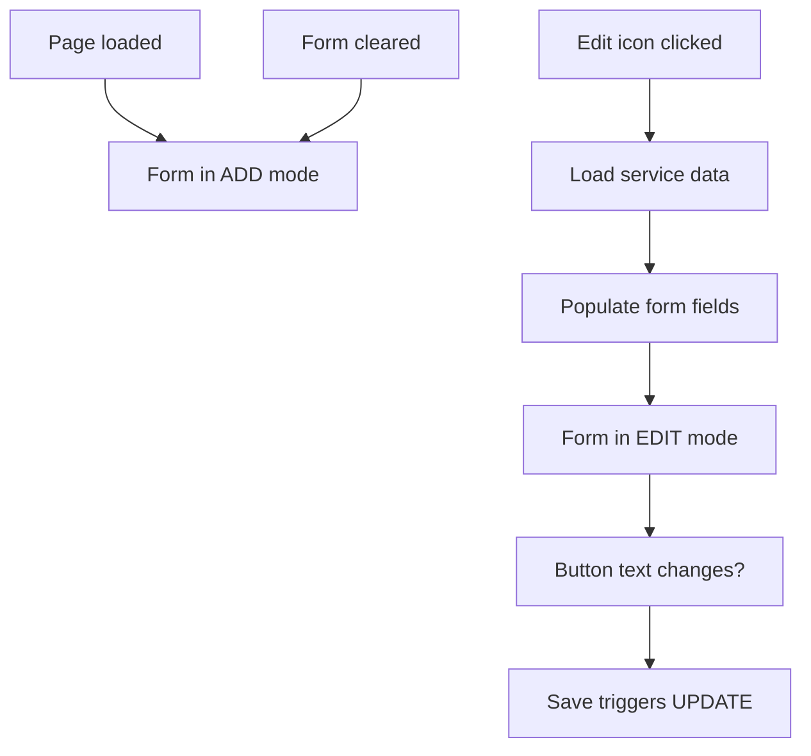

# ნომენკლატურა - სამედიცინო I (Nomenclature - Medical 1)

**Page Title:** ოპერაცია, კონსულტაცია, კვლევები (Operations, Consultations, Studies)

**URL:** `http://178.134.21.82:8008/clinic.php#3s31`

**Extraction Date:** 2025-11-18

---

## Page Overview

The Medical 1 nomenclature page manages medical services including operations, consultations, and studies. It provides an inline form for adding new services and a searchable/filterable table for viewing and managing existing services.

**Key Features:**
- Inline service entry form (no modal popup)
- Multi-criteria search and filtering
- Status-based filtering (Active/Deleted)
- Department assignment management
- Excel export functionality
- Edit and delete actions per service

---

## Navigation Structure

### Main Menu Path
1. **ნომენკლატურა** (Nomenclature) - Main menu item
2. **სამედიცინო I** (Medical 1) - Submenu tab

### Nomenclature Submenu Tabs (13 tabs)
1. **სამედიცინო I** (Medical 1) - Active
2. სამედიცინო II (Medical 2)
3. სასაქონლო (Goods/Supplies)
4. ლაბორატორიული (Laboratory)
5. ფასები (Prices)
6. ფასების სია (Price List)
7. ICD10, NCSP, ICPC2
8. LAB Aliases
9. ჯგუფები (Groups)
10. ფიზიკალური (Physical)
11. ფორმები (Forms)
12. სეთინგი (Settings)
13. ტესტები (Tests)

---

## Page Layout

### Section 1: Inline Entry Form (Top)
A single-row form for adding new services with required fields marked with asterisk (*).

### Section 2: Filter/Search Area (Middle)
Multi-field search and filtering interface with dropdown filters and text inputs.

### Section 3: Data Table (Bottom)
Scrollable table displaying all services with edit/delete actions.

### Section 4: Status Indicator (Bottom Right)
Display count: "ხაზზე (103)" (103 lines/records)

---

## Form Fields (Add/Edit Service)

### Inline Entry Form Fields

| Field ID | Name Attribute | Label (ქართული) | Type | Required | Validation | Options/Notes |
|----------|----------------|------------------|------|----------|------------|---------------|
| `an_cod` | - | კოდი* (Code) | text | Yes | Non-empty | Service code identifier |
| `an_nam` | - | დასახელება* (Name) | text | Yes | Non-empty | Service name/description |
| `sa_angrp` | - | ჯგუფი* (Group) | select | Yes | Must select | See Group Options below |
| `musubgroup` | - | ქვეჯგუფი (Subgroup) | select | No | - | See Subgroup Options below (50 options) |
| `it_isint` | - | ტიპი* (Type) | select | Yes | Must select | See Type Options below |
| `gevtbtyp` | - | სერვისი* (Service) | select | Yes | Must select | See Service Type Options below |
| `an_insan` | - | (Add Button) | button | - | - | Green plus icon, triggers insert |

### Group Options (ჯგუფი*)
| Value | Text (Georgian) | Translation |
|-------|----------------|-------------|
| - | (Empty) | Default/Not selected |
| 5 | კონსულტაცია | Consultation |
| 9 | ოპერაცია | Operation |
| 24 | ლაბორატორიული კვლევები | Laboratory Studies |
| 25 | ინსტრუმენტული კვლევები | Instrumental Studies |
| 28 | პროცედურები | Procedures |
| 29 | ინტერვენციული ჩარევები | Interventional Procedures |
| 40 | დონე | Level |

### Subgroup Options (ქვეჯგუფი) - 50 Options
**Note:** Extensive subgroup list includes medical specialties and DRG categories. See appendix for complete list.

Sample values:
- 724: ინსტრუმენტული გამოკვლევები (Instrumental Examinations)
- 725: ლაბორატორიული გამოკვლევები (Laboratory Examinations)
- 6515: კარდიოქირურგიული ოპერაცია (Cardiac Surgery Operation)
- 6516: ანგიოქირურგიული ოპერაცია (Vascular Surgery Operation)
- ... (46 more options including DRG categories)

### Type Options (ტიპი*)
| Value | Text (Georgian) | Translation |
|-------|----------------|-------------|
| - | (Empty) | Default/Not selected |
| 1 | შიდა | Internal |
| 5135 | სხვა კლინიკები | Other Clinics |
| 19916 | ლიმბახი | Limbach |
| 19935 | მრჩეველი | Consultant |
| 20142 | ხომასურიძე | Khomasuridze |
| 28135 | თოდუა | Todua |
| 99696 | ჰეპა | Hepa |

### Service Type Options (სერვისი*)
| Value | Text (Georgian) | Translation |
|-------|----------------|-------------|
| - | (Empty) | Default/Not selected |
| 1 | ამბულატორიული | Ambulatory |
| 2 | სტაციონარული | Stationary/Inpatient |
| 3 | ორივე | Both |

### Add Button Logic
- **ID:** `an_insan`
- **Class:** `smadbut`
- **Action:** Calls `glAj("insert", ...)` AJAX function
- **Validation:** Shows message "გთხოვთ შეავსოთ ყველა აუცილებელი ველი" (Please fill all required fields) if validation fails
- **Behavior:** On success, adds record to table and clears form

---

## Search & Filter Functionality

### Filter Section Fields

| Field ID | Label (Georgian) | Type | Purpose | Filter Logic |
|----------|------------------|------|---------|--------------|
| `an_flcod` | (Code search) | text | Search by service code | Partial match |
| `an_flnam` | სერვისის ძებნა (Service search) | text | Search by service name | Partial match with placeholder |
| `sa_flgrp` | (Group filter) | select | Filter by group | Exact match (dropdown) |
| `flt_isint` | (Type filter) | select | Filter by type | Exact match (dropdown) |
| `st_amo` | (Start amount) | text | Price range start | Numeric comparison |
| `end_amo` | (End amount) | text | Price range end | Numeric comparison |
| `grtegfil` | (Subgroup filter) | select | Filter by subgroup | Exact match (50 options) |
| `dg_stst` | აქტიური (Status) | select | Filter by status | Active/Deleted/All |
| `grpbenmIn` | არის განყოფილებაში | select | Department assignment | Is/Is not in department |
| `grpbenm` | (Department) | select | Department selector | Exact match (100+ departments) |
| `inactiv` | (Active status) | select | Activity filter | Active/Passive/All |
| `sveg_nvp` | (Checkbox) | checkbox | Disable price range | When checked, disables st_amo & end_amo |

### Department Filter Options (grpbenm) - 100+ Options
Sample departments (see screenshot for complete list):
- 18: კარდიოქირურგია (Cardiosurgery)
- 620: სისხლძარღვთა ქირურგია (Vascular Surgery)
- 734: ინტერვენციული კარდიოლოგია (Interventional Cardiology)
- 735: კარდიოლოგია (Cardiology)
- 736: ამბულატორია (Ambulatory)
- 746: ლაბორატორია (Laboratory)
- ... (90+ more departments and staff roles)

### Status Filter Options (dg_stst)
| Value | Text | Selected |
|-------|------|----------|
| - | (Empty) | No |
| 1 | აქტიური (Active) | Yes (default) |
| 2 | წაშლილი (Deleted) | No |

### Filter/Search Button
- **ID:** `an_flan`
- **Class:** `fltrbut`
- **Text:** (Filter icon/button)
- **Action:** Calls `glAj("search", ...)` with all filter field values
- **Behavior:** Refreshes table with filtered results

### Excel Export Button
- **Class:** `excel`
- **Icon:** Excel icon image
- **Action:** Calls `glAj("cexcell2v", "nomsamed", ...)` with current filter parameters
- **Behavior:** Exports filtered table data to Excel format

---

## Table Structure

### Table ID: `an_tnam`

### Column Headers (10 columns)

| Column # | Header (Georgian) | Header (English) | Data Type | Description |
|----------|------------------|------------------|-----------|-------------|
| 1 | კოდი | Code | text | Service code (e.g., "CO456", "TEST001") |
| 2 | დასახელება | Name | text | Service name/description |
| 3 | ჯგუფი | Group | text | Service group (კონსულტაცია, ოპერაცია, etc.) |
| 4 | ტიპი | Type | text | Service type (შიდა, სხვა კლინიკები, etc.) |
| 5 | ფასი | Price | number | Service price (numeric value) |
| 6 | ჯამი | Total | number | Total amount |
| 7 | კალჰედ | CalHed | number | Calculator header/count |
| 8 | Prt | Print | checkbox | Printable flag (checked/unchecked) |
| 9 | ItmGetPrc | Item Get Price | number | Item pricing flag/count |
| 10 | (Actions) | Actions | icons | Edit & Delete action buttons |

### Action Column (Column 10)
Each row contains two action elements:
- **Delete Icon:** `<div class="del"></div>` - Triggers delete action
- **Edit Icon:** `<div class="det iz"></div>` - Triggers edit action

### Sample Row Data
```
Code: TEST001
Name: Test Service
Group: კონსულტაცია
Type: შიდა
Price: (empty)
Total: (empty)
CalHed: 0
Prt: ☑ (checked)
ItmGetPrc: 0
Actions: [Delete] [Edit]
```

### Table Features
- **Scrollable:** Vertical scrolling for many records
- **Sortable:** Likely sortable by clicking column headers
- **Inline editing:** Edit actions load data into top form
- **Row highlighting:** Visual feedback on hover/selection
- **Record count:** Displayed as "ხაზზე (N)" where N is total records

---

## Workflow Logic

### Adding a New Service



**Required Fields:**
1. კოდი* (Code) - Must be unique
2. დასახელება* (Name) - Service description
3. ჯგუფი* (Group) - Service category
4. ტიპი* (Type) - Service type
5. სერვისი* (Service) - Ambulatory/Stationary/Both

**Form Validation:**
- Client-side: Checks for non-empty required fields
- Server-side: Likely checks for code uniqueness, valid dropdown values

**Add Button AJAX Call:**
```javascript
glAj("insert", "an_insan", "", "manhov", "mainMsg", "|", "|",
  {"an_cod":"1"},
  {"an_nam":"1"},
  {"sa_angrp":"3"},
  {"it_isint":"3"},
  {"musubgroup":"2"},
  {"gevtbtyp":"3"}
);
```

### Searching/Filtering Services



**Filter Button AJAX Call:**
```javascript
glAj("search", "an_flan", "", "manhov", "", "|", "|",
  {"an_flcod":"11"},     // Code search
  {"an_flnam":"11"},     // Name search
  {"sa_flgrp":"9"},      // Group filter
  {"flt_isint":"9"},     // Type filter
  {"st_amo":"11"},       // Price start
  {"end_amo":"11"},      // Price end
  {"grtegfil":"9"},      // Subgroup filter
  {"dg_stst":"9"},       // Status filter
  {"grpbenm":"9"},       // Department filter
  {"grpbenmIn":"9"},     // Department assignment
  {"inactiv":"9"},       // Active/Passive
  {"sveg_nvp":"12"}      // Price range checkbox
);
```

**Filter Logic:**
- Multiple filters use AND logic (all conditions must match)
- Text searches likely use LIKE pattern matching
- Dropdown filters use exact value matching
- Price range creates WHERE clause: `price BETWEEN st_amo AND end_amo`
- Status filter: 1=Active, 2=Deleted, empty=All

### Editing a Service



**Edit Behavior (Inferred):**
- Clicking edit icon (`<div class="det iz">`) populates the top entry form
- Form switches to "edit mode" (likely updates button from "Add" to "Update")
- User modifies fields and saves
- Table row updates with new values

### Deleting a Service



**Delete Behavior (Inferred):**
- Clicking delete icon (`<div class="del">`) triggers confirmation
- Soft delete: Sets status to "წაშლილი" (Deleted)
- Hard delete: Removes from database (less likely)
- Deleted items can be viewed by changing status filter

### Excel Export



**Excel Export AJAX Call:**
```javascript
glAj("cexcell2v", "nomsamed", "", "manhov", "", "|", "|",
  // Same filter parameters as search
);
```

---

## JavaScript Functions & Events

### Primary AJAX Function: `glAj()`
Global AJAX function used for all server communications.

**Function Signature:**
```javascript
glAj(action, elementId, param3, param4, param5, separator1, separator2, ...fieldParams)
```

**Parameters:**
- `action`: Operation type ("insert", "search", "update", "delete", "cexcell2v")
- `elementId`: Triggering element ID
- `param3-5`: Additional parameters
- `separator1-2`: Delimiters ("|")
- `fieldParams`: Objects mapping field IDs to data type codes
  - "1" = text input
  - "2" = dropdown (single select)
  - "3" = dropdown (required)
  - "9" = filter dropdown
  - "11" = search text input
  - "12" = checkbox

### Field Type Codes in AJAX Calls
| Code | Field Type | Usage |
|------|-----------|--------|
| 1 | Text input (add form) | Regular text field value |
| 2 | Dropdown (optional) | Selected dropdown value |
| 3 | Dropdown (required) | Required dropdown value |
| 9 | Filter dropdown | Filter selection value |
| 11 | Search text | Search query text |
| 12 | Checkbox | Checkbox state (checked/unchecked) |

### Event Handlers

#### Add Button (an_insan)
```javascript
onclick="glAj('insert',this.id,'','manhov','mainMsg','|','|',
  {'an_cod':'1'},{'an_nam':'1'},{'sa_angrp':'3'},
  {'it_isint':'3'},{'musubgroup':'2'},{'gevtbtyp':'3'});"
```

#### Filter Button (an_flan)
```javascript
onclick="glAj('search',this.id,'','manhov','','|','|',
  {'an_flcod':'11'},{'an_flnam':'11'},{'sa_flgrp':'9'},
  {'flt_isint':'9'},{'st_amo':'11'},{'end_amo':'11'},
  {'grtegfil':'9'},{'dg_stst':'9'},{'grpbenm':'9'},
  {'grpbenmIn':'9'},{'inactiv':'9'},{'sveg_nvp':'12'});"
```

#### Excel Export Button
```javascript
onclick="glAj('cexcell2v','nomsamed','','manhov','','|','|',
  // Same parameters as search
);"
```

#### Price Range Checkbox (sveg_nvp)
```javascript
onclick="var t=$(this);
  if(t.prop('checked')==true){
    $('#st_amo,#end_amo').val('').prop('disabled',true).addClass('disSel');
  } else{
    $('#st_amo,#end_amo').prop('disabled',false).removeClass('disSel');
  }"
```
**Behavior:** When checked, disables and clears price range inputs.

---

## API Endpoints (Inferred)

### Base Endpoint
All AJAX calls go through: `http://178.134.21.82:8008/sub/3/load.php`

### Insert Service
- **Action:** `insert`
- **Method:** POST
- **Parameters:**
  - `an_cod`: Service code
  - `an_nam`: Service name
  - `sa_angrp`: Group ID
  - `it_isint`: Type ID
  - `musubgroup`: Subgroup ID (optional)
  - `gevtbtyp`: Service type ID
- **Response:** Success/error message, new record ID

### Search/Filter Services
- **Action:** `search`
- **Method:** POST
- **Parameters:** All filter field values
- **Response:** HTML table rows or JSON array of services

### Update Service (Inferred)
- **Action:** `update`
- **Method:** POST
- **Parameters:** Service ID + modified field values
- **Response:** Success/error message

### Delete Service (Inferred)
- **Action:** `delete`
- **Method:** POST
- **Parameters:** Service ID
- **Response:** Success/error message

### Excel Export
- **Action:** `cexcell2v`
- **Method:** POST
- **Parameters:** Current filter criteria
- **Response:** Excel file download

---

## Validation Rules

### Client-Side Validation
1. **Required Field Check:**
   - Code (an_cod) must not be empty
   - Name (an_nam) must not be empty
   - Group (sa_angrp) must be selected
   - Type (it_isint) must be selected
   - Service (gevtbtyp) must be selected

2. **Error Message:**
   - Georgian: "გთხოვთ შეავსოთ ყველა აუცილებელი ველი"
   - English: "Please fill all required fields"
   - Displayed at top of page

### Server-Side Validation (Inferred)
1. **Code Uniqueness:** Service code must be unique
2. **Valid Foreign Keys:** Group, Type, Service Type IDs must exist
3. **Data Type Validation:** Numeric fields must contain valid numbers
4. **Length Limits:** Field length constraints (likely enforced)

---

## Conditional Logic

### Department Filter Visibility


### Price Range Input State


### Form Mode (Add vs Edit)


---

## Integration Points

### Related Pages/Sections
1. **ნომენკლატურა → სამედიცინო II** - Additional medical services
2. **ნომენკლატურა → ფასები** - Pricing management for services
3. **ნომენკლატურა → ჯგუფები** - Service group management
4. **პაციენტის ისტორია** - Patient encounters reference these services
5. **რეგისტრაცია** - Patient registration may assign services

### Data Dependencies
- **Groups (ჯგუფები):** Service must belong to a group
- **Departments (განყოფილებები):** Services can be assigned to departments
- **Pricing:** Services link to price management system
- **Patient Encounters:** Services are used in patient visits/treatments

---

## Technical Notes for Implementation

### Key Implementation Requirements

1. **Form Handling:**
   - Implement inline form with client-side validation
   - Required fields: code, name, group, type, service type
   - Clear form after successful add
   - Populate form for edit operations

2. **AJAX Communication:**
   - All operations use AJAX (no page refresh)
   - Implement `glAj()` function or equivalent
   - Handle success/error responses
   - Update UI dynamically

3. **Table Management:**
   - Dynamic row addition/removal
   - Sortable columns (likely)
   - Scroll handling for large datasets
   - Row action buttons (edit/delete)

4. **Search/Filter:**
   - Multi-field filtering with AND logic
   - Text search with partial matching
   - Dropdown filters with exact matching
   - Price range filtering
   - Status filtering (active/deleted)

5. **Department Assignment:**
   - 100+ department options
   - Conditional dropdown visibility
   - "Is/Is not in department" toggle

6. **Data Export:**
   - Excel export with current filter criteria
   - Include all visible columns
   - Respect filter selections

### Database Schema (Inferred)

**Services Table:**
```sql
CREATE TABLE services (
  id INT PRIMARY KEY AUTO_INCREMENT,
  code VARCHAR(50) UNIQUE NOT NULL,
  name VARCHAR(255) NOT NULL,
  group_id INT NOT NULL,
  subgroup_id INT,
  type_id INT NOT NULL,
  service_type_id INT NOT NULL,
  price DECIMAL(10,2),
  total_amount DECIMAL(10,2),
  cal_hed INT DEFAULT 0,
  printable BOOLEAN DEFAULT TRUE,
  item_get_price INT DEFAULT 0,
  status VARCHAR(20) DEFAULT 'active',
  created_at TIMESTAMP,
  updated_at TIMESTAMP,
  FOREIGN KEY (group_id) REFERENCES service_groups(id),
  FOREIGN KEY (subgroup_id) REFERENCES service_subgroups(id),
  FOREIGN KEY (type_id) REFERENCES service_types(id),
  FOREIGN KEY (service_type_id) REFERENCES service_service_types(id)
);
```

**Department Assignment Table:**
```sql
CREATE TABLE service_department_assignments (
  id INT PRIMARY KEY AUTO_INCREMENT,
  service_id INT NOT NULL,
  department_id INT NOT NULL,
  assigned_at TIMESTAMP,
  FOREIGN KEY (service_id) REFERENCES services(id),
  FOREIGN KEY (department_id) REFERENCES departments(id),
  UNIQUE KEY unique_assignment (service_id, department_id)
);
```

### UI/UX Considerations

1. **Inline Form Placement:**
   - Form at top of page for quick access
   - Always visible (sticky positioning?)
   - Clear visual separation from table

2. **Validation Feedback:**
   - Real-time validation on blur/change
   - Error messages in Georgian
   - Field highlighting for errors

3. **Table Interaction:**
   - Row hover effects for better UX
   - Clear action icons (edit/delete)
   - Confirm dialog for delete operations

4. **Filter UX:**
   - Collapsible filter panel option
   - Clear all filters button
   - Active filter indicators
   - Filter count badge

5. **Loading States:**
   - Loading spinner during AJAX calls
   - Disable buttons during operations
   - Skeleton loading for table

### Security Considerations

1. **Input Validation:**
   - Sanitize all user inputs
   - Prevent SQL injection
   - Validate dropdown selections server-side

2. **Authorization:**
   - Check user permissions for add/edit/delete
   - Audit log for all modifications
   - Role-based access control

3. **Data Integrity:**
   - Enforce foreign key constraints
   - Prevent duplicate codes
   - Validate numeric ranges

---

## Appendices

### Appendix A: Complete Subgroup Options (50 options)

| Value | Georgian Text | Translation/Category |
|-------|--------------|---------------------|
| 724 | ინსტრუმენტული გამოკვლევები | Instrumental Examinations |
| 725 | ლაბორატორიული გამოკვლევები | Laboratory Examinations |
| 6515 | კარდიოქირურგიული ოპერაცია | Cardiac Surgery Operation |
| 6516 | ანგიოქირურგიული ოპერაცია | Vascular Surgery Operation |
| 14644 | რენტგენები | X-rays |
| 15888 | არითმოლოგიური ჩარევები | Arrhythmology Interventions |
| 16019 | ონკოქირურგიული ჩარევები | Oncosurgical Interventions |
| 16400 | ინტერვენციული ჩარევები | Interventional Procedures |
| 17349 | გართულება | Complication |
| 18225 | კონსერვატიული მკურნალობა | Conservative Treatment |
| 20201 | დერმატოლოგია | Dermatology |
| 25155 | ზოგადი ქირურგია | General Surgery |
| 28548 | კარდიოქირურგია 1 ვარიანტი | Cardiosurgery Variant 1 |
| 37708 | უროლოგია | Urology |
| 37878 | გინეკოლოგია | Gynecology |
| 40091 | ოფთალმოლოგია | Ophthalmology |
| 42184 | ტრავმატოლოგია | Traumatology |
| 44557 | ნეიროქირურგია | Neurosurgery |
| 50551 | ონკოლოგია | Oncology |
| 58967 | ენდოკრინული, ალიმენტური და მეტაბოლური დარღვევები და დაავადებები/DRG | Endocrine/Alimentary/Metabolic Disorders/DRG |
| 58968 | თვალის დაავადებები და დაზიანებები/DRG | Eye Diseases and Injuries/DRG |
| 58969 | თირკმელებისა და საშარდე სისტემის დაავადებები და დარღვევები/DRG | Kidney and Urinary System Disorders/DRG |
| 58970 | ინფექციური და პარაზიტული დაავადებები/DRG | Infectious and Parasitic Diseases/DRG |
| 58971 | კანისა და კანქვეშა ქსოვილის დაავადებები და დაზიანებები/DRG | Skin and Subcutaneous Tissue Diseases/DRG |
| 58972 | მამაკაცის სასქესო სისტემის დაავადებები და დარღვევები/DRG | Male Reproductive System Disorders/DRG |
| 58973 | მიელოპროლიფერაციული დაავადებები, მცირე დიფერენცირებული ნეოპლაზმები/DRG | Myeloproliferative Diseases, Low-Differentiated Neoplasms/DRG |
| 58975 | მრავლობითი მნიშვნელოვანი ტრავმა/DRG | Multiple Significant Trauma/DRG |
| 58976 | ნერვული სისტემის დაავადებები/DRG | Nervous System Diseases/DRG |
| 58977 | ორსულობა, მშობიარობა და ლოგინობის ხანა/DRG | Pregnancy, Childbirth, and Puerperium/DRG |
| 58979 | სარძევე ჯირკვლის პრობლემები/DRG | Mammary Gland Problems/DRG |
| 58981 | სასუნთქი სისტემის დაავადებები და დაზიანებები/DRG | Respiratory System Diseases and Injuries/DRG |
| 58982 | საჭმლის მომნელებელი სისტემის დაავადებები და დაზიანებები/DRG | Digestive System Diseases and Injuries/DRG |
| 59082 | სისხლის მიმოქცევის სისტემის დაავადებები და დაზიანებები/DRG | Circulatory System Diseases and Injuries/DRG |
| 59083 | სისხლმბადი ორგანოებისა და სისხლის დაავადებები და დარღვევები, იმუნოლოგიური დარღვევები/DRG | Hematopoietic Organs and Blood Disorders, Immunological Disorders/DRG |
| 59084 | ტრავმები, მოწამვლები და მედიკამენტების ტოქსიკური ეფექტები/DRG | Traumas, Poisonings, and Toxic Effects of Medications/DRG |
| 59087 | ქალის სასქესო სისტემის დაავადებები და დარღვევები/DRG | Female Reproductive System Diseases and Disorders/DRG |
| 59089 | ყურის, ცხვირის, პირის ღრუსა და ყელის დაავადებები და დაზიანებები/DRG | Ear, Nose, Oral Cavity, and Throat Diseases/DRG |
| 59091 | ძვალ-კუნთოვანი სისტემისა და შემაერთებელი ქსოვილის დაავადებები და დაზიანებები/DRG | Musculoskeletal System and Connective Tissue Diseases/DRG |
| 59092 | ჰეპატო-ბილიარული სისტემისა და პანკრეასის დაავადებები და დაზიანებები/DRG | Hepatobiliary System and Pancreas Diseases/DRG |
| 60251 | კარდიოლოგია | Cardiology |
| 60252 | შინაგან სნეულებათა დეპარტამენტი | Internal Diseases Department |
| 76438 | CT კვლევები (ახალი) | CT Studies (New) |
| 77937 | მიკროქირურგია | Microsurgery |
| 81538 | პლასტიკური ქირურგია | Plastic Surgery |
| 89310 | უროლოგია/ახალი | Urology/New |
| 95766 | MRI | MRI |
| 97363 | ქიმიო | Chemotherapy |
| 101040 | ჩირქოვანი ქირურგია | Purulent Surgery |
| 101118 | მამოლოგია | Mammology |

### Appendix B: Complete Department Options (100+ options)

**Note:** Due to extensive list, showing categorized summary:

**Medical Departments (18 options):**
- კარდიოქირურგია (Cardiosurgery)
- სისხლძარღვთა ქირურგია (Vascular Surgery)
- ინტერვენციული კარდიოლოგია (Interventional Cardiology)
- კარდიოლოგია (Cardiology)
- ზოგადი ქირურგიის დეპარტამენტი (General Surgery Department)
- ნეიროქირურგია (Neurosurgery)
- ონკოლოგია (Oncology)
- ნევროლოგია (Neurology)
- ... and more

**Support Departments (15 options):**
- ამბულატორია (Ambulatory)
- ლაბორატორია (Laboratory)
- რადიოლოგია (Radiology)
- ენდოსკოპია (Endoscopy)
- ... and more

**Staff Roles/Positions (70+ options):**
- Emergency department staff roles
- Operating room staff roles
- Department-specific nursing roles
- Laboratory technician roles
- Administrative roles
- ... comprehensive staffing structure

---

## Summary

The Nomenclature Medical 1 page provides comprehensive service management with:

**Core Functionality:**
- ✅ Inline service entry (no modal)
- ✅ Multi-field search and filtering
- ✅ Department assignment management
- ✅ Status-based filtering
- ✅ Excel export
- ✅ Edit/delete operations

**Key Technical Features:**
- AJAX-based operations (no page refresh)
- Dynamic table updates
- Complex filtering with multiple criteria
- Hierarchical dropdown options (50+ subgroups, 100+ departments)
- Client and server-side validation

**Implementation Priority:**
1. Basic CRUD operations (Add, Search, Edit, Delete)
2. Filter functionality with dropdown cascades
3. Department assignment logic
4. Excel export functionality
5. Validation and error handling

**Next Steps for Implementation:**
1. Design database schema matching field structure
2. Implement `glAj()` AJAX handler function
3. Build inline form with validation
4. Create dynamic table with action buttons
5. Implement filter/search logic
6. Add Excel export functionality
7. Test with Georgian language support
