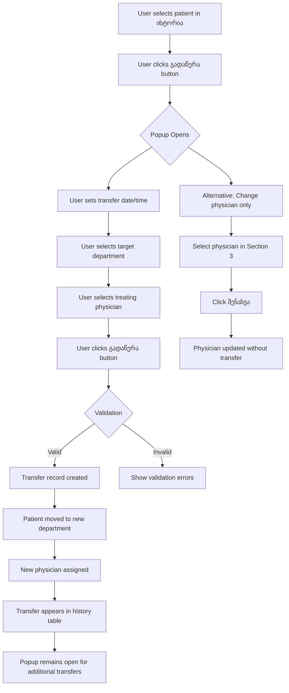

# Patient Departmental Transfer Form (განყოფილებიდან განყოფილებაზე გადაწერა)

## Overview

**Purpose**: Transfer patients between hospital departments with assignment to new treating physicians
**Georgian Name**: განყოფილებიდან განყოფილებაზე გადაწერა
**Context**: Accessed from Patient History (პაციენტის ისტორია > ისტორია) after selecting a patient record
**Button Location**: Third action button labeled "გადაწერა" in the patient history detail view
**URL Context**: http://178.134.21.82:8008/clinic.php (after patient selection)

## Functional Scope

This form manages inter-departmental patient transfers within the hospital system. It handles:
- Transfer date/time specification
- Destination department selection
- Treating physician assignment
- Transfer history tracking
- Diagnosis/nosology movement tracking
- Primary physician selection for the visit

## Form Sections

The გადაწერა popup consists of three main sections:
1. **Department-to-Department Transfer** (განყოფილებიდან განყოფილებაზე გადაწერა)
2. **Nosology Movement** (ნოზოლოგიებზე მოძრაობა)
3. **Treating Physician Selection** (მკურნალი ექიმის არჩევა)

---

## Section 1: Department-to-Department Transfer

### Header Title
**Georgian**: განყოფილებიდან განყოფილებაზე გადაწერა
**English**: Department-to-Department Transfer

### Field Documentation

| Field Label (Georgian) | Field ID/Name | Type | Required | Default Value | Validation | Notes |
|------------------------|---------------|------|----------|---------------|------------|-------|
| (Date/Time) | Unknown ID | DateTime | Yes | Current date/time (2025-11-10 21:19) | Valid datetime format | Displays with date picker button (...) |
| განყოფილება (Department) | `Ros_br` or ID=`trs_dctrtpgr` | Select | Yes | Empty (no selection) | Must select from list | Target department for transfer |
| მკურნალი ექიმი (Treating Physician) | ID=`trs_dctrdoc` | Select | Yes | Empty (no selection) | Must select from list | Physician in target department |
| გადაწერა (Transfer Button) | N/A | Button | N/A | N/A | N/A | Executes the transfer action |

### Department Dropdown Options

**Field ID**: `Ros_br` (or `trs_dctrtpgr`)
**Total Options**: 24 (including 1 empty option)

| Value | Department Name (Georgian) |
|-------|----------------------------|
| (empty) | (Empty option) |
| 18 | კარდიოქირურგია (Cardiosurgery) |
| 620 | სისხლძარღვთა ქირურგია (Vascular Surgery) |
| 735 | კარდიოლოგია (Cardiology) |
| 736 | ამბულატორია (Ambulatory/Outpatient) |
| 981 | არითმოლოგია (Arrhythmology) |
| 3937 | კარდიოქირურგიული განყოფილება (Cardiosurgical Department) |
| 17828 | გადაუდებელი განყოფილება (ER) (Emergency Department) |
| 25119 | ზოგადი ქირურგიის დეპარტამენტი (General Surgery Department) |
| 25612 | პოსტოპი ორი (Post-Op Two) |
| 33965 | კლინიკური ონკოლოგია (Clinical Oncology) |
| 36614 | შინაგან სნეულებათა დეპარტამენტი (Internal Medicine Department) |
| 38129 | კოვიდ განყოფილება (COVID Department) |
| 40908 | ზოგადი რეანიმაცია (General ICU/Resuscitation) |
| 42171 | ტრავმა ორთოპედია (Trauma Orthopedics) |
| 44164 | ნეიროქირურგია (Neurosurgery) |
| 50549 | ონკოლოგია (Oncology) |
| 51442 | ამბულატორიული ონკოლოგია (Ambulatory Oncology) |
| 55320 | ნევროლოგია (Neurology) |
| 59741 | ნევროლოგიური კვლევები (Neurological Studies) |
| 77934 | მიკროქირურგია (Microsurgery) |
| 81437 | პლასტიკური ქირურგია (Plastic Surgery) |
| 90587 | უროლოგია (Urology) |
| 96800 | ჩირქოვანი ქირურგია (Purulent Surgery/Infectious Surgery) |

### Treating Physician Dropdown

**Field ID**: `trs_dctrdoc`
**Total Options**: 235+ physicians (including "-- --" placeholder)
**See**: Full physician list documented in `/patient-history/appendices/physician-list.md`

**First 10 Options**:
1. (Empty)
2. -- --
3. აბშილავა ბესო
4. ადამაშვილი მიხეილ
5. ამბროლაძე შოთა
6. ანანიკოვი ნინო
7. ანჩაბაძე მანანა
8. არაბული ბაკურ
9. არევაძე პაპუნა
10. აროშიძე ლევან

### Transfer History Table

After each transfer, a record appears in the history table with columns:

| Column Header (Georgian) | Description | Data Type |
|--------------------------|-------------|-----------|
| (No header - Row Number) | Sequential number | Integer |
| თარიღი (Date) | Transfer date and time | DateTime (YYYY-MM-DD HH:MM:SS) |
| განყოფილება (Department) | Department name | Text |
| მკურნალი ექიმი (Treating Physician) | Physician name | Text |
| დრო (საათებში) (Time in Hours) | Duration/hours spent | Number |
| (Action column) | Edit/delete actions | Buttons |

**Example Row** (from current patient):
- Row #: 1
- Date: 2025-11-10 20:30:00
- Department: გადაუდებელი განყოფილება (ER)
- Physician: (empty)
- Time (Hours): (empty)

---

## Section 2: Nosology Movement (ნოზოლოგიებზე მოძრაობა)

### Header Title
**Georgian**: ნოზოლოგიებზე მოძრაობა
**English**: Movement on Nosologies (Diagnosis Movement Tracking)

### Purpose
Tracks patient movement across different diagnoses/nosologies during their hospital stay.

### Table Structure

| Column Header (Georgian) | English | Description | Data Type |
|--------------------------|---------|-------------|-----------|
| სად (Where) | Where/Location | Department or location | Text |
| დასახელება (Name/Title) | Name | Diagnosis/Nosology name | Text |
| დაწყება (Start) | Start | Start date/time | DateTime |
| დასრულება (End) | End | End date/time | DateTime |
| საათი (Hours) | Hours | Duration in hours | Number |

**Current State**: Table is empty for this patient (no nosology movement records)

---

## Section 3: Treating Physician Selection (მკურნალი ექიმის არჩევა)

### Header Title
**Georgian**: მკურნალი ექიმის არჩევა
**English**: Treating Physician Selection

### Purpose
Assign or change the primary treating physician for the current patient visit.

### Fields

| Field Label (Georgian) | Field ID/Name | Type | Required | Options Count | Notes |
|------------------------|---------------|------|----------|---------------|-------|
| (Physician Dropdown) | `smvlki` | Select | Yes | 235+ | Same physician list as in Section 1 |
| შენახვა (Save) | N/A | Button | N/A | N/A | Saves physician assignment |

### Related Actions

- **მკურნალი ექიმის გაუქმება** (Cancel Treating Physician): Link to cancel/remove physician assignment
- **ისტორიის ნახვა** (View History): Link to view physician assignment history

### Additional Elements

- **SMS ხელშეკრულებების გააქტიურება**: SMS contract activation section (appears to be a separate feature)
- **თ ა ნ ხ მ ო ბ ა** (Agreement/Consent): Link for agreement/consent functionality

---

## Validation Rules

### Required Fields
1. Transfer Date/Time - must be valid datetime
2. Target Department - must be selected from dropdown
3. Treating Physician - must be selected from dropdown

### Business Logic

1. **Transfer Execution**:
   - When "გადაწერა" button is clicked, system creates a transfer record
   - Patient is moved from current department to selected department
   - New physician is assigned as treating doctor
   - Transfer timestamp is recorded

2. **History Tracking**:
   - Each transfer creates a new row in the history table
   - Previous department/physician information is preserved
   - Time spent in each department can be calculated

3. **Physician Assignment**:
   - Separate physician selection allows changing doctor without full department transfer
   - "შენახვა" button saves the physician change
   - "მკურნალი ექიმის გაუქმება" removes physician assignment

### Constraints
- Cannot transfer to the same department patient is currently in (assumed)
- Physician must belong to selected department (assumed)
- Transfer date cannot be in the future (assumed)

---

## Workflow Sequence



---

## UI Elements

### Popup Structure
- **Close Button**: "×" in top-right corner closes the popup
- **Tab/Section Headers**: Two clickable tabs:
  - "გადაწერა" (Transfer) - currently active
  - "ფაილების საცავი" (File Repository)

### Field Layout
```
┌────────────────────────────────────────────────────────────┐
│  გადაწერა                               ფაილების საცავი ×  │
├────────────────────────────────────────────────────────────┤
│  განყოფილებიდან განყოფილებაზე გადაწერა                    │
│                                                            │
│  [2025-11-10 21:19] [...]  [განყოფილება ▼]              │
│  [მკურნალი ექიმი ▼]  [გადაწერა]                          │
│                                                            │
│  ┌──────────────────────────────────────────────────┐    │
│  │ # │ თარიღი │ განყოფილება │ მკურნალი ექიმი │ დრო │    │
│  ├───┼────────┼──────────────┼────────────────┼─────┤    │
│  │ 1 │ 2025...│ გადაუდებელი..│               │     │    │
│  └──────────────────────────────────────────────────┘    │
│                                                            │
│  ნოზოლოგიებზე მოძრაობა                                    │
│  ┌──────────────────────────────────────────────────┐    │
│  │ სად │ დასახელება │ დაწყება │ დასრულება │ საათი │    │
│  ├─────┼────────────┼─────────┼────────────┼───────┤    │
│  │(Empty table)                                      │    │
│  └──────────────────────────────────────────────────┘    │
│                                                            │
│  მკურნალი ექიმის არჩევა                                   │
│  [მკურნალი ექიმი ▼]  [შენახვა]                            │
│  მკურნალი ექიმის გაუქმება                                 │
│                                                            │
│  ისტორიის ნახვა                                           │
│                                                            │
│  [SMS Icon] SMS ხელშეკრულებების გააქტიურება              │
│  თ ა ნ ხ მ ო ბ ა                                          │
└────────────────────────────────────────────────────────────┘
```

---

## Integration Points

### Data Sources
1. **Department Master Data**: Department list with IDs (18, 620, 735, etc.)
2. **Physician Master Data**: Active physicians list (235+ entries)
3. **Patient Record**: Currently selected patient from ისტორია list
4. **Transfer History**: Historical transfers for this patient
5. **Nosology/Diagnosis Data**: ICD codes or internal diagnosis system

### Related Modules
- **Patient History (ისტორია)**: Source module where this form is accessed
- **Department Management**: Maintains department master data
- **Staff/HR Module**: Maintains physician information
- **Clinical Records**: Updates patient location and attending physician

### Database Operations
- **INSERT**: New transfer record when გადაწერა is executed
- **UPDATE**: Patient's current department and physician
- **SELECT**: Fetch patient's transfer history for display
- **SELECT**: Fetch nosology movement records

---

## Technical Notes

### Field IDs Identified
- `Ros_br` or `trs_dctrtpgr`: Department dropdown in transfer section
- `trs_dctrdoc`: Treating physician dropdown in transfer section
- `smvlki`: Treating physician dropdown in Section 3
- DateTime field: ID unknown (has disabled textbox with date picker button)

### Form Behavior
- Popup modal overlay (blocks background interaction)
- Multiple sections in single popup
- Table auto-populates after transfers
- Form does NOT auto-close after submission (allows multiple transfers)

### Georgian Text Preservation
All Georgian labels preserved exactly as displayed in UI for database compatibility and future reference.

---

## Source Reference

**Extraction Date**: 2025-11-10
**EMR Version**: SoftMedic | ჰელსიკორი
**URL**: http://178.134.21.82:8008/clinic.php
**Navigation Path**: პაციენტის ისტორია > ისტორია > [Select Patient] > გადაწერა button
**Screenshot**: `/Users/toko/Desktop/SoftMedicMap/.playwright-mcp/gadatsera-popup-full.png`

---

## Summary Statistics

- **Total Form Sections**: 3
- **Total Input Fields**: 4 (1 datetime, 3 select dropdowns)
- **Total Buttons**: 3 (გადაწერა, შენახვა, close button)
- **Total Dropdowns**: 3
- **Department Options**: 24
- **Physician Options**: 235+
- **Total Links**: 4 (file repository, cancel physician, view history, agreement)
- **History Tables**: 2 (transfer history, nosology movement)
