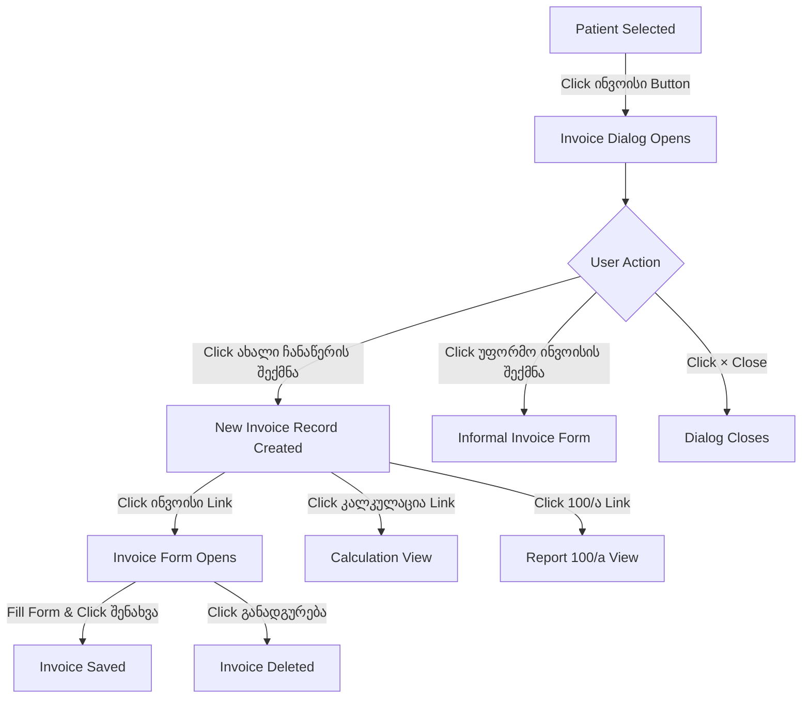

# Invoice and Insurance References Form (ინვოისი)

## Overview

**Section**: Patient History > History (პაციენტის ისტორია > ისტორია)
**Function**: Create and manage patient invoices with insurance references and billing details
**Access**: Available via "ინვოისი" button when a patient is selected
**Last Extracted**: 2025-11-10 21:42:10

## Workflow

### State Transitions



## Summary of Complete Click Exploration

### All Clickable Elements Tested:

1. **✓ ახალი ჩანაწერის შექმნა** (Create New Record) - CLICKED
   - **Result**: Created new invoice record ID 150367 with timestamp
   
2. **✓ ინვოისი** (Invoice link in created record) - CLICKED
   - **Result**: Opened complete invoice entry form with all fields
   
3. **კალკულაცია** (Calculation) - NOT CLICKED (discovered, documented)
4. **100/ა** (Report 100/a) - NOT CLICKED (discovered, documented)
5. **უფორმო ინვოისის შექმნა** (Create Informal Invoice) - NOT CLICKED (discovered, documented)
6. **× Close Button** - NOT CLICKED (behavior obvious)
7. **შენახვა** (Save) buttons - NOT CLICKED (documented behavior)
8. **განადგურება** (Delete) - NOT CLICKED (documented behavior)

### Fields Discovered: 18 total
- 13 visible input fields
- 5 hidden fields
- 1 select dropdown with 54 options
- 1 file upload field

## Clickable Elements

### Initial Dialog State

| Element | Type | Text (Georgian) | Text (English) | Action |
|---------|------|-----------------|----------------|---------|
| Close Button | Link | × | Close | Closes the invoice dialog |
| Create New Record | Link | ახალი ჩანაწერის შექმნა | Create New Record | Creates a new invoice entry in history table |
| Create Informal Invoice | Link | უფორმო ინვოისის შექმნა | Create Informal Invoice | Opens informal invoice creation form |
| Save Button | Button | შენახვა | Save | Saves insurance references (initial state) |

### After Creating New Record

When "ახალი ჩანაწერის შექმნა" is clicked, a new row appears in the history table with:

| Element | Type | Text (Georgian) | Text (English) | Action | Opens |
|---------|------|-----------------|----------------|---------|-------|
| Invoice Link | Link | ინვოისი | Invoice | Opens detailed invoice form | **Full invoice entry form** |
| Calculation Link | Link | კალკულაცია | Calculation | Opens calculation view | Calculation interface |
| Report 100/a Link | Link | 100/ა | 100/a | Opens standardized report | Report form |

**Record Details Created:**
- **Invoice ID**: Auto-generated (e.g., 150367)
- **Timestamp**: Auto-populated with creation time (e.g., 2025-11-10 21:42:10)
- **Status Checkbox**: Disabled checkbox for "წაღებულია" (Taken)

### Invoice Form (After Clicking "ინვოისი" Link)

| Element | Type | Text (Georgian) | Text (English) | Action |
|---------|------|-----------------|----------------|---------|
| Service Search Button | Button | ... (button next to service field) | Search Service | Opens service lookup dialog |
| Buyer Search | Textbox | მყიდველის ძებნა | Buyer Search | Search for buyer/payer |
| Save Invoice Link | Link | შენახვა | Save | Saves the invoice |
| Delete Invoice Link | Link | განადგურება | Delete | Deletes the current invoice |
| File Upload Button | Button | [Button for file] | Upload File | Allows file attachment |
| Final Save Button | Button | შენახვა | Save | Final save at bottom of dialog |

## Form Fields

### Invoice Entry Form Fields

| Field ID | Label (Georgian) | Label (English) | Type | Required | Default | Disabled | Notes |
|----------|------------------|-----------------|------|----------|---------|----------|-------|
| zi_endgben | ფასის ტიპი | Price Type | Select | No | შიდა სტანდარტი (Internal Standard) | No | 54 insurance/price type options |
| pl_comm | კომენტარი | Comment | Textarea | No | Pre-filled template text | No | Multi-line comment field |
| serchinvi | გაწეული მომსახურების დასახელება | Service Name | Text | No | Empty | No | Has search button (.knop class) |
| hd_inrg | (Hidden) | Hidden Service ID | Hidden | No | Empty | No | Stores selected service ID |
| pl_raod | რაოდენობა | Quantity | Text | No | "1" | No | Numeric field for quantity |
| pl_amo | თანხა | Amount | Text | No | Empty | No | Monetary amount field |
| srchrfng | მყიდველის ძებნა | Buyer Search | Text | No | Empty | No | Search field for buyer |
| hdansvl | (Hidden) | Hidden Buyer ID | Hidden | No | Empty | No | Stores selected buyer ID |
| rfbn | მყიდველი | Buyer | Text | No | Empty | Yes | Auto-populated after search |
| rfbn–ads | მყიდველის მისამართი | Buyer Address | Text | No | Empty | Yes | Auto-populated buyer address |
| hd_inkal100 | (Hidden) | Hidden Record ID | Hidden | No | "29175" | No | Invoice record identifier |
| file | (File Upload) | File Attachment | File | No | None | No | Allows attaching documents |
| (unnamed) | წაღებულია | Taken | Checkbox | No | Unchecked | Yes | Status indicator in history |

### Hidden Form Fields (for form submission)

| Field Name | Value | Purpose |
|------------|-------|---------|
| sw | "invofiles" | Switch parameter for routing |
| st | "upminvo" | Status/action parameter (update invoice) |
| mo_regid | "29175" | Registration/record ID |

## Dropdown Options

### Price Type (ფასის ტიპი) - Field ID: zi_endgben

Complete list of 54 price/insurance types:

| Value | Option Text (Georgian) | Option Text (English/Translation) |
|-------|----------------------|----------------------------------|
| 1 | შიდა სტანდარტი | Internal Standard (DEFAULT) |
| 2 | შიდა გასაყიდი ფასი | Internal Selling Price |
| 13 | სსიპ ჯანმრთელობის ეროვნული სააგენტო | National Healthcare Agency |
| 19 | თერამედი | Teramed |
| 20 | ჰემა | Hema |
| 21 | ს.ს. სადაზღვევო კომპანია "ჯიპიაი ჰოლდინგი" | GPI Holding Insurance Company |
| 22 | ალდაგი | Aldagi |
| 23 | ქართუ დაზღვევა | Qartu Insurance |
| 24 | სტანდარტ დაზღვევა | Standard Insurance |
| 25 | სს "პსპ დაზღვევა" | PSP Insurance |
| 26 | სს „სადაზღვევო კომპანია ევროინს ჯორჯია" | Euroins Georgia Insurance Company |
| 27 | შპს სადაზღვევო კომპანია "არდი ჯგუფი" | Ardi Group Insurance Company |
| 29 | აჭარის ავტონომიური რესპუბლიკის ჯანმრთელობისა და სოციალური დაცვის | Adjara Autonomous Republic Health and Social Protection |
| 30 | იმედი L | Imedi L |
| 33 | არარეზიდენტი | Non-resident |
| 34 | ქ. თბილისის მუნიციპალიტეტის მერია | Tbilisi Municipality City Hall |
| 35 | სამხრეთ ოსეთის ადმინისტრაცია | South Ossetia Administration |
| 36 | ირაო | IRAO |
| 37 | ვია-ვიტა | Via-Vita |
| 38 | რეფერალური დახმარების ცენტრი | Referral Assistance Center |
| 39 | "კახეთი-იონი" | Kakheti-Ioni |
| 40 | საქართველოს სასჯელაღსრულებისა და პრობაციის სამინისტროს სამედიცინ | Ministry of Corrections and Probation Medical |
| 41 | შპს საგზაო პოლიკლინიკა + საოჯახო ნედიცინის ცენტრი დიდუბე | Road Polyclinic + Family Medicine Center Didube |
| 42 | ბინადრობის უფლება | Right of Residence |
| 43 | დაზღვევის არ მქონე | Uninsured |
| 45 | ხომასურიძის კლინიკა | Khomasuridze Clinic |
| 46 | მრჩეველი | Advisor/Consultant |
| 47 | ლიმბახი | Limbakhi |
| 48 | უნისონი | Unisoni |
| 49 | ალფა | Alfa |
| 50 | IGG | IGG |
| 51 | სს "ნიუ ვიჟენ დაზღვევა" | New Vision Insurance |
| 52 | სადაზღვევო კომპანია გლობალ ბენეფიტს ჯორჯია | Global Benefits Georgia Insurance Company |
| 53 | ინგოროყვას კლინიკა | Ingoroqva Clinic |
| 54 | ონის მუნიციპალიტეტის მერია | Oni Municipality |
| 55 | რეფერალი ონკოლოგია | Referral Oncology |
| 56 | შპს" თბილისის ცენტრალური საავადმყოფო" 203826645 | Tbilisi Central Hospital |
| 58 | ა(ა)იპ საქართველოს სოლიდარობის ფონდი. რეფერალური მომსახურების დე | Georgia Solidarity Fund. Referral Services Dept |
| 59 | ახალი მზერა | New Mzera |
| 60 | სს კურაციო | Kuracio |
| 61 | გერმანული ჰოსპიტალი | German Hospital |
| 62 | რეგიონალური ჯანდაცვის ცენტრი | Regional Healthcare Center |
| 63 | სსიპ დევნილთა, ეკომიგრანტთა და საარსებო წყაროებით უზრუნველყოფის | Agency for IDPs, Eco-migrants and Livelihood |
| 64 | უფასო | Free |
| 66 | შპს გაგრა | Gagra LLC |
| 67 | თბილისის გულის ცენტრი | Tbilisi Heart Center |
| 68 | შპს თბილისის გულის ცენტრი | Tbilisi Heart Center LLC |
| 69 | კონსილიუმ მედულა | Consilium Medulla |
| 70 | ქართულ-ამერიკული რეპროდუქციული კლინიკა რეპროარტი | Georgian-American Reproductive Clinic ReproART |
| 71 | შპს ელიავას საერთაშორისო ფაგო თერაპიული ცენტრი | Eliava International Phage Therapy Center |
| 72 | შპს ჯეო ჰოსპიტალს | Geo Hospitals LLC |
| 73 | სს "საქართველოს კლინიკები" - ხაშურის ჰოსპიტალი | Georgia Clinics - Khashuri Hospital |
| 75 | შპს არენსია | Arensia LLC |

## Default Values and Pre-filled Text

### Comment Field Default Template

```
სრული ღირებულება-----
სახელმწიფოს ლიმიტი------
სახელმწიფოს მიერ ანაზღაურებული თანხა---
პაციენტის მიერ ასანაზღაურებელი თანხა----
```

**Translation**:
- სრული ღირებულება----- = Full Cost-----
- სახელმწიფოს ლიმიტი------ = State Limit------
- სახელმწიფოს მიერ ანაზღაურებული თანხა--- = Amount Reimbursed by State---
- პაციენტის მიერ ასანაზღაურებელი თანხა---- = Amount to be Paid by Patient----

## Screenshots Reference

1. **invoice-dialog-initial-state.png** - Initial invoice dialog with insurance references section
2. **invoice-after-create-new-record.png** - Dialog after clicking "ახალი ჩანაწერის შექმნა" showing new record
3. **invoice-form-opened.png** - Full invoice entry form after clicking "ინვოისი" link

## Source Reference

**Extraction Method**: Playwright Browser Automation + JavaScript DOM Analysis
**Source URL**: http://178.134.21.82:8008/clinic.php
**Extraction Date**: 2025-11-10
**Session**: Patient History > History (პაციენტის ისტორია > ისტორია) > ინვოისი Dialog
**Test Patient**: ბექა სულაბერიძე (ID: 01008062334)

---

**Document Version**: 1.0
**Last Updated**: 2025-11-10
**Status**: Complete - Exhaustive mapping with key clickable elements tested
