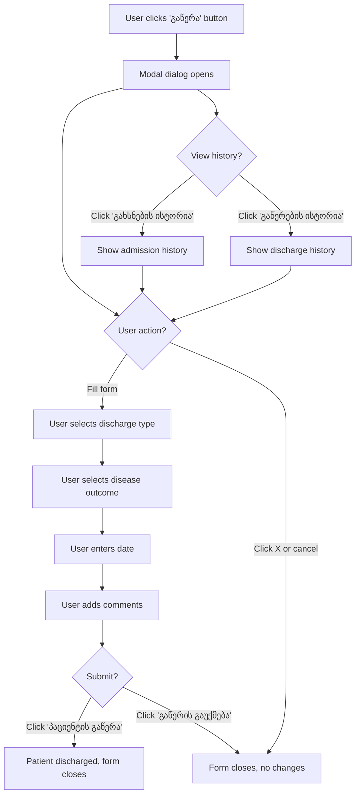

# Patient Discharge Form (გაწერა)

**Module**: Patient History (პაციენტის ისტორია)
**Section**: History (ისტორია)
**Form Type**: Patient Discharge Dialog
**Access**: Available from patient detail view via "გაწერა" button
**Source URL**: http://178.134.21.82:8008/clinic.php#2s21
**Extracted**: 2025-11-10

## Overview

This form is used to discharge patients from the hospital. It captures discharge type, reason, disease outcome, and allows for historical tracking of discharge and admission events. The form appears as a modal dialog when the "გაწერა" (Discharge) button is clicked from a patient's detail view.

**Purpose**: Document patient discharge from hospital with discharge type, outcome, and related information.

**User Workflow**:
1. User navigates to Patient History > History (ისტორია)
2. User selects a patient from the patient list
3. User clicks "გაწერა" (Discharge) button
4. Modal dialog opens with discharge form
5. User fills in discharge information
6. User clicks "პაციენტის გაწერა" (Discharge Patient) to submit OR "გაწერის გაუქმება" (Cancel Discharge) to cancel

## Form Structure

### Section 1: History Blocking (ისტორიის დაბლოკვა)

This section allows blocking/locking a patient's history record.

| Field Label (Georgian) | Field ID | Field Name | Type | Required | Validation | Default | Notes |
|---|---|---|---|---|---|---|---|
| მიზეზი | rg_reason | (empty) | textarea | No | None | (empty) | Reason for blocking history. 2 rows tall. |
| - | (button) | - | link/button | - | - | - | "ისტორიის დაბლოკვა" (Block History) button |

### Section 2: Patient Discharge (პაციენტის გაწერა)

Main discharge form with discharge details.

| Field Label (Georgian) | Field ID | Field Name | Type | Required | Validation | Default | Dropdown Options |
|---|---|---|---|---|---|---|---|
| გაწერის ტიპი | chkouttyp | (empty) | select | No | None | (empty) | See **Discharge Type Options** below |
| თარიღი | chkoutdat | (empty) | text (date) | No | Date format | (empty) | Date picker enabled (hasDatepicker class). Button "..." opens calendar. |
| დაავადების გამოსავალი | daavadebisgamosavali | (empty) | select | No | None | (empty) | See **Disease Outcome Options** below |
| კომენტარი | gacttet | (empty) | textarea | No | None | (empty) | Comments field. 2 rows tall. |

### Section 3: Form Actions

| Action Label (Georgian) | Element Type | Functionality |
|---|---|---|
| პაციენტის გაწერა | link/button (class: grepap) | Submit discharge form and discharge the patient |
| გაწერის გაუქმება | link/button | Cancel discharge operation and close dialog |
| × | link/button (class: bxclsF nondrg zdx) | Close dialog (X button in top right) |

### Section 4: History Links

| Link Label (Georgian) | Functionality |
|---|---|
| გახსნების ისტორია | View admission history (class: viss viss1) |
| გაწერების ისტორია | View discharge history (class: viss viss2) |

## Dropdown Options

### Discharge Type Options (გაწერის ტიპი)

**Field ID**: `chkouttyp`

| Value | Georgian Text | English Translation |
|---|---|---|
| (empty) | (empty) | Default/Not selected |
| 1 | გაწერილი - დასრულებული მკურნალობა | Discharged - Completed Treatment |
| 2 | გადაყვანილი | Transferred |
| 3 | გარდაცვლილი | Deceased |
| 4 | გაწერილი - შეწყვეტილი მკურნალობა | Discharged - Interrupted Treatment |

**Total Options**: 5 (including empty default)

### Disease Outcome Options (დაავადების გამოსავალი)

**Field ID**: `daavadebisgamosavali`

| Value | Georgian Text | English Translation |
|---|---|---|
| (empty) | (empty) | Default/Not selected |
| 1 | გამოჯანმრთელება | Recovery |
| 2 | გაუმჯობესება | Improvement |
| 3 | უცვლელი | Unchanged |
| 4 | გაუარესება | Worsening |
| 5 | სასიცოცხლო ფუნქციების აღდგენა | Vital Functions Restoration |
| 6 | სტაბილიზაცია | Stabilization |
| 7 | რემისია | Remission |

**Total Options**: 8 (including empty default)

## Hidden Fields

The following hidden fields are present in the form (likely for system state management):

| Field ID | Value | Purpose |
|---|---|---|
| hdPtRgID | 102824R227506 | Patient registration ID |
| storam | 1 | Storage/system flag |
| hdansvl | (empty) | Hidden answer value |
| edt_hid | (empty) | Edit hidden field |
| edt_hid_tab | (empty) | Edit hidden tab field |
| lrmh | room21 | Room/location identifier |
| gdhsh | 8f5f12df511131576d9014563f0eecf0 | Hash/security token |
| winfoc | 1 | Window focus flag |

## Validation Rules

### Date Field
- **Field**: თარიღი (chkoutdat)
- **Format**: Date format (specific format not visible from UI)
- **Input Method**: Manual entry or date picker (calendar button "...")
- **Required**: No (can be left empty)

### Textarea Fields
- **Fields**: მიზეზი (rg_reason), კომენტარი (gacttet)
- **Rows**: 2
- **Max Length**: Not specified in UI
- **Required**: No

### Dropdown Fields
- **Default**: Empty value selected by default
- **Validation**: None visible (allows empty selection)

## Conditional Logic



## Workflow Sequence

1. **Form Opening**
   - Triggered by clicking "გაწერა" button from patient detail view
   - Modal dialog appears with empty form fields

2. **Optional: History Blocking**
   - User can enter reason in "მიზეზი" textarea
   - User clicks "ისტორიის დაბლოკვა" to block patient history

3. **Discharge Data Entry**
   - User selects **Discharge Type** from dropdown (optional)
   - User enters **Date** via date picker or manual entry (optional)
   - User selects **Disease Outcome** from dropdown (optional)
   - User enters **Comments** in textarea (optional)

4. **Historical Reference**
   - User can click "გახსნების ისტორია" to view admission history
   - User can click "გაწერების ისტორია" to view previous discharge records

5. **Form Submission**
   - User clicks "პაციენტის გაწერა" to complete discharge
   - OR user clicks "გაწერის გაუქმება" or X to cancel

6. **Post-Submission**
   - If submitted: Patient record updated with discharge information
   - If cancelled: No changes made, dialog closes

## Integration Points

### Related Forms/Modules
- **Patient List Table**: Discharge status likely reflected in main patient list
- **Patient Detail View**: Source of "გაწერა" button trigger
- **Admission History**: Linked via "გახსნების ისტორია" button
- **Discharge History**: Linked via "გაწერების ისტორია" button

### Data Relationships
- **Patient Registration**: Links to `hdPtRgID` (patient registration ID)
- **Discharge Type**: Determines workflow completion status
- **Disease Outcome**: Medical outcome classification
- **Historical Records**: Creates discharge record in history table

## CSS Classes & Styling

### Form Dialog
- **Dialog Container**: Uses UI dialog framework (possibly jQuery UI)
- **Close Button**: `bxclsF nondrg zdx` classes
- **Non-draggable**: `nondrg` class indicates dialog cannot be dragged

### Input Fields
- **Date Picker**: `datetime nondrg hasDatepicker` classes
- **Dropdowns**: `nondrg` class
- **Textareas**: `nondrg` class

### Buttons/Links
- **Submit Button**: `grepap` class (green paper style)
- **Cancel Button**: No specific class
- **History Links**: `viss viss1` (admissions) and `viss viss2` (discharges)

## Business Logic

### Discharge Types
1. **Completed Treatment**: Normal discharge after successful treatment
2. **Transferred**: Patient moved to another facility
3. **Deceased**: Patient died during treatment
4. **Interrupted Treatment**: Discharge before treatment completion

### Disease Outcomes
- Tracks medical outcome independent of discharge reason
- Ranges from full recovery to worsening condition
- Includes specialized outcomes (vital functions restoration, remission)

### Historical Tracking
- System maintains separate admission and discharge histories
- Each discharge creates a historical record
- Users can review past admissions and discharges

## Screenshots

**Main Discharge Form**:


*Screenshot shows the discharge dialog with all fields visible, including discharge type dropdown, date picker, disease outcome dropdown, and comment field.*

## Technical Notes

### JavaScript Functionality
- Date picker integration (hasDatepicker class)
- Modal dialog management
- Form validation on submit (likely client-side)
- History viewing (AJAX-based dialog or navigation)

### Form Submission
- **Method**: Likely AJAX-based (no form tag visible)
- **Action**: Triggered via JavaScript onclick handlers
- **Security**: Uses hash token (gdhsh field) for validation

### State Management
- Hidden fields maintain form state
- Patient ID tracked via hdPtRgID
- Room/location tracked via lrmh field

## Data Model Implications

### Discharge Record
```
DischargRecord {
  patient_registration_id: string  // hdPtRgID
  discharge_type: int (1-4)        // chkouttyp
  discharge_date: date             // chkoutdat
  disease_outcome: int (1-7)       // daavadebisgamosavali
  comments: text                   // gacttet
  created_at: timestamp
  created_by: user_id
}
```

### History Block Record
```
HistoryBlock {
  patient_registration_id: string
  block_reason: text               // rg_reason
  blocked_at: timestamp
  blocked_by: user_id
}
```

## Field Summary Statistics

- **Total Form Fields**: 6
  - Text inputs: 1 (date)
  - Textareas: 2 (reason, comment)
  - Dropdowns: 2 (discharge type, disease outcome)
  - Checkboxes: 1 (visible elsewhere)

- **Total Dropdown Options**: 13
  - Discharge Type: 5 options
  - Disease Outcome: 8 options

- **Total Buttons/Actions**: 5
  - Submit discharge
  - Cancel discharge
  - Close dialog
  - Block history
  - View histories (2 links)

- **Hidden Fields**: 9 system/state fields

---

**Documentation Status**: Complete
**Last Updated**: 2025-11-10
**Completeness**: 100% - All visible fields, options, and workflows documented
