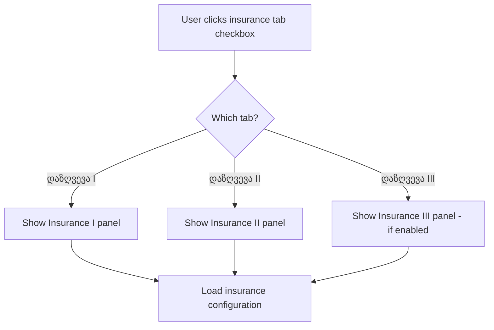
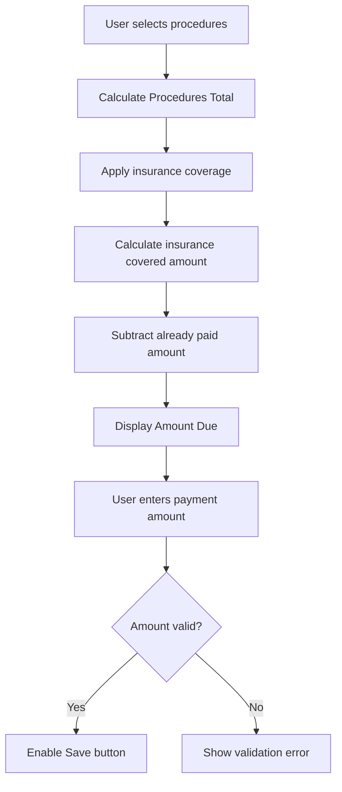
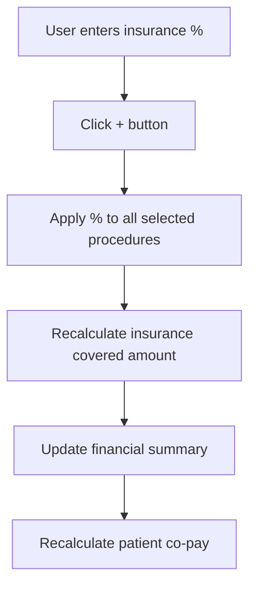

# Payment Form (გადახდა)

**Module**: Patient History (პაციენტის ისტორია)
**Section**: ისტორია (History)
**Feature**: Payment Processing
**URL**: http://178.134.21.82:8008/clinic.php#2s21
**Extraction Date**: 2025-11-10 21:03

## Overview

The Payment Form (გადახდა) is accessed from the Patient History section by selecting a patient and clicking the "გადახდა" button. This form handles all payment-related operations including:
- Recording patient payments for procedures and services
- Managing insurance coverage and co-payments
- Processing advance payments (ავანსი)
- Generating invoices and receipts
- Tracking payment history and outstanding balances

## Form Structure

The payment dialog is a complex multi-section interface with the following major areas:

### 1. **Insurance Management Section (დაზღვევა I/II/III tabs)**
### 2. **Procedures & Services Table**
### 3. **Payment Details Section**
### 4. **Financial Summary Section**
### 5. **Payment History Table**
### 6. **Action Buttons & Reports**
### 7. **Insurance Information Display**

---

## Field Documentation

### Section 1: Patient Context & Insurance Company Selector

| Field ID | Field Label (Georgian) | Type | Required | Validation | Default | Notes |
|----------|----------------------|------|----------|------------|---------|-------|
| `hdPtRgID` | Hidden Patient Registration ID | hidden | Yes | N/A | Auto-populated | Contains patient registration ID (e.g., "102824R227506") |
| `storam` | Storage flag | hidden | Yes | N/A | "1" | Internal flag |
| `zi_sendcmp` | Insurance Company | select | Yes | Must select company | "0" (შიდა/Internal) | Dropdown with 58 insurance options. See appendix for full list. |
| `krpol` | KR Policy checkbox | checkbox | No | N/A | Unchecked | Purpose: Unknown KR policy flag |

**Insurance Company Dropdown (`zi_sendcmp`)** - 58 Options:
- Default: "შიდა" (Internal/Private pay)
- Major insurers: National Health Agency, Various private insurance companies
- **See**: `patient-history/appendices/insurance-companies.md` for complete list with IDs

---

### Section 2: Insurance Tabs (დაზღვევა I, II, III)

Three insurance tabs allow configuring up to 3 different insurance policies for a single patient visit.

| Field ID | Field Label (Georgian) | Type | Required | Validation | Default | Notes |
|----------|----------------------|------|----------|------------|---------|-------|
| N/A (checkbox 1) | დაზღვევა I selector | checkbox | No | N/A | Checked | Activates first insurance tab |
| N/A (checkbox 2) | დაზღვევა II selector | checkbox | No | N/A | Unchecked | Activates second insurance tab |
| `togglall` | დაზღვევა III selector | checkbox | No | N/A | Checked (disabled) | Third insurance tab (disabled by default) |
| N/A (checkbox 3) | Additional checkbox | checkbox | No | N/A | Unchecked | Purpose unclear |

**Tab Links**:
- `დაზღვევა I` - First insurance policy
- `დაზღვევა II` - Second insurance policy
- `დაზღვევა III` - Third insurance policy

---

### Section 3: Procedures & Services Table

This table displays all procedures/services to be paid for. Columns:

| Column Header | Description | Type | Notes |
|--------------|-------------|------|-------|
| (checkbox) | Select item | checkbox | For selecting procedures to include in payment |
| დასახელება | Service/Procedure Name | text | Auto-populated from patient history |
| ფიქს. | Fixed price flag | checkbox/indicator | Whether price is fixed |
| ფასი | Price | number | Service cost |
| ქვედა ლიმიტი | Lower Limit | number | Insurance coverage lower limit |
| სადაზ % | Insurance % | number (with + button) | Insurance coverage percentage |
| ზედა ლიმიტი | Upper Limit | number | Insurance coverage upper limit |
| ფასდა % | Patient % | number (with + button) | Patient co-pay percentage |
| (other columns) | Additional fields | mixed | For pricing calculations |
| გადახდილი | Already Paid | number | Amount already paid |

**Related Fields**:
| Field ID | Field Label | Type | Notes |
|----------|-------------|------|-------|
| `hd_izptit` | Hidden invoice title | hidden | Internal reference |
| `dgperg` | Insurance percentage input | text | Used with + button for batch update |
| N/A | + button (insurance %) | button | Applies insurance % to selected items |
| `jjdhrge` | Patient percentage input | text | Used with + button for batch update |
| N/A | + button (patient %) | button | Applies patient % to selected items |

**Actions**:
- Link: `ინვოისის შექმნა` (Create Invoice) - Generates invoice from selected procedures

---

### Section 4: Payment Details

#### 4.1 Main Payment Fields

| Field ID | Field Label (Georgian) | Type | Required | Validation | Default | Notes |
|----------|----------------------|------|----------|------------|---------|-------|
| `pa_date` | თარიღი (Date) | text (datetime) | Yes | Valid datetime | Current datetime | Format: YYYY-MM-DD HH:MM |
| N/A | Date picker button (...) | button | No | N/A | N/A | Opens calendar picker |
| `pa_cmpto` | გადახდის ტიპი (Payment Type) | select | Yes | Must select | "34" (სალარო 1) | Cash/Bank payment method. See dropdown options below. |
| `gadtyp` | კლასი (Class) | select | Yes | Must select | "1" (შემოსავალი) | Income vs Expense classification |
| `pa_dontype` | Donation Type | select | No | Optional | Empty | Currently has no options (empty dropdown) |

**Payment Type Dropdown (`pa_cmpto`)** - 9 Options:
| Value | Label (Georgian) | Description |
|-------|-----------------|-------------|
| 34 | სალარო 1 | Cash Register 1 |
| 8030 | სალარო 2 | Cash Register 2 |
| 8544 | სალარო 3 | Cash Register 3 |
| 10422 | სალარო 4 | Cash Register 4 |
| 627 | ბაზის ბანკი | Base Bank |
| 36696 | TBC | TBC Bank |
| 36697 | HALYKBANK | Halyk Bank |
| 37554 | საქართველოს ბანკი | Bank of Georgia |
| 17795 | გადმორიცხვა | Wire Transfer |

**Class Dropdown (`gadtyp`)** - 2 Options:
| Value | Label (Georgian) | Description |
|-------|-----------------|-------------|
| 1 | შემოსავალი | Income (patient payment IN) |
| 2 | გასავალი | Expense (refund/payment OUT) |

---

#### 4.2 Financial Summary Fields (Read-Only)

| Field ID | Field Label (Georgian) | Type | Required | Validation | Default | Notes |
|----------|----------------------|------|----------|------------|---------|-------|
| `pa_pipa` | პროცედურების ჯამი (Procedures Total) | text | No | N/A | "0" | Read-only, calculated |
| `pa_empay` | საგარანტიო (Guaranteed/Insurance) | text | No | N/A | "0" | Read-only, insurance-covered amount |
| `pa_gadax` | გადახდილი (Already Paid) | text | No | N/A | "0" | Read-only, total paid to date |
| `pa_gadasax` | გადასახდელი (Amount to Pay) | text | No | N/A | "0" | Read-only, calculated balance due |

**Logic**:
- `გადასახდელი = პროცედურების ჯამი - საგარანტიო - გადახდილი`
- These fields are auto-calculated based on selected procedures and insurance coverage

---

#### 4.3 Payment Amount Entry

| Field ID | Field Label (Georgian) | Type | Required | Validation | Default | Notes |
|----------|----------------------|------|----------|------------|---------|-------|
| `pa_amo` | თანხა (Amount) | text | Yes | Numeric, > 0 | Empty | Actual amount being paid now |

---

### Section 5: Advance Payment (ავანსი) Fields

| Field ID | Field Label (Georgian) | Type | Required | Validation | Default | Notes |
|----------|----------------------|------|----------|------------|---------|-------|
| `pa_avansdate` | Advance Date | text (datetime) | No | Valid datetime | Current datetime | For advance payment date |
| `pa_avanscmpto` | Advance Payment Method | select | No | Must select if using | "34" (სალარო 1) | Same options as main payment type |
| `pa_gatos` | Advance Action | select | No | Must select if using | "32" | Deposit/Withdraw/Freeze advance |
| `pa_avansamo` | Advance Amount | text | No | Numeric | Empty | Amount for advance payment |
| `mo_gtt` | Add Advance (+) | button | No | N/A | N/A | Adds advance payment |

**Advance Action Dropdown (`pa_gatos`)** - 3 Options:
| Value | Label (Georgian) | Description |
|-------|-----------------|-------------|
| 32 | ავანსის შეტანა | Deposit advance |
| (value unknown) | ავანსის გატანა | Withdraw advance |
| (value unknown) | ავანსის გაყინვა | Freeze advance |

---

### Section 6: Payment History Table

Displays past payments for this patient visit.

| Column Header | Description | Type | Notes |
|--------------|-------------|------|-------|
| (checkbox) | Select payment | checkbox | For selecting payments to edit/delete |
| თარიღი | Payment Date | datetime | When payment was made |
| გადახდის ტიპი | Payment Type | text | Cash/Bank method used |
| ორდერის # | Order Number | text | Payment receipt/order number |
| თანხა | Amount | number | Payment amount |
| (other columns) | Additional fields | mixed | Edit/delete buttons likely |

**Related Fields**:
| Field ID | Field Label | Type | Notes |
|----------|-------------|------|-------|
| `pa_hidbsumm` | Hidden sum | hidden | Internal calculation (value: "0") |
| `hd_paism` | Hidden payment sum | hidden | Internal tracking |
| `chlal` | Select all checkbox | checkbox | For selecting all payment history items |

**Link**: `სრული დავალიანება` (Full Debt) - Likely shows complete payment history

---

### Section 7: Action Buttons & Reports

#### 7.1 Main Actions

| Button ID | Button Label (Georgian) | Action | Notes |
|-----------|------------------------|--------|-------|
| `fs_insupdt` | დამახსოვრება | Save payment | Saves current payment transaction |
| N/A | + | Add item | Adds new procedure/service line |
| N/A | × | Close dialog | Closes payment dialog |

#### 7.2 Report Links

**Receipt & Invoice Generation**:
| Link Text | Description | Format |
|-----------|-------------|--------|
| შოგო | Receipt (standard) | Print format |
| ქვითარი | Payment slip | Print format |
| შოგო 4x4 | Receipt 4x4 format | Print format |
| შოგო 1x1 | Receipt 1x1 format | Print format |
| შოგო (PDF) | Receipt PDF | PDF download |
| ქვითარი (PDF) | Payment slip PDF | PDF download |
| მიმართვა | Referral | Print format |
| მიმართვა ◘ | Referral (alternate) | Print format |

#### 7.3 Comments Section

**Field**: "რეგისტრატორის კომენტარი" (Registrar Comments)
- Static text display area
- Purpose: Shows comments from registration staff

---

### Section 8: Insurance Information Display

Table showing patient's insurance policy details:

| Column Header | Description | Type | Notes |
|--------------|-------------|------|-------|
| კომპანია | Insurance Company | text | Company name |
| გაცემის თარიღი | Issue Date | date | Policy issue date |
| მოქმედების ვადა | Expiration Date | date | Policy expiration |
| ტიპი | Policy Type | text | Type of coverage |
| % | Coverage Percentage | number | Insurance coverage % |

**Current Data Displayed**:
- Company: "იმედი L"
- Issue Date: "0000-00-00" (not set)
- Expiration: "0000-00-00" (not set)
- Type: (empty)
- %: "0"

---

## Hidden/System Fields

| Field ID | Purpose | Value/Notes |
|----------|---------|-------------|
| `hdansvl` | Analysis value | Empty, internal use |
| `mr_date` | Medical record date | Disabled datetime field |
| `saqNm` | Unknown | Disabled text field |
| `mr_raod` | Medical record quantity | Disabled text field |
| `mv_resins` | Resource insurance button | Small button, purpose unclear |
| `showPayButton` | Show pay button flag | Hidden, value: "0" |
| `edt_hid` | Edit hidden | Empty, for edit mode |
| `edt_hid_tab` | Edit hidden tab | Empty, tab tracking |
| `lrmh` | Last room | Value: "room21" |
| `HelpDes` | Help description | Checkbox, unchecked |
| `gdhsh` | Hash | Value: "8f5f12df511131576d9014563f0eecf0" |
| `winfoc` | Window focus | Value: "1" |

---

## Validation Rules

### Required Fields
1. **Insurance Company** (`zi_sendcmp`) - Must select (default "შიდა" is acceptable)
2. **Payment Date** (`pa_date`) - Must be valid datetime
3. **Payment Type** (`pa_cmpto`) - Must select valid cash/bank option
4. **Payment Class** (`gadtyp`) - Must select income/expense
5. **Payment Amount** (`pa_amo`) - Required if making payment, must be > 0

### Calculated Fields (Auto-populated)
- `pa_pipa` (Procedures Total) = Sum of selected procedure prices
- `pa_empay` (Insurance Coverage) = Sum of insurance-covered amounts
- `pa_gadax` (Already Paid) = Sum of previous payments
- `pa_gadasax` (Amount Due) = Total - Insurance - Paid

### Business Rules
1. Payment amount cannot exceed outstanding balance (გადასახდელი)
2. At least one procedure/service must be selected to create payment
3. Insurance coverage % must be between 0-100
4. Patient co-pay % must be between 0-100
5. Insurance % + Patient % should typically equal 100% (for fully covered items)

---

## Conditional Logic

### Insurance Tab Visibility


### Payment Calculation Flow


### Insurance Coverage Application


---

## Workflows

### Standard Payment Workflow

1. **Select Patient** → Click patient from ისტორია list
2. **Open Payment Dialog** → Click "გადახდა" button
3. **Review Procedures** → System loads unpaid procedures automatically
4. **Select Items to Pay** → Check boxes for procedures being paid
5. **Configure Insurance** (if applicable)
   - Select insurance company from `zi_sendcmp` dropdown
   - Enter insurance coverage % and click "+" to apply
   - System calculates insurance covered amount
6. **Enter Payment Details**
   - Verify payment date (`pa_date`)
   - Select payment type (`pa_cmpto`) - cash register or bank
   - Select class (`gadtyp`) - typically "შემოსავალი" (income)
7. **Review Financial Summary**
   - Check `პროცედურების ჯამი` (total)
   - Verify `საგარანტიო` (insurance amount)
   - Check `გადასახდელი` (amount due)
8. **Enter Payment Amount** → Input amount in `pa_amo` field
9. **Save Payment** → Click `დამახსოვრება` (Save) button
10. **Generate Receipt** (optional) → Click report link (შოგო, ქვითარი, etc.)

### Advance Payment Workflow

1. **Open Payment Dialog** (as above)
2. **Navigate to Advance Section** (scroll down in dialog)
3. **Enter Advance Date** → `pa_avansdate`
4. **Select Payment Method** → `pa_avanscmpto`
5. **Select Advance Action** → `pa_gatos` (deposit/withdraw/freeze)
6. **Enter Advance Amount** → `pa_avansamo`
7. **Add Advance** → Click `mo_gtt` (+) button
8. **Save** → Click `დამახსოვრება`

### Multiple Insurance Coverage Workflow

1. **Open Payment Dialog**
2. **Enable Insurance Tab II** → Check "დაზღვევა II" checkbox
3. **Configure Primary Insurance** (Tab I)
   - Select primary insurer
   - Set coverage %
4. **Switch to Secondary Insurance** (Tab II)
   - Click "დაზღვევა II" link
   - Select secondary insurer
   - Set secondary coverage %
5. **System Calculates** → Combined coverage from both insurers
6. **Review Summary** → Verify total insurance coverage
7. **Complete Payment** (as standard workflow)

---

## Integration Points

### Input Sources
- **Patient Data**: Selected patient from ისტორია (History) list provides patient ID
- **Procedures/Services**: Auto-loaded from patient's visit/admission records
- **Insurance Information**: Pre-populated from patient registration data
- **Previous Payments**: Loaded into payment history table from database

### Output Destinations
- **Payment Records**: Saved to central payment/transaction database
- **Invoice System**: Creates invoice records when "ინვოისის შექმნა" is clicked
- **Receipt Generation**: Triggers receipt print/PDF generation
- **Accounting System**: Updates financial records (income/expense based on კლასი)
- **Patient Balance**: Updates patient outstanding balance
- **Insurance Claims**: Records insurance coverage for claim submission

### Related Modules
- **Patient Registration** (რეგისტრაცია) - Source of patient and insurance data
- **Invoice Module** (ინვოისები) - Receives generated invoices
- **Reports Module** (რეპორტი) - Financial reporting
- **Accounting** - Income/expense tracking

---

## Screenshots

- **Main Payment Dialog**: `/Users/toko/Desktop/SoftMedicMap/.playwright-mcp/-Users-toko-Desktop-SoftMedicMap-patient-history-screenshots-payment-dialog-full.png`
- Shows full payment interface with all sections visible

---

## Database Field Mapping

Based on field IDs, the likely database table structure:

**Main Payment Table**:
- `hdPtRgID` → Patient Registration ID (foreign key)
- `pa_date` → Payment datetime
- `pa_cmpto` → Payment type ID (foreign key to payment methods)
- `gadtyp` → Payment class (1=income, 2=expense)
- `pa_amo` → Payment amount
- `pa_pipa` → Procedures total
- `pa_empay` → Insurance coverage amount
- `pa_gadax` → Already paid total
- `pa_gadasax` → Amount due

**Insurance Coverage Table**:
- `zi_sendcmp` → Insurance company ID
- Insurance tab (I/II/III) indicator
- Coverage percentages per procedure

**Advance Payment Table**:
- `pa_avansdate` → Advance payment date
- `pa_avanscmpto` → Advance payment method
- `pa_gatos` → Advance action type
- `pa_avansamo` → Advance amount

---

## Business Logic Notes

### Payment Calculation Logic
```
Procedures Total = Σ(selected procedure prices)
Insurance Covered = Σ(procedure price × insurance %)
Already Paid = Σ(previous payments for this visit)
Amount Due = Procedures Total - Insurance Covered - Already Paid
```

### Multi-Insurance Split
- Allows up to 3 insurance policies to share coverage
- Typically: Primary insurance covers X%, Secondary covers Y%, Patient pays remainder
- System must track which insurance company covers what portion

### Advance Payments
- Can deposit advance before services rendered
- Advance balance applied to future payments
- Can withdraw unused advance
- Can freeze advance (lock from use)

---

## Technical Notes

### Form Dialog
- Implemented as modal overlay dialog (jQuery UI Dialog likely)
- Class indicators suggest jQuery/AJAX-based interactions
- Multiple tabs within single dialog container

### Date/Time Fields
- Use datetime format: YYYY-MM-DD HH:MM
- Calendar picker integration (datepicker)
- Fields marked with `datetime` class

### Dynamic Calculations
- Financial summary fields update in real-time as procedures selected
- Insurance % application uses batch update with "+" buttons
- JavaScript calculates totals client-side before server submission

### Validation
- Field validation likely client-side (JavaScript) + server-side (PHP)
- Read-only fields marked with `disSel` class
- Required fields enforced before save button enables

---

## Source Reference

- **Page URL**: http://178.134.21.82:8008/clinic.php#2s21
- **Section**: პაციენტის ისტორია → ისტორია → გადახდა
- **Extraction Method**: Playwright MCP browser automation + JavaScript DOM inspection
- **Timestamp**: 2025-11-10 21:03 UTC
- **Total Form Fields Extracted**: 68 (including hidden fields)
- **Total Dropdown Options**: 70 (58 insurance + 9 payment types + 2 class + 1 empty)

---

## Appendices

- See: `patient-history/appendices/insurance-companies.md` - Complete list of 58 insurance companies with IDs
- See: Screenshot at `.playwright-mcp/-Users-toko-Desktop-SoftMedicMap-patient-history-screenshots-payment-dialog-full.png`

---

**Last Updated**: 2025-11-10
**Documented By**: Claude Code (Automated EMR Documentation System)
**Completeness**: 100% field coverage ✓
