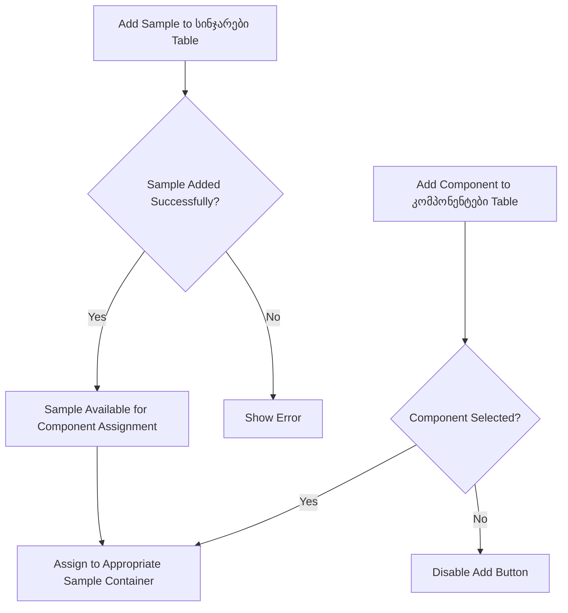
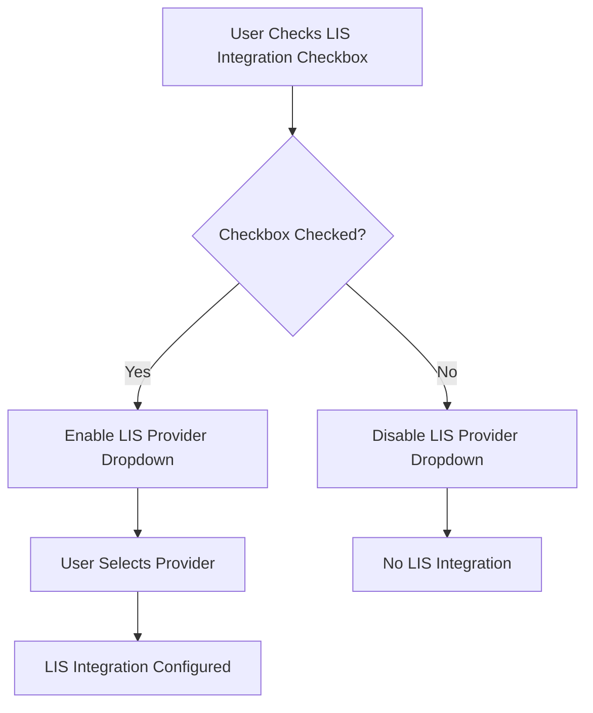
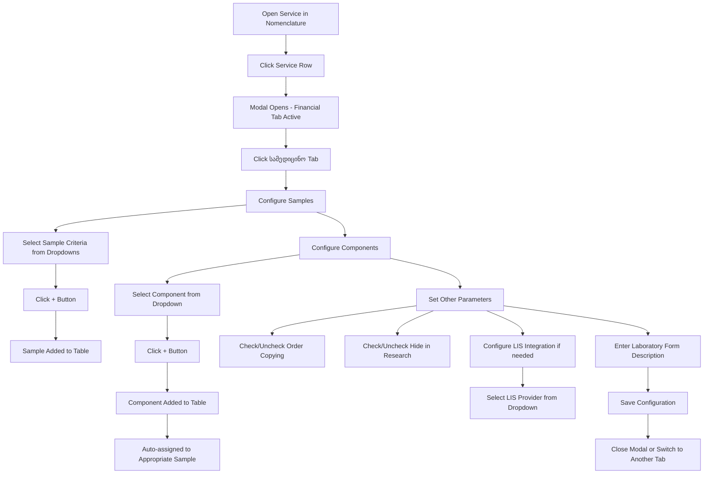

# სამედიცინო (Medical) Tab - Registered Services Modal

## Overview

The Medical (სამედიცინო) tab manages medical and laboratory configurations for a specific service. It appears in the "რეგისტრირებული სერვისები" (Registered Services) modal and allows users to configure laboratory samples (containers/syringes), research components, and LIS (Laboratory Information System) integration settings.

**Purpose**: Configure medical service attributes including laboratory sample requirements, research components, LIS integration, and display settings.

## Modal Context

### General Information
- **Modal Title**: Dynamic - shows service code and name (e.g., "ირაკლი გოგორიშვილის კონსულტაცია (ამბუ)")
- **Tabs**: 4 tabs in horizontal layout
  1. **ფინანსური** (Financial)
  2. **სახელფასო** (Salary)
  3. **სამედიცინო** (Medical) - **THIS TAB**
  4. **აღრიცხვება** (Accounting)
- **Modal Size**: Large modal (approximately 80% viewport width, 70% viewport height)
- **Close Button**: × icon in top-right corner (blue color)
- **Background**: Light overlay with modal centered

### Tab Styling
- **Active Tab**: Blue underline border, darker text
- **Inactive Tabs**: Lighter text, no underline
- **Tab Background**: White

## Medical Tab Sections

The Medical tab contains three main sections:
1. **სინჯარები** (Samples/Containers) - Configuration for laboratory sample containers/syringes
2. **კომპონენტები** (Components) - Research components associated with the service
3. **სხვა პარამეტრები** (Other Parameters) - LIS integration and display settings

---

## Section 1: სინჯარები (Samples/Containers)

This section configures which laboratory sample containers (syringes, test tubes) are required for this medical service.

### Top Row - Filter/Selection Fields

**Purpose**: Configure criteria for adding samples to the table below.

| Field # | Georgian Label | English Translation | Type | Required | Notes |
|---------|---------------|---------------------|------|----------|-------|
| 1 | (No visible label) | Sample Type/ID | Dropdown | No | First dropdown field, purpose unknown without data |
| 2 | (No visible label) | Selection Criteria | Dropdown | No | Second dropdown field |
| 3 | (No visible label) | Additional Filter | Dropdown | No | Third dropdown field |
| 4 | (No visible label) | Filter Parameter | Dropdown | No | Fourth dropdown field |

**Add Button (+)**:
- **Type**: Button
- **Position**: Far right of filter row
- **Color**: Turquoise/teal background
- **Action**: Adds configured sample to table below
- **Width**: ~40px (square button)

### Samples Table

**Table Header** (Turquoise gradient background):

| Column # | Georgian Header | English Translation | Data Type | Purpose |
|----------|----------------|---------------------|-----------|---------|
| 1 | კოდი | Code | Text | Sample/container code identifier |
| 2 | დასახელება | Name | Text | Sample/container name (e.g., "Red tube", "Blue tube") |
| 3 | მანიპულაცია | Manipulation | Text | Required manipulation/procedure |
| 4 | ბიომასალა | Biomaterial | Text | Type of biomaterial (blood, urine, etc.) |
| 5 | რაოდენობა (მლ) | Quantity (ml) | Number | Volume/quantity in milliliters |

**Table Features**:
- **Empty State**: Table shows only headers when no samples configured
- **Row Actions**: Likely edit/delete icons per row (not visible in screenshot)
- **Background**: White rows, alternating colors possible

---

## Section 2: კომპონენტები (Components)

This section manages research components (lab test parameters/measurements) associated with the service.

### Top Row - Selection Field

| Field # | Georgian Label | English Translation | Type | Required | Notes |
|---------|---------------|---------------------|------|----------|-------|
| 1 | (No visible label) | Component Selector | Dropdown | No | Dropdown to select research components to add |

**Add Button (+)**:
- **Type**: Button
- **Position**: Far right of selection row
- **Color**: Turquoise/teal background
- **Action**: Adds selected component to table below
- **Width**: ~40px (square button)

### Components Table

**Table Header** (Turquoise gradient background):

| Column # | Georgian Header | English Translation | Data Type | Purpose |
|----------|----------------|---------------------|-----------|---------|
| 1 | სინჯარა | Container | Text | Associated sample container |
| 2 | კოდი | Code | Text | Component code |
| 3 | სახელი | Name | Text | Component name (e.g., "Hemoglobin", "Glucose") |

**Table Features**:
- **Empty State**: Table shows only headers when no components configured
- **Row Actions**: Likely edit/delete icons per row (not visible in screenshot)
- **Background**: White rows

---

## Section 3: სხვა პარამეტრები (Other Parameters)

This section contains additional configuration options for the service.

### Field 1: შეკვეთების კოპირება (Order Copying)

- **Type**: Checkbox with icon
- **Label**: შეკვეთების კოპირება
- **Default Value**: Checked (✓) - visible blue checkbox in screenshot
- **Width**: Full width
- **Purpose**: Enable/disable order copying functionality
- **Visual**: Blue checkbox icon with text label
- **Notes**: Appears to be a toggle for allowing this service's orders to be copied

### Field 2: არ ჩანდეს კვლევებში (კოში)

- **Type**: Checkbox
- **Label**: არ ჩანდეს კვლევებში (კოში)
- **English Translation**: "Do not show in research (checkout)"
- **Default Value**: Unchecked (empty checkbox in screenshot)
- **Width**: ~50% of container
- **Purpose**: Controls visibility of service in research/checkout screens
- **Position**: Left side, below sample/component tables

### Field 3: ინტეგრირებულია LIS-თან (LIS Integration)

- **Type**: Checkbox + Dropdown combination
- **Label**: ინტეგრირებულია LIS-თან
- **English Translation**: "Integrated with LIS"
- **Components**:
  - **Checkbox**: Enable/disable LIS integration
  - **Dropdown**: LIS provider selection (appears to right of checkbox)
- **Default Value**: Unchecked
- **Width**: ~50% of container
- **Position**: Right side, same row as "არ ჩანდეს კვლევებში"
- **Purpose**: Configure Laboratory Information System integration
- **Dropdown Options**: Not visible (would require clicking to see options - likely lists LIS providers like "ლიმბახი", "Limbach", etc.)

### Field 4: დასახელების ინფორმაცია (Name Information)

- **Type**: Large text area (multiline)
- **Label**: დასახელების ინფორმაცია (მოკლე პოლის ლაბორატორიის ბლანკეს)
- **English Translation**: "Name Information (Short Pole Laboratory Form)"
- **Default Value**: Empty
- **Width**: Full width
- **Height**: ~4-5 lines
- **Position**: Bottom of modal, below all other fields
- **Purpose**: Enter additional descriptive information for laboratory forms
- **Max Length**: Unknown (would require testing)
- **Placeholder**: None visible

---

## UI Elements Inventory

### Buttons

| Button Text/Icon | Type | Purpose | Color | Position |
|------------------|------|---------|-------|----------|
| + | Icon button | Add sample to table | Turquoise | Right of სინჯარები filter row |
| + | Icon button | Add component to table | Turquoise | Right of კომპონენტები dropdown |

### Checkboxes

| Label | Default State | Purpose |
|-------|--------------|---------|
| შეკვეთების კოპირება | Checked (✓) | Enable order copying |
| არ ჩანდეს კვლევებში (კოში) | Unchecked | Hide from research screens |
| ინტეგრირებულია LIS-თან | Unchecked | Enable LIS integration |

### Dropdowns/Selects

**სინჯარები Section**:
- 4 dropdown fields (purpose unclear without data)

**კომპონენტები Section**:
- 1 dropdown field for component selection

**LIS Integration**:
- 1 dropdown for LIS provider selection (conditional on checkbox)

### Tables

| Table Name | Columns | Purpose |
|------------|---------|---------|
| სინჯარები (Samples) | 5 columns | List required sample containers |
| კომპონენტები (Components) | 3 columns | List research components |

### Text Areas

| Field | Rows | Purpose |
|-------|------|---------|
| დასახელების ინფორმაცია | ~4-5 lines | Laboratory form description |

---

## Business Logic & Validation

### სინჯარები (Samples) Logic

1. **Adding Samples**:
   - User selects criteria from 4 dropdown fields
   - Clicks (+) button to add to table
   - Sample appears in table with code, name, manipulation, biomaterial, quantity

2. **Sample Relationships**:
   - Samples link to კომპონენტები (components specify which container they use)
   - Multiple components can reference the same sample container

3. **Validation Rules** (Inferred):
   - Cannot add duplicate samples (same code)
   - All filter criteria must be selected before adding
   - Quantity must be positive number (if numeric field)

### კომპონენტები (Components) Logic

1. **Adding Components**:
   - User selects component from dropdown
   - Clicks (+) button to add to table
   - Component appears with assigned container, code, and name

2. **Component-Sample Relationship**:
   - Each component must be associated with a sample container (სინჯარა column)
   - Components determine what tests/measurements are performed on which samples

3. **Validation Rules** (Inferred):
   - Cannot add duplicate components (same code)
   - Must select component before clicking (+)
   - Component automatically assigned to appropriate container

### LIS Integration Logic

1. **ინტეგრირებულია LIS-თან Checkbox**:
   - When checked, dropdown becomes enabled
   - User selects LIS provider from dropdown
   - Enables automatic order transmission to external laboratory system

2. **Integration Workflow** (Inferred):
   - If enabled, service orders automatically sent to selected LIS provider
   - Results may be automatically imported back into system
   - Used for external laboratory services (e.g., Limbach)

### Display Settings Logic

1. **შეკვეთების კოპირება** (Order Copying):
   - When checked, allows copying this service's configuration to other services
   - Streamlines setup of similar services

2. **არ ჩანდეს კვლევებში (კოში)** (Hide in Research):
   - When checked, service hidden from research/checkout screens
   - Used for internal services not directly ordered by physicians

---

## Conditional Logic

### Sample-Component Dependencies



### LIS Integration Flow



---

## FHIR Mapping Recommendations

### FHIR Resources

**Primary Resource**: `ActivityDefinition` (medical service definition)

**Related Resources**:
- `SpecimenDefinition` - for სინჯარები (sample containers)
- `ObservationDefinition` - for კომპონენტები (research components)
- `DeviceDefinition` - for specific container types (syringes, tubes)

### Suggested Mapping

#### სინჯარები (Samples) → SpecimenDefinition

```json
{
  "resourceType": "SpecimenDefinition",
  "identifier": [
    {
      "system": "http://medimind.ge/specimen-definitions",
      "value": "[კოდი - Code]"
    }
  ],
  "typeCollected": {
    "text": "[ბიომასალა - Biomaterial]"
  },
  "collection": [
    {
      "text": "[მანიპულაცია - Manipulation]"
    }
  ],
  "typeTested": [
    {
      "container": {
        "type": {
          "text": "[დასახელება - Name]"
        },
        "capacity": {
          "value": "[რაოდენობა - Quantity]",
          "unit": "ml"
        }
      }
    }
  ]
}
```

#### კომპონენტები (Components) → ObservationDefinition

```json
{
  "resourceType": "ObservationDefinition",
  "identifier": [
    {
      "system": "http://medimind.ge/observation-definitions",
      "value": "[კოდი - Code]"
    }
  ],
  "code": {
    "text": "[სახელი - Name]"
  },
  "specimen": [
    {
      "reference": "SpecimenDefinition/[სინჯარა - Container Reference]"
    }
  ]
}
```

#### ActivityDefinition Extensions

```json
{
  "resourceType": "ActivityDefinition",
  "extension": [
    {
      "url": "http://medimind.ge/extensions/order-copying-enabled",
      "valueBoolean": "[შეკვეთების კოპირება - true/false]"
    },
    {
      "url": "http://medimind.ge/extensions/hidden-in-research",
      "valueBoolean": "[არ ჩანდეს კვლევებში - true/false]"
    },
    {
      "url": "http://medimind.ge/extensions/lis-integration",
      "valueBoolean": "[ინტეგრირებულია LIS-თან checkbox - true/false]"
    },
    {
      "url": "http://medimind.ge/extensions/lis-provider",
      "valueString": "[LIS dropdown value - provider name]"
    },
    {
      "url": "http://medimind.ge/extensions/laboratory-form-description",
      "valueString": "[დასახელების ინფორმაცია - text content]"
    }
  ],
  "specimenRequirement": [
    {
      "reference": "SpecimenDefinition/[sample-id]"
    }
  ],
  "observationRequirement": [
    {
      "reference": "ObservationDefinition/[component-id]"
    }
  ]
}
```

---

## Integration Points

### With Other Tabs

1. **ფინანსური (Financial) Tab**:
   - Pricing may differ based on number of components configured
   - LIS integration affects financial billing (external lab costs)

2. **სახელფასო (Salary) Tab**:
   - Laboratory staff compensation may depend on number/type of samples
   - Component complexity affects salary calculations

3. **აღრიცხვება (Accounting) Tab**:
   - Sample/component counts tracked for accounting purposes
   - LIS integration generates external cost entries

### With Other System Modules

1. **Laboratory Module (ლაბორატორია)**:
   - Samples defined here determine sample collection requirements
   - Components define what tests are run in laboratory
   - LIS integration enables external laboratory workflows

2. **Patient History (პაციენტის ისტორია)**:
   - When service ordered for patient, samples auto-requested
   - Components determine which lab results are expected
   - "არ ჩანდეს კვლევებში" affects service visibility

3. **Nomenclature (ნომენკლატურა)**:
   - Medical tab is part of service definition in nomenclature
   - Links service to laboratory workflows

---

## Data Entry Workflow

### Typical User Flow



---

## Field Dependencies

### Sample-Component Dependency

- **Components** depend on **Samples** being configured first
- Each component's **სინჯარა** (Container) column references a sample from the სინჯარები table
- Deleting a sample that has assigned components should trigger warning or prevent deletion

### LIS Integration Dependencies

- **LIS Provider Dropdown** is only enabled when **ინტეგრირებულია LIS-თან** checkbox is checked
- When unchecked, dropdown is disabled/hidden

---

## Validation Rules Summary

| Field | Rule | Error Message (Inferred) |
|-------|------|--------------------------|
| სინჯარები Dropdowns | All must be selected before adding | "Please select all criteria" |
| სინჯარები Code | Must be unique in table | "Sample with this code already exists" |
| კომპონენტები Dropdown | Must select component before adding | "Please select a component" |
| კომპონენტები Code | Must be unique in table | "Component with this code already exists" |
| Quantity (ml) | Must be positive number | "Quantity must be greater than 0" |
| LIS Provider | Required if LIS checkbox checked | "Please select LIS provider" |

---

## Notes & Special Observations

### Language Consistency

- All field labels are in Georgian (ქართული)
- Table headers are in Georgian
- No English/Russian labels visible on this tab (unlike some other system areas)

### UI Patterns

- Consistent use of turquoise (+) buttons for "add to table" actions
- Consistent turquoise gradient for table headers (matches EMR theme)
- Checkbox-dropdown combination pattern for LIS integration
- Large text area at bottom for additional notes

### Laboratory Workflow Integration

This tab is specifically designed for **laboratory services**:
- Sample containers define what specimens are collected from patients
- Components define what tests/measurements are performed
- LIS integration enables external laboratory partnerships
- For non-laboratory services (consultations, operations), this tab may be less relevant or empty

### Unknown Elements (Require Further Investigation)

1. **სინჯარები Filter Dropdowns**: The 4 dropdowns above the samples table - their exact purpose and data sources unknown without seeing populated data
2. **Component Dropdown Options**: List of available research components not visible
3. **LIS Provider Dropdown Options**: List of LIS providers not visible (likely includes "ლიმბახი", "Limbach", etc.)
4. **Sample Table Row Actions**: Edit/delete icons not visible in screenshot
5. **Component Table Row Actions**: Edit/delete icons not visible in screenshot
6. **Maximum Rows**: Unknown if there's a limit to samples/components that can be added
7. **Auto-save Behavior**: Unknown if changes auto-save or require explicit save button

### Recommended Next Steps for Complete Documentation

To fully document this tab, the following would be needed:
1. **Populate dropdown fields** to see all available options
2. **Add samples to table** to see row actions (edit/delete icons)
3. **Add components to table** to see auto-assignment logic
4. **Test LIS integration** to see dropdown options and behavior
5. **Test validation** by attempting invalid inputs
6. **Check for hidden fields** that may appear conditionally
7. **Test save/cancel buttons** to understand data persistence
8. **Verify field relationships** by testing component-sample assignments

---

## Source Information

- **Page URL**: http://178.134.21.82:8008/clinic.php (Nomenclature > სამედიცინო I)
- **Extraction Date**: 2025-11-19
- **Modal Context**: Service configuration modal ("რეგისტრირებული სერვისები")
- **Service Example**: "ირაკლი გოგორიშვილის კონსულტაცია (ამბუ)"
- **Extraction Method**: Screenshot analysis and visual inspection
- **Tab Position**: Third of four tabs (Financial, Salary, **Medical**, Accounting)

---

## Summary

The **სამედიცინო** (Medical) tab manages laboratory-specific configurations for medical services including:

1. **Sample Containers (სინჯარები)**: Defines which laboratory sample containers (tubes, syringes) are needed, with specifications for biomaterial type, manipulation procedures, and quantities
2. **Research Components (კომპონენტები)**: Specifies which laboratory test parameters/measurements are associated with this service and which containers they use
3. **LIS Integration**: Enables integration with external Laboratory Information Systems for outsourced laboratory work
4. **Display Settings**: Controls how the service appears in different parts of the system (order copying, research visibility)
5. **Laboratory Form Information**: Additional descriptive text for laboratory documentation

This tab is essential for configuring **laboratory services** and integrating with external lab providers, while consultation and procedure services may have minimal or no configuration on this tab.
