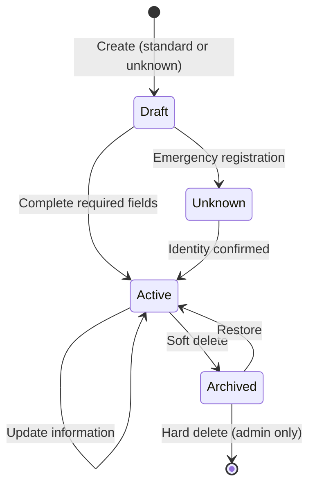
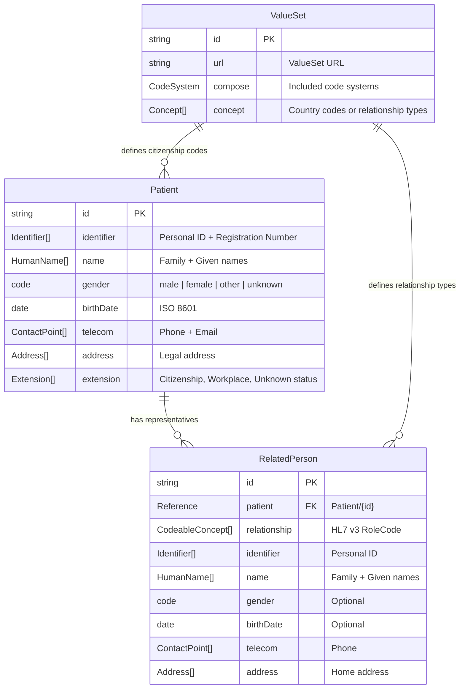

# Data Model: FHIR-Based Patient Registration System

**Feature**: 004-fhir-registration-implementation
**Date**: 2025-11-12
**Purpose**: Define FHIR resource structures, relationships, and data mappings for patient registration

---

## Overview

This data model defines how legacy Georgian hospital EMR patient data maps to FHIR R4 resources. The model supports multilingual operations (Georgian/English/Russian), handles 250 country citizenships, manages representative relationships, and maintains Georgian-specific validation rules.

**Core FHIR Resources**:
- **Patient**: Primary resource for patient demographics and identification
- **RelatedPerson**: Resource for representatives, guardians, and emergency contacts
- **ValueSet**: Reference data for citizenship and relationship types

---

## 1. Patient Resource Structure

### 1.1 Core Patient Resource

```typescript
interface PatientResource extends Patient {
  resourceType: 'Patient';

  // Identifiers
  identifier: [
    {
      system: 'http://medimind.ge/identifiers/personal-id';
      value: string; // 11-digit Georgian national ID (პირადი ნომერი)
      use: 'official';
      type?: {
        coding: [{
          system: 'http://terminology.hl7.org/CodeSystem/v2-0203';
          code: 'NI'; // National identifier
          display: 'National unique individual identifier';
        }];
      };
    },
    {
      system: 'http://medimind.ge/identifiers/registration-number';
      value: string; // Hospital-assigned registration number (რიგითი ნომერი)
      use: 'secondary';
      type?: {
        coding: [{
          system: 'http://terminology.hl7.org/CodeSystem/v2-0203';
          code: 'MR'; // Medical record number
          display: 'Medical record number';
        }];
      };
    }
  ];

  // Name
  name: [
    {
      use: 'official';
      family: string; // Last name (გვარი)
      given: string[]; // First name (სახელი)
      extension?: [
        {
          url: 'http://medimind.ge/fhir/StructureDefinition/patronymic';
          valueString: string; // Father's name (მამის სახელი)
        }
      ];
    }
  ];

  // Demographics
  gender: 'male' | 'female' | 'other' | 'unknown'; // Required
  birthDate?: string; // ISO 8601 date (optional, but typically provided)

  // Contact Information
  telecom?: [
    {
      system: 'phone';
      value: string; // E.164 format: +995XXXXXXXXX
      use: 'mobile' | 'home' | 'work';
    },
    {
      system: 'email';
      value: string; // RFC 5322 format
      use: 'work' | 'home';
    }
  ];

  // Address
  address?: [
    {
      use: 'home';
      type: 'physical';
      text: string; // Legal address (იურიდიული მისამართი)
      city?: string;
      country?: string; // ISO 3166-1 alpha-2 code (e.g., 'GE')
    }
  ];

  // Extensions (Georgian-specific data)
  extension?: [
    {
      url: 'http://medimind.ge/fhir/StructureDefinition/citizenship';
      valueCodeableConcept: {
        coding: [{
          system: 'urn:iso:std:iso:3166';
          code: string; // ISO 3166-1 alpha-2 code
          display?: string; // Georgian country name
        }];
      };
    },
    {
      url: 'http://medimind.ge/fhir/StructureDefinition/workplace';
      valueString?: string; // Workplace (სამუშაო ადგილი)
    },
    {
      url: 'http://medimind.ge/fhir/StructureDefinition/unknown-patient';
      valueBoolean?: boolean; // True for emergency unknown patients
    },
    {
      url: 'http://medimind.ge/fhir/StructureDefinition/arrival-datetime';
      valueDateTime?: string; // For unknown patients
    },
    {
      url: 'http://medimind.ge/fhir/StructureDefinition/registration-notes';
      valueString?: string; // Additional notes for unknown patients
    }
  ];

  // Metadata
  meta?: {
    versionId?: string;
    lastUpdated?: string;
    tag?: [
      {
        system: 'http://medimind.ge/fhir/CodeSystem/patient-status';
        code: 'active' | 'unknown' | 'archived';
        display: string;
      }
    ];
  };
}
```

### 1.2 Patient Field Mappings

| Legacy EMR Field | FHIR Element | Type | Required | Validation |
|------------------|--------------|------|----------|------------|
| `ri_prsno` (პირადი ნომერი) | `identifier[0].value` | string | Conditional* | 11 digits, checksum |
| `ri_hisno` (რიგითი ნომერი) | `identifier[1].value` | string | Auto-generated | Unique, immutable |
| `ri_fname` (სახელი) | `name[0].given[0]` | string | Yes* | Non-empty |
| `ri_lname` (გვარი) | `name[0].family` | string | Yes* | Non-empty |
| `ri_father` (მამის სახელი) | `name[0].extension[0].valueString` | string | No | - |
| `ri_brth` (დაბადების თარიღი) | `birthDate` | date | No | Not future, <120 years |
| `ri_sqs` (სქესი) | `gender` | code | Yes* | male, female |
| `ri_fon`, `ri_meug` (ტელეფონი) | `telecom[system='phone'].value` | string | No | E.164 format |
| `ri_email` (იმეილი) | `telecom[system='email'].value` | string | No | RFC 5322 format |
| `ri_addr` (იურიდიული მისამართი) | `address[0].text` | string | No | - |
| `ri_work` (სამუშაო ადგილი) | `extension[workplace].valueString` | string | No | - |
| `mo_moq` (მოქალაქეობა) | `extension[citizenship].valueCodeableConcept` | CodeableConcept | No | ISO 3166-1 code |

**\* Conditional**: Required for standard registration; optional when `r_anonym` (unknown patient) checkbox is enabled

### 1.3 Identifier Systems

| Identifier Type | System URI | Use | Format | Example |
|----------------|------------|-----|--------|---------|
| Georgian Personal ID | `http://medimind.ge/identifiers/personal-id` | official | 11 numeric digits | `26001014632` |
| Registration Number | `http://medimind.ge/identifiers/registration-number` | secondary | Auto-increment | `98960` |
| Temporary ID (Unknown) | `http://medimind.ge/identifiers/temporary` | temp | `UNK-{timestamp}-{random}` | `UNK-1699564800-a7b3c9` |

### 1.4 Patient Validation Rules

```typescript
// Validation rules enforced at client and server layers
interface PatientValidationRules {
  personalID: {
    required: boolean; // False if unknownPatient = true
    format: /^\d{11}$/; // Exactly 11 digits
    checksum: (id: string) => boolean; // Luhn-variant algorithm
  };

  firstName: {
    required: boolean; // False if unknownPatient = true
    minLength: 1;
    maxLength: 100;
    pattern: /^[\u10A0-\u10FFa-zA-Z\s'-]+$/; // Georgian + Latin + common punctuation
  };

  lastName: {
    required: boolean; // False if unknownPatient = true
    minLength: 1;
    maxLength: 100;
    pattern: /^[\u10A0-\u10FFa-zA-Z\s'-]+$/;
  };

  gender: {
    required: boolean; // False if unknownPatient = true
    enum: ['male', 'female', 'other', 'unknown'];
  };

  birthDate: {
    required: false;
    format: 'YYYY-MM-DD'; // ISO 8601
    max: 'today'; // Cannot be in future
    min: 'today - 120 years'; // Reasonable age limit
  };

  email: {
    required: false;
    pattern: /^[^\s@]+@[^\s@]+\.[^\s@]+$/; // RFC 5322 simplified
  };

  phone: {
    required: false;
    pattern: /^\+\d{10,15}$/; // E.164 format
    defaultCountryCode: '+995'; // Georgia
  };
}
```

### 1.5 Patient State Transitions



**State Definitions**:
- **Draft**: Patient record created but missing required fields (internal state, not exposed)
- **Unknown**: Emergency registration with temporary identifier (`unknownPatient` extension = true)
- **Active**: Complete patient record with all required fields (default state)
- **Archived**: Soft-deleted patient record (retained for audit/reporting)

---

## 2. RelatedPerson Resource Structure

### 2.1 Core RelatedPerson Resource

```typescript
interface RelatedPersonResource extends RelatedPerson {
  resourceType: 'RelatedPerson';

  // Link to Patient
  patient: {
    reference: string; // Format: "Patient/{id}"
    type?: 'Patient';
    display?: string; // Patient name for readability
  };

  // Relationship Type
  relationship: [
    {
      coding: [
        {
          system: 'http://terminology.hl7.org/CodeSystem/v3-RoleCode';
          code: string; // MTH, FTH, SIS, BRO, etc.
          display: string; // English display name
        }
      ];
      text?: string; // Georgian relationship name (e.g., "დედა")
    }
  ];

  // Identifier
  identifier?: [
    {
      system: 'http://medimind.ge/identifiers/personal-id';
      value: string; // 11-digit Georgian national ID
      use: 'official';
    }
  ];

  // Name
  name: [
    {
      use: 'official';
      family: string; // Representative last name
      given: string[]; // Representative first name
    }
  ];

  // Demographics
  gender?: 'male' | 'female' | 'other' | 'unknown';
  birthDate?: string; // ISO 8601 date

  // Contact Information
  telecom?: [
    {
      system: 'phone';
      value: string; // E.164 format
      use: 'mobile' | 'home' | 'work';
    }
  ];

  // Address
  address?: [
    {
      use: 'home';
      text: string; // Representative address
    }
  ];

  // Extensions (Georgian-specific)
  extension?: [
    {
      url: 'http://medimind.ge/fhir/StructureDefinition/relationship-side';
      valueCode?: 'maternal' | 'paternal'; // For general relatives
    }
  ];

  // Active status
  active?: boolean; // Default: true

  // Metadata
  meta?: {
    versionId?: string;
    lastUpdated?: string;
  };
}
```

### 2.2 RelatedPerson Field Mappings

| Legacy EMR Field | FHIR Element | Type | Required | Validation |
|------------------|--------------|------|----------|------------|
| `ri_natlname` (სახელი) | `name[0].given[0]` | string | Conditional* | Non-empty |
| `ri_natfname` (გვარი) | `name[0].family` | string | Conditional* | Non-empty |
| `ri_natpersno` (პირადი ნომერი) | `identifier[0].value` | string | No | 11 digits if provided |
| `ri_natbrth` (დაბადების თარიღი) | `birthDate` | date | No | Not future |
| `ri_natsqs` (სქესი) | `gender` | code | No | male, female, unknown |
| `ri_nattel` (ტელ) | `telecom[0].value` | string | No | E.164 format |
| `ri_nataddr` (მისამართი) | `address[0].text` | string | No | - |
| `mo_natkav` (ნათესავი) | `relationship[0].coding[0].code` | code | Conditional* | HL7 v3 RoleCode |
| Patient reference | `patient.reference` | reference | Yes | Valid Patient ID |

**\* Conditional**: Required when patient is minor (age < 18)

### 2.3 Relationship Type Mappings

| Legacy Value | Georgian Label | HL7 v3 Code | English Display | Extension |
|--------------|----------------|-------------|-----------------|-----------|
| 1 | დედა | MTH | Mother | - |
| 2 | მამა | FTH | Father | - |
| 3 | და | SIS | Sister | - |
| 4 | ძმა | BRO | Brother | - |
| 5 | ბებია | GRMTH | Grandmother | - |
| 6 | ბაბუა | GRFTH | Grandfather | - |
| 7 | შვილი | CHILD | Child | - |
| 8 | მეუღლე | SPS | Spouse | - |
| 9 | ნათესავი | FAMMEMB | Family Member | - |
| 10 | ნათესავი დედის მხრიდან | FAMMEMB | Family Member | maternal |
| 11 | ნათესავი მამის მხრიდან | FAMMEMB | Family Member | paternal |

**Relationship Value Set URL**: `http://medimind.ge/fhir/ValueSet/relationship-types`

### 2.4 RelatedPerson Cardinality Rules

- **One patient** → **Zero or more RelatedPerson resources**
- **Mandatory relationships**: At least one RelatedPerson required when patient age < 18
- **Multiple representatives**: Supported (e.g., both parents for minor patient)
- **Reciprocal relationships**: Not automatically created (one-way Patient → RelatedPerson)

---

## 3. ValueSet Definitions

### 3.1 Citizenship ValueSet

**ValueSet URL**: `http://medimind.ge/fhir/ValueSet/citizenship`
**Purpose**: Country codes for patient citizenship with Georgian, English, and Russian translations

```typescript
interface CitizenshipValueSet {
  resourceType: 'ValueSet';
  id: 'medimind-citizenship';
  url: 'http://medimind.ge/fhir/ValueSet/citizenship';
  version: '1.0.0';
  name: 'MediMindCitizenship';
  title: 'MediMind Citizenship Codes';
  status: 'active';
  description: 'ISO 3166-1 country codes with Georgian translations for patient citizenship';

  compose: {
    include: [
      {
        system: 'urn:iso:std:iso:3166';
        concept: [
          {
            code: 'GE'; // ISO 3166-1 alpha-2
            display: 'საქართველო'; // Georgian (primary)
            designation: [
              { language: 'ka', value: 'საქართველო' },
              { language: 'en', value: 'Georgia' },
              { language: 'ru', value: 'Грузия' }
            ];
          },
          {
            code: 'US';
            display: 'ამერიკის შეერთებული შტატები';
            designation: [
              { language: 'ka', value: 'ამერიკის შეერთებული შტატები' },
              { language: 'en', value: 'United States' },
              { language: 'ru', value: 'Соединенные Штаты' }
            ];
          }
          // ... 248 more countries (total 250)
        ];
      }
    ];
  };
}
```

**Data File Location**: `packages/app/src/emr/translations/citizenship.json`

**JSON Structure**:
```json
{
  "valueSet": "http://medimind.ge/fhir/ValueSet/citizenship",
  "version": "1.0.0",
  "countries": [
    {
      "code": "GE",
      "numeric": "268",
      "displayKa": "საქართველო",
      "displayEn": "Georgia",
      "displayRu": "Грузия"
    },
    {
      "code": "US",
      "numeric": "840",
      "displayKa": "ამერიკის შეერთებული შტატები",
      "displayEn": "United States",
      "displayRu": "Соединенные Штаты"
    }
    // ... 248 more entries
  ]
}
```

### 3.2 Gender ValueSet

**Standard FHIR**: Uses `http://hl7.org/fhir/ValueSet/administrative-gender`

| Code | Georgian Display | English Display | Russian Display |
|------|------------------|-----------------|-----------------|
| male | მამრობითი | Male | Мужской |
| female | მდედრობითი | Female | Женский |
| other | სხვა | Other | Другой |
| unknown | უცნობი | Unknown | Неизвестно |

**Legacy Mapping**: Legacy values 1 (მამრობითი) → `male`, 2 (მდედრობითი) → `female`

---

## 4. Resource Relationships

### 4.1 Entity Relationship Diagram



### 4.2 Resource Search Parameters

**Patient Resource**:
| Parameter | Type | Example | Description |
|-----------|------|---------|-------------|
| `identifier` | token | `http://medimind.ge/identifiers/personal-id\|26001014632` | Search by personal ID or registration number |
| `family` | string | `ხოზვრია` | Search by last name (partial match) |
| `given` | string | `თენგიზი` | Search by first name (partial match) |
| `birthdate` | date | `1986-01-26` | Exact birth date match |
| `gender` | token | `male` | Gender code |
| `phone` | token | `+995500050610` | Phone number (exact match) |
| `email` | token | `patient@example.com` | Email address (exact match) |
| `_sort` | token | `-_lastUpdated` | Sort by most recently updated (descending) |
| `_count` | number | `20` | Page size for pagination |
| `_offset` | number | `0` | Offset for pagination |

**RelatedPerson Resource**:
| Parameter | Type | Example | Description |
|-----------|------|---------|-------------|
| `patient` | reference | `Patient/123` | Search by linked patient ID |
| `relationship` | token | `http://terminology.hl7.org/CodeSystem/v3-RoleCode\|MTH` | Search by relationship type |
| `identifier` | token | `http://medimind.ge/identifiers/personal-id\|12345678901` | Search by representative personal ID |

### 4.3 Search Examples

```typescript
// Search for patient by personal ID
const patient = await medplum.searchOne('Patient', {
  identifier: 'http://medimind.ge/identifiers/personal-id|26001014632'
});

// Search for patients by name
const patients = await medplum.searchResources('Patient', {
  given: 'თენგიზი',
  family: 'ხოზვრია'
});

// Get all representatives for a patient
const representatives = await medplum.searchResources('RelatedPerson', {
  patient: `Patient/${patientId}`
});

// Paginated patient list (newest first)
const bundle = await medplum.search('Patient', {
  _sort: '-_lastUpdated',
  _count: '20',
  _offset: '0'
});
```

---

## 5. Extension Definitions

### 5.1 Patronymic Extension

**URL**: `http://medimind.ge/fhir/StructureDefinition/patronymic`
**Context**: HumanName
**Type**: string
**Cardinality**: 0..1
**Description**: Father's name (მამის სახელი) - Georgian naming tradition

**Example**:
```json
{
  "url": "http://medimind.ge/fhir/StructureDefinition/patronymic",
  "valueString": "გიორგის"
}
```

### 5.2 Citizenship Extension

**URL**: `http://medimind.ge/fhir/StructureDefinition/citizenship`
**Context**: Patient
**Type**: CodeableConcept
**Cardinality**: 0..1
**Description**: Patient's country of citizenship using ISO 3166-1 codes

**Example**:
```json
{
  "url": "http://medimind.ge/fhir/StructureDefinition/citizenship",
  "valueCodeableConcept": {
    "coding": [{
      "system": "urn:iso:std:iso:3166",
      "code": "GE",
      "display": "საქართველო"
    }]
  }
}
```

### 5.3 Workplace Extension

**URL**: `http://medimind.ge/fhir/StructureDefinition/workplace`
**Context**: Patient
**Type**: string
**Cardinality**: 0..1
**Description**: Patient's place of employment (სამუშაო ადგილი)

**Example**:
```json
{
  "url": "http://medimind.ge/fhir/StructureDefinition/workplace",
  "valueString": "თბილისის სახელმწიფო უნივერსიტეტი"
}
```

### 5.4 Unknown Patient Extension

**URL**: `http://medimind.ge/fhir/StructureDefinition/unknown-patient`
**Context**: Patient
**Type**: boolean
**Cardinality**: 0..1
**Description**: Indicates emergency registration with minimal identification

**Example**:
```json
{
  "url": "http://medimind.ge/fhir/StructureDefinition/unknown-patient",
  "valueBoolean": true
}
```

### 5.5 Arrival DateTime Extension

**URL**: `http://medimind.ge/fhir/StructureDefinition/arrival-datetime`
**Context**: Patient
**Type**: dateTime
**Cardinality**: 0..1
**Description**: Timestamp of emergency arrival for unknown patients

**Example**:
```json
{
  "url": "http://medimind.ge/fhir/StructureDefinition/arrival-datetime",
  "valueDateTime": "2025-11-12T14:30:00+04:00"
}
```

### 5.6 Relationship Side Extension

**URL**: `http://medimind.ge/fhir/StructureDefinition/relationship-side`
**Context**: RelatedPerson
**Type**: code
**Cardinality**: 0..1
**Allowed Values**: `maternal`, `paternal`
**Description**: Specifies maternal vs paternal side for general relatives

**Example**:
```json
{
  "url": "http://medimind.ge/fhir/StructureDefinition/relationship-side",
  "valueCode": "maternal"
}
```

---

## 6. Data Integrity Constraints

### 6.1 Business Rules

1. **Unique Personal ID**: No two active patients can have the same Georgian personal ID
   - Enforced via unique index on `Patient.identifier[system='personal-id'].value`
   - Exception: Temporary IDs for unknown patients are exempt

2. **Registration Number Auto-Generation**: Hospital registration number is system-assigned and immutable
   - Generated as auto-increment sequence
   - Format: Numeric, starting from 1

3. **Minor Patient Representative Requirement**: Patients under 18 years old MUST have at least one RelatedPerson
   - Calculated from `Patient.birthDate`
   - Enforced at application layer (not FHIR constraint)

4. **Representative Relationship Validity**: RelatedPerson.relationship MUST use valid HL7 v3 RoleCode
   - Validated against `http://medimind.ge/fhir/ValueSet/relationship-types`
   - Custom codes rejected

5. **Citizenship Code Validity**: Patient citizenship extension MUST use ISO 3166-1 alpha-2 codes
   - Validated against `http://medimind.ge/fhir/ValueSet/citizenship`
   - Invalid codes rejected

6. **Gender Consistency**: Patient and representative genders MUST use FHIR administrative-gender codes
   - Values: `male`, `female`, `other`, `unknown`
   - Legacy numeric codes (1, 2) converted during migration

7. **Date Constraints**:
   - Birth date MUST NOT be in the future
   - Birth date MUST NOT make patient older than 120 years
   - Representative birth date MUST NOT be in the future

8. **Email Format Validation**: Email addresses MUST conform to RFC 5322 (simplified)
   - Pattern: `^[^\s@]+@[^\s@]+\.[^\s@]+$`
   - Enforced at client and server

9. **Phone Number Format**: Phone numbers MUST use E.164 international format
   - Pattern: `^\+\d{10,15}$`
   - Default country code: +995 (Georgia)

10. **Unknown Patient Identifier Uniqueness**: Temporary identifiers for unknown patients MUST be unique
    - Format: `UNK-{timestamp}-{random}`
    - Collision probability: < 1 in 10^9

### 6.2 Referential Integrity

```sql
-- Pseudo-SQL constraints (actual implementation via FHIR server)

-- Patient identifier uniqueness
CREATE UNIQUE INDEX idx_patient_personal_id
ON Patient_Identifier (value)
WHERE system = 'http://medimind.ge/identifiers/personal-id'
  AND meta.tag NOT CONTAINS 'archived';

-- Registration number uniqueness
CREATE UNIQUE INDEX idx_patient_registration_number
ON Patient_Identifier (value)
WHERE system = 'http://medimind.ge/identifiers/registration-number';

-- RelatedPerson to Patient reference
ALTER TABLE RelatedPerson
ADD CONSTRAINT fk_related_person_patient
FOREIGN KEY (patient.reference)
REFERENCES Patient(id)
ON DELETE CASCADE;

-- RelatedPerson relationship code validity
ALTER TABLE RelatedPerson
ADD CONSTRAINT chk_relationship_code
CHECK (relationship.coding.code IN (
  SELECT code FROM ValueSet_Concept
  WHERE valueSet = 'http://medimind.ge/fhir/ValueSet/relationship-types'
));
```

### 6.3 Cascade Behavior

**Patient Deletion**:
- **Soft Delete (Archive)**: Patient marked as archived, RelatedPerson records retained
- **Hard Delete (Admin)**: Patient deleted, all linked RelatedPerson resources cascade delete

**RelatedPerson Deletion**:
- No cascade to Patient (one-way relationship)
- Deleting representative does not affect patient record

---

## 7. Data Migration Strategy

### 7.1 Legacy to FHIR Mapping

**Source**: Legacy EMR database (PostgreSQL)
**Target**: Medplum FHIR server (PostgreSQL with FHIR schema)

**Migration Steps**:

1. **Extract legacy patient records** from `patients` table
2. **Transform to FHIR Patient resources** using field mappings (Section 1.2)
3. **Validate transformed resources** against FHIR R4 schema
4. **Load Patient resources** via Medplum API (`createResource`)
5. **Extract legacy representative records** from `patient_relatives` table
6. **Transform to FHIR RelatedPerson resources** with patient references
7. **Load RelatedPerson resources** via Medplum API
8. **Verify referential integrity** between Patient and RelatedPerson

**Data Transformation Script** (pseudocode):
```typescript
async function migratePatients(legacyDB: Database, medplum: MedplumClient) {
  // Extract legacy records
  const legacyPatients = await legacyDB.query('SELECT * FROM patients');

  for (const legacyPatient of legacyPatients) {
    // Transform to FHIR Patient
    const patient: Patient = {
      resourceType: 'Patient',
      identifier: [
        {
          system: 'http://medimind.ge/identifiers/personal-id',
          value: legacyPatient.ri_prsno,
          use: 'official'
        },
        {
          system: 'http://medimind.ge/identifiers/registration-number',
          value: legacyPatient.ri_hisno,
          use: 'secondary'
        }
      ],
      name: [{
        use: 'official',
        family: legacyPatient.ri_lname,
        given: [legacyPatient.ri_fname],
        extension: legacyPatient.ri_father ? [{
          url: 'http://medimind.ge/fhir/StructureDefinition/patronymic',
          valueString: legacyPatient.ri_father
        }] : undefined
      }],
      gender: legacyPatient.ri_sqs === '1' ? 'male' : 'female',
      birthDate: legacyPatient.ri_brth ? formatDateISO(legacyPatient.ri_brth) : undefined,
      telecom: [
        legacyPatient.ri_fon && {
          system: 'phone',
          value: normalizePhone(legacyPatient.ri_fon),
          use: 'mobile'
        },
        legacyPatient.ri_email && {
          system: 'email',
          value: legacyPatient.ri_email,
          use: 'work'
        }
      ].filter(Boolean),
      address: legacyPatient.ri_addr ? [{
        use: 'home',
        type: 'physical',
        text: legacyPatient.ri_addr
      }] : undefined,
      extension: [
        legacyPatient.mo_moq && {
          url: 'http://medimind.ge/fhir/StructureDefinition/citizenship',
          valueCodeableConcept: {
            coding: [{
              system: 'urn:iso:std:iso:3166',
              code: mapCitizenshipCode(legacyPatient.mo_moq)
            }]
          }
        },
        legacyPatient.ri_work && {
          url: 'http://medimind.ge/fhir/StructureDefinition/workplace',
          valueString: legacyPatient.ri_work
        }
      ].filter(Boolean)
    };

    // Validate and create
    const errors = validateResource(patient);
    if (errors.length > 0) {
      console.error(`Validation failed for patient ${legacyPatient.id}:`, errors);
      continue;
    }

    const createdPatient = await medplum.createResource(patient);
    console.log(`Migrated patient ${createdPatient.id}`);

    // Migrate representatives
    await migrateRepresentatives(legacyDB, medplum, legacyPatient.id, createdPatient.id!);
  }
}
```

### 7.2 Data Validation Checks

Post-migration validation queries:

```typescript
// Verify patient count
const legacyCount = await legacyDB.query('SELECT COUNT(*) FROM patients');
const fhirCount = await medplum.search('Patient', { _summary: 'count' });
assert(legacyCount === fhirCount.total, 'Patient count mismatch');

// Verify no missing personal IDs
const missingIDs = await medplum.searchResources('Patient', {
  identifier: 'http://medimind.ge/identifiers/personal-id',
  _count: '0',
  _summary: 'count'
});
assert(missingIDs.total === 0, 'Patients missing personal ID identifiers');

// Verify representative linkages
const orphanedReps = await medplum.searchResources('RelatedPerson', {
  patient: 'Patient/nonexistent',
  _count: '0',
  _summary: 'count'
});
assert(orphanedReps.total === 0, 'Orphaned RelatedPerson records found');
```

---

## Summary

This data model provides comprehensive FHIR R4 resource definitions for patient registration, including:

1. **Patient Resource**: Complete structure with Georgian-specific extensions (patronymic, citizenship, workplace)
2. **RelatedPerson Resource**: Representative/guardian relationships with HL7 v3 RoleCode mappings
3. **ValueSets**: Citizenship codes (250 countries) and relationship types (11 relationships)
4. **Validation Rules**: Business constraints, referential integrity, and data quality checks
5. **Search Parameters**: Efficient querying for patient lists and representative lookups
6. **Migration Strategy**: Legacy EMR to FHIR transformation patterns

**Next Phase**: API contract generation and developer quickstart guide.

---

**Data Model Date**: 2025-11-12
**FHIR Version**: R4 (4.0.1)
**Status**: ✅ Complete - Ready for API Contract Design
