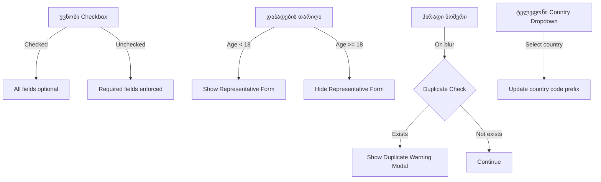
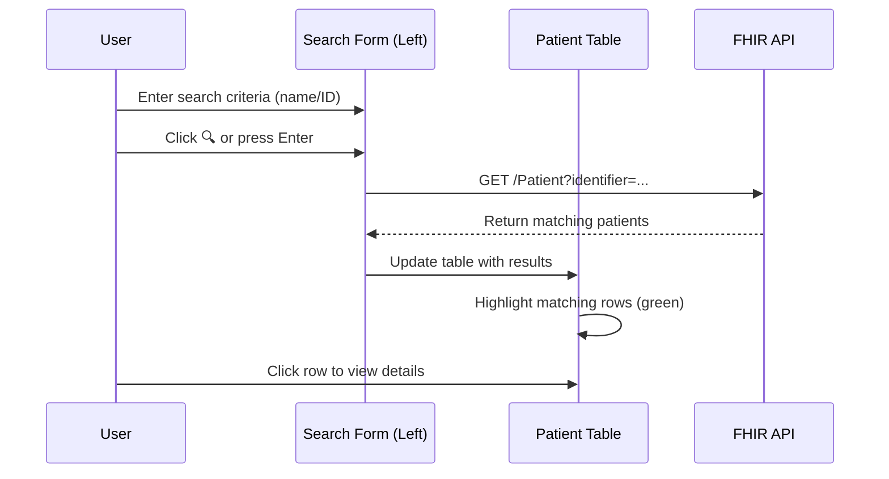
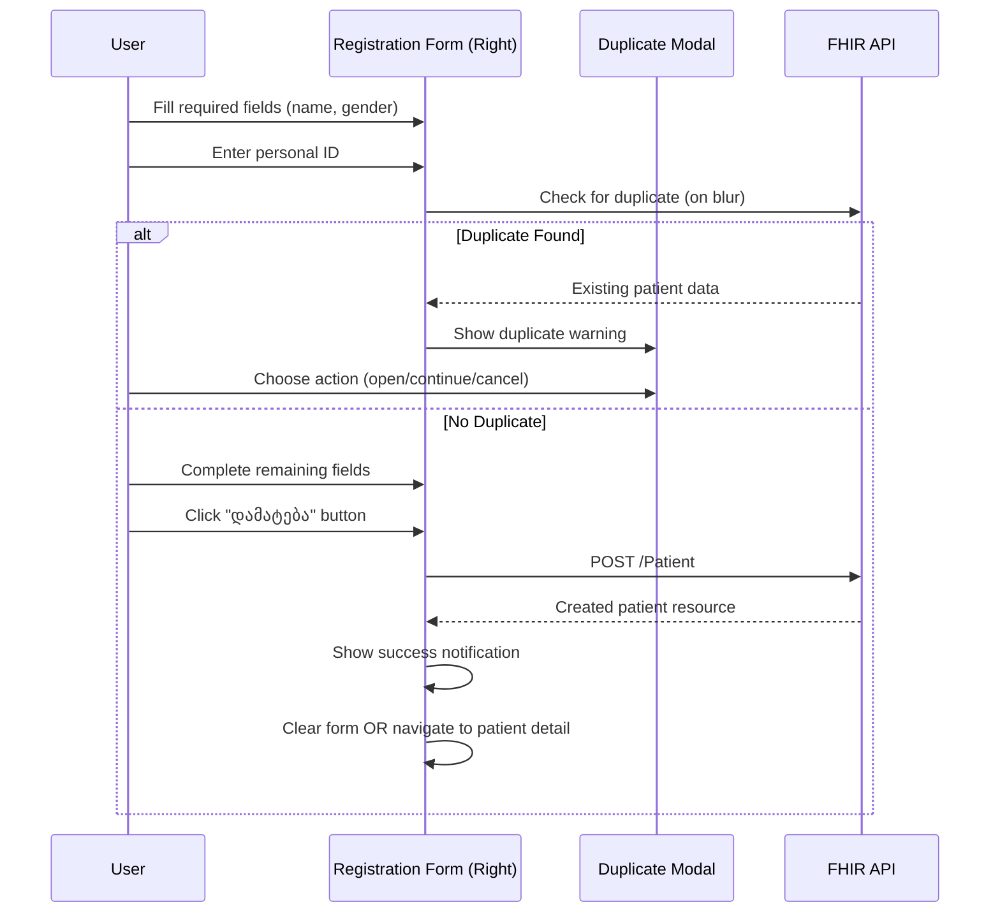
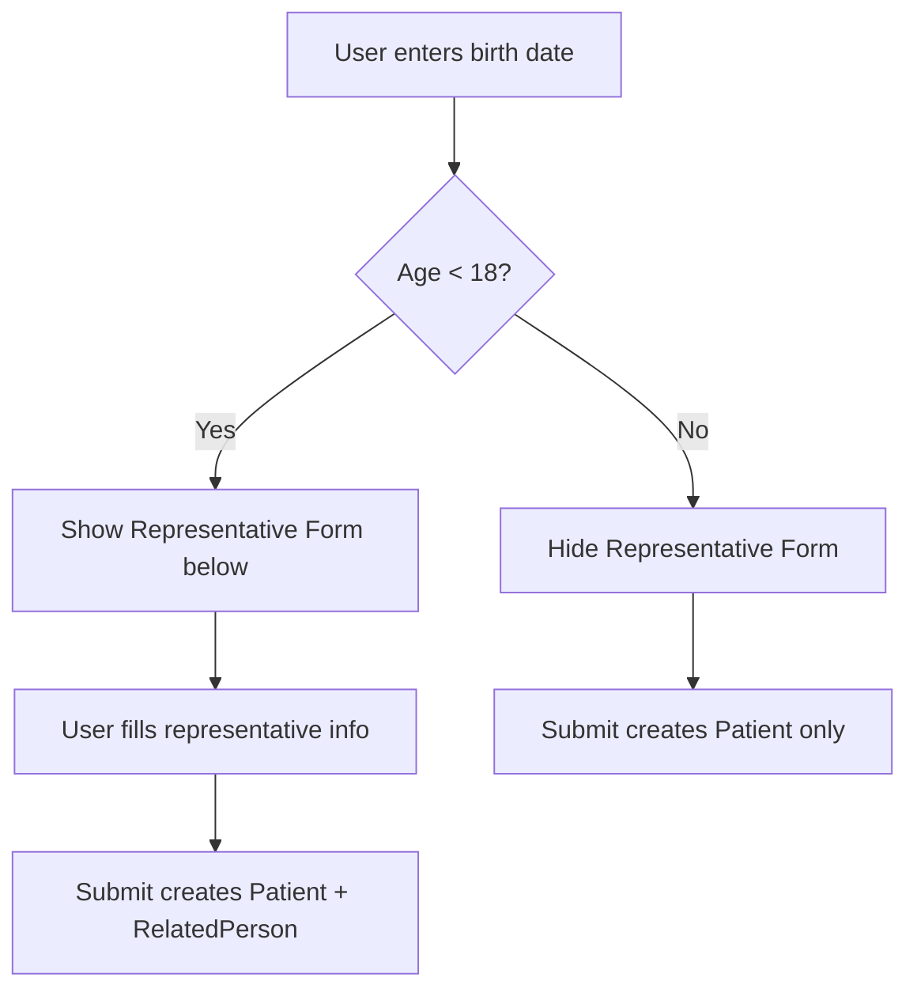

# Original EMR Registration Page - Complete Mapping

**Document Version**: 1.0
**Analysis Date**: 2025-11-13
**Screenshot Source**: Screenshot 2025-11-13 at 00.59.29.png
**Purpose**: Comprehensive documentation of the original EMR registration interface for exact replication

---

## Table of Contents

1. [Overview](#overview)
2. [Page Layout Structure](#page-layout-structure)
3. [Left Section: Patient Search](#left-section-patient-search)
4. [Right Section: Patient Registration Form](#right-section-patient-registration-form)
5. [Bottom Section: Patient List Table](#bottom-section-patient-list-table)
6. [Field-by-Field Mapping](#field-by-field-mapping)
7. [UI Components Analysis](#ui-components-analysis)
8. [Interaction Patterns](#interaction-patterns)
9. [Visual Design Specifications](#visual-design-specifications)
10. [FHIR Mapping](#fhir-mapping)
11. [Gap Analysis](#gap-analysis)
12. [Implementation Recommendations](#implementation-recommendations)

---

## Overview

The original EMR registration page (რეგისტრაციაში) implements a **2-column layout with integrated search and add functionality**. The page combines:

- **Left Column**: Patient search form (მოძებნის ფორმა)
- **Right Column**: Patient add/registration form (პაციენტის დამატება)
- **Bottom Section**: Searchable patient list table with inline actions

This unified approach allows users to search for existing patients and register new ones simultaneously without navigation.

---

## Page Layout Structure

```
┌─────────────────────────────────────────────────────────────────────────┐
│  Top Navigation (TopNavBar - Gray #e9ecef)                             │
├─────────────────────────────────────────────────────────────────────────┤
│  Main Menu (EMRMainMenu - Turquoise active state)                      │
├─────────────────────────────────────────────────────────────────────────┤
│  Sub Menu (HorizontalSubMenu - Turquoise gradient tabs)                │
│  [რეგისტრაციაში][მიმღები][კონტრაქტები][...]                           │
├─────────────────────────────────────────────────────────────────────────┤
│                                                                         │
│  ┌─────────────────────────┬─────────────────────────────────────────┐│
│  │  LEFT COLUMN            │  RIGHT COLUMN                           ││
│  │  (Patient Search)       │  (Patient Registration)                ││
│  │  ~35% width             │  ~65% width                             ││
│  │                         │                                         ││
│  │  ┌───────────────────┐  │  ┌───────────────────────────────────┐ ││
│  │  │ პაციენტის მოძებნა │  │  │ პაციენტის დამატება                │ ││
│  │  │ (Patient Search)  │  │  │ (Patient Add)                     │ ││
│  │  ├───────────────────┤  │  ├───────────────────────────────────┤ ││
│  │  │ სახელი:           │  │  │ პირადი ნომერი:  [________]       │ ││
│  │  │ [______________]  │  │  │                                   │ ││
│  │  │                   │  │  │ სახელი:*        მამის სახელი      │ ││
│  │  │ პირადი ნომერი:    │  │  │ [________]      [________]        │ ││
│  │  │ [______________]  │  │  │                                   │ ││
│  │  │                   │  │  │ გვარი:*         ტელეფონი          │ ││
│  │  │ რეგისტრაცია ნომერი│  │  │ [________]      [+995][555...]    │ ││
│  │  │ [______________]  │  │  │                                   │ ││
│  │  │                   │  │  │ დაბადების თარიღი სქესი             │ ││
│  │  │       [🔍]        │  │  │ [_________]     [dropdown ▼]      │ ││
│  │  │                   │  │  │                                   │ ││
│  │  └───────────────────┘  │  │ იმეილი          მოქალაქეობა       │ ││
│  │                         │  │ [________]      [საქართველო ▼]   │ ││
│  │                         │  │                                   │ ││
│  │                         │  │ მისამართი                         │ ││
│  │                         │  │ [_____________________________]   │ ││
│  │                         │  │                                   │ ││
│  │                         │  │ სამუშაო         ☐ უცნობი        │ ││
│  │                         │  │ [________]                        │ ││
│  │                         │  │                                   │ ││
│  │                         │  │              [დამატება ▼]         │ ││
│  │                         │  │              (Turquoise button)   │ ││
│  │                         │  └───────────────────────────────────┘ ││
│  └─────────────────────────┴─────────────────────────────────────────┘│
│                                                                         │
│  ┌─────────────────────────────────────────────────────────────────┐  │
│  │ BOTTOM SECTION: Patient List Table                             │  │
│  │ (Full-width turquoise header table)                            │  │
│  ├──────┬───────────┬────────┬──────────────┬───────────┬────────┤  │
│  │რეგი# │ პირადი ნ. │ სახელი │    გვარი     │ დაბ.თარ.  │ სქესი │  │
│  ├──────┼───────────┼────────┼──────────────┼───────────┼────────┤  │
│  │99091 │01027072038│ ლაშა   │ ამირანაშვილი │ 23-04-2000│ მამრ..│  │
│  │99090 │62502024035│ გვანცა  │ ჩიჩუა        │ 19-02-1997│ მამრ..│  │
│  │...   │...        │...     │...           │...        │...    │  │
│  └──────┴───────────┴────────┴──────────────┴───────────┴────────┘  │
│                                                                         │
│  [Action Buttons: H Q icons on top-right corner]                       │
└─────────────────────────────────────────────────────────────────────────┘
```

### Layout Specifications

| Component | Width | Position | Background |
|-----------|-------|----------|------------|
| Left Column (Search) | ~35% | Left | White/Light gray (#f8f9fa) |
| Right Column (Add) | ~65% | Right | White |
| Patient Table | 100% | Bottom | Turquoise header (#17a2b8) |
| Form Containers | Auto | Padded | White with subtle border |

---

## Left Section: Patient Search

### Section Header
- **Georgian Label**: "პაციენტის მოძებნა" (Patient Search)
- **Background**: Light gray (#f1f3f5)
- **Font**: Bold, medium size (~16px)

### Search Form Fields

#### 1. სახელი (Name)
- **Type**: Text input
- **Label**: "სახელი:" (Name)
- **Placeholder**: None visible
- **Required**: No
- **Validation**: None
- **Purpose**: Search by first name

#### 2. გვარი (Last Name)
- **Type**: Text input
- **Label**: "გვარი:" (Last Name)
- **Placeholder**: None visible
- **Required**: No
- **Validation**: None
- **Purpose**: Search by last name

#### 3. პირადი ნომერი (Personal ID)
- **Type**: Text input
- **Label**: "პირადი ნომერი:" (Personal ID)
- **Placeholder**: None visible
- **Max Length**: 11 digits
- **Required**: No
- **Validation**: Numeric only
- **Purpose**: Search by 11-digit Georgian personal ID

#### 4. რეგისტრაცია ნომერი (Registration Number)
- **Type**: Text input
- **Label**: "რეგისტრაცია ნომერი:" (Registration Number)
- **Placeholder**: None visible
- **Required**: No
- **Validation**: None
- **Purpose**: Search by hospital-assigned registration number

### Search Button
- **Icon**: 🔍 Magnifying glass (search icon)
- **Position**: Centered below all search fields
- **Color**: Default/Gray
- **Behavior**: Triggers search in table below
- **Keyboard Shortcut**: Enter key (assumed)

### Visual Design
- **Container**: White box with light gray border
- **Padding**: ~16px
- **Field Spacing**: ~12px vertical between fields
- **Label Style**: Left-aligned, colon after text
- **Input Style**: Light border, white background

---

## Right Section: Patient Registration Form

### Section Header
- **Georgian Label**: "პაციენტის დამატება" (Patient Add)
- **Background**: Light gray (#f1f3f5)
- **Font**: Bold, medium size (~16px)

### Form Layout
The form uses a **2-column grid layout** for most fields, with some spanning full width.

### Form Fields (Top to Bottom, Left to Right)

#### Row 1: Personal ID + Unknown Checkbox

**პირადი ნომერი (Personal ID)**
- **Type**: Text input
- **Label**: "პირადი ნომერი:" (Personal ID)
- **Placeholder**: None visible
- **Max Length**: 11 digits
- **Required**: Yes (unless "უცნობი" checked)
- **Validation**: 11-digit numeric with Luhn checksum
- **Position**: Top row, full width
- **Icon**: Small info icon (ℹ️) next to label
- **Tooltip**: Likely explains format (11 digits)

**უცნობი (Unknown Patient)**
- **Type**: Checkbox
- **Label**: "უცნობი" (Unknown)
- **Position**: Top-right corner of form
- **Required**: No
- **Behavior**: When checked, relaxes required field validation
- **Purpose**: Emergency/unknown patient registration

#### Row 2: First Name + Father's Name

**სახელი (First Name)**
- **Type**: Text input
- **Label**: "სახელი:*" (First Name) - Asterisk indicates required
- **Placeholder**: None visible
- **Required**: Yes (unless "უცნობი" checked)
- **Validation**: Non-empty string
- **Position**: Left column

**მამის სახელი (Father's Name/Patronymic)**
- **Type**: Text input
- **Label**: "მამის სახელი" (Father's Name)
- **Placeholder**: None visible
- **Required**: No
- **Validation**: None
- **Position**: Right column
- **Note**: Georgian naming convention - patronymic

#### Row 3: Last Name + Phone

**გვარი (Last Name)**
- **Type**: Text input
- **Label**: "გვარი:*" (Last Name) - Asterisk indicates required
- **Placeholder**: None visible
- **Required**: Yes (unless "უცნობი" checked)
- **Validation**: Non-empty string
- **Position**: Left column

**ტელეფონი (Phone)**
- **Type**: Phone input with country code dropdown
- **Label**: "ტელეფონი" (Phone)
- **Format**: [Country Flag Dropdown] + [Phone Number Field]
- **Country Code**: Default "+995" (Georgia) with flag icon 🇬🇪
- **Placeholder**: "555 12 34 56" (Georgian mobile format)
- **Required**: No
- **Validation**: Phone number format
- **Position**: Right column
- **Country Dropdown**: Shows flag icon, allows selection of country code
- **Number Format**: Space-separated groups (3-2-2-2 digits)

#### Row 4: Birth Date + Gender

**დაბადების თარიღი (Birth Date)**
- **Type**: Date picker
- **Label**: "დაბადების თარიღი" (Birth Date)
- **Format**: DD-MM-YYYY or calendar picker
- **Required**: No
- **Validation**: Must be in past, not > 120 years ago
- **Position**: Left column
- **Behavior**: Triggers minor detection if age < 18

**სქესი (Gender)**
- **Type**: Dropdown select
- **Label**: "სქესი" (Gender)
- **Options**:
  - მამრობითი (Male)
  - მდედრობითი (Female)
  - სხვა (Other) - likely
- **Required**: Yes (unless "უცნობი" checked)
- **Position**: Right column
- **Default**: None selected (placeholder shown)

#### Row 5: Email + Citizenship

**იმეილი (Email)**
- **Type**: Email input
- **Label**: "იმეილი" (Email)
- **Placeholder**: None visible
- **Required**: No
- **Validation**: RFC 5322 email format
- **Position**: Left column

**მოქალაქეობა (Citizenship)**
- **Type**: Searchable dropdown
- **Label**: "მოქალაქეობა" (Citizenship)
- **Default**: "საქართველო" (Georgia)
- **Options**: 250 countries in Georgian
- **Required**: No (defaults to Georgia)
- **Position**: Right column
- **Icon**: Dropdown arrow (▼)
- **Searchable**: Yes (type to filter)

#### Row 6: Address (Full Width)

**მისამართი (Address)**
- **Type**: Text input (single line)
- **Label**: "მისამართი" (Address)
- **Placeholder**: None visible
- **Required**: No
- **Validation**: None
- **Position**: Full width row
- **Note**: Not textarea - single line input

#### Row 7: Workplace

**სამუშაო (Workplace)**
- **Type**: Text input
- **Label**: "სამუშაო" (Workplace/Occupation)
- **Placeholder**: None visible
- **Required**: No
- **Validation**: None
- **Position**: Left column (right side empty in this row)

### Submit Button

**დამატება (Add/Register)**
- **Type**: Submit button with dropdown
- **Label**: "დამატება" (Add)
- **Color**: **Turquoise gradient** (#17a2b8 to #20c4dd)
- **Position**: Bottom-right of form
- **Size**: Medium-large (~120px width, ~40px height)
- **Icon**: Dropdown arrow (▼) - suggests additional actions
- **Text Color**: White
- **Style**:
  - Gradient background (turquoise)
  - Rounded corners (~4px)
  - White text
  - Drop shadow
- **Behavior**:
  - Primary action: Register patient
  - Dropdown may reveal: "Save and Continue", "Save and New", etc.

### Visual Design (Right Column)

- **Container**: White box with light border
- **Padding**: ~16px
- **Field Spacing**: ~12px vertical between rows
- **Label Style**:
  - Left-aligned above field
  - Asterisk (*) for required fields
  - Font size: ~14px
- **Input Style**:
  - Light gray border (#ced4da)
  - White background
  - ~36px height
  - Full-width within column
- **Grid**: 2-column with ~12px gap
- **Required Indicator**: Red asterisk (*) after label

---

## Bottom Section: Patient List Table

### Table Header
- **Background**: **Turquoise gradient** (#17a2b8 to #20c4dd)
- **Text Color**: White
- **Font Weight**: Bold
- **Height**: ~40px

### Table Columns (Left to Right)

| Column | Georgian Label | English | Width | Type | Sortable | Notes |
|--------|---------------|---------|-------|------|----------|-------|
| 1 | რეგისტრ. # | Registration Number | ~80px | Text | Yes | Hospital-assigned ID |
| 2 | პირადი ნომერი | Personal ID | ~120px | Text | Yes | 11-digit Georgian ID |
| 3 | სახელი | First Name | ~100px | Text | Yes | Patient first name |
| 4 | გვარი | Last Name | ~150px | Text | Yes | Patient last name |
| 5 | დაბ. თარიღი | Birth Date | ~110px | Date | Yes | Format: DD-MM-YYYY |
| 6 | სქესი | Gender | ~100px | Text | No | მამრობითი/მდედრობითი |
| 7 | ტელეფონი | Phone | ~130px | Text | No | With country code |
| 8 | მისამართი | Address | ~150px | Text | No | Truncated with ... |
| 9 | მოქმედებები | Actions | ~100px | Icons | No | Edit/Delete buttons |

### Table Row Data (Visible Rows Analysis)

**Row 1 (Highlighted in Light Green)**
- **რეგისტრ. #**: 99091
- **პირადი ნომერი**: 01027072038
- **სახელი**: ლაშა (Lasha)
- **გვარი**: ამირანაშვილი (Amiranashvili)
- **დაბ. თარიღი**: 23-04-2000
- **სქესი**: მამრობითი (Male)
- **ტელეფონი**: (Not fully visible)
- **მისამართი**: საქართველო, ქალა... (Georgia, Kala...)
- **Note**: Light green background (#c6efce) indicates selected/highlighted row

**Row 2 (Highlighted in Light Green)**
- **რეგისტრ. #**: 99090
- **პირადი ნომერი**: 62502024035
- **სახელი**: გვანცა (Gvantsa)
- **გვარი**: ჩიჩუა (Chichua)
- **დაბ. თარიღი**: 19-02-1997
- **სქესი**: მამრობითი (Male)
- **ტელეფონი**: ; 995591225890 (Format: ; +995...)
- **მისამართი**: სოხუმი, ძ.ევგენიძის... (Sokhumi...)

**Row 3**
- **რეგისტრ. #**: 99080
- **პირადი ნომერი**: 62007011312
- **სახელი**: ლენა (Lena)
- **გვარი**: ხვიდელიანი (Khvideliani)
- **დაბ. თარიღი**: 30-01-1973
- **სქესი**: მამრობითი (Male)
- **ტელეფონი**: ; 995555585562
- **მისამართი**: გარდაბან. ბბოლო მეგა... (Gardabani...)

**Row 4 (Highlighted in Light Green - 1700100**5968)**
- **რეგისტრ. #**: 99076
- **პირადი ნომერი**: 17001005968 (Green background on this cell)
- **სახელი**: გია (Gia)
- **გვარი**: ეტერიშვილი (Eterishvili)
- **დაბ. თარიღი**: 08-06-1966
- **სქესი**: მამრობითი (Male)
- **ტელეფონი**: ; 995511277686
- **მისამართი**: საქართველო, განის... (Georgia, Ganis...)

### Row Highlighting
- **Light Green Background** (#c6efce): Selected/matched rows (possibly search results)
- **White Background**: Unselected rows
- **Alternating**: No striped pattern visible

### Table Actions (Per Row)

**Edit Button** (✏️ Pencil icon)
- **Position**: Actions column, left side
- **Color**: Gray/blue on hover
- **Behavior**: Opens patient edit form
- **Tooltip**: Likely "რედაქტირება" (Edit)

**Delete Button** (🗑️ Trash icon)
- **Position**: Actions column, right side
- **Color**: Gray/red on hover
- **Behavior**: Prompts confirmation, then deletes patient
- **Tooltip**: Likely "წაშლა" (Delete)

### Table Features

**Sorting**
- Sortable columns have clickable headers
- Likely ascending/descending toggle
- Visual indicator (arrow) on active sort

**Pagination**
- Not visible in screenshot
- Likely at bottom of table
- Format: Page numbers or Previous/Next buttons

**Row Selection**
- Click row to select (light green highlight)
- Multiple selection possible (Ctrl+Click)

**Search Highlight**
- Matched personal IDs shown with green background
- Indicates search result matches

### Visual Design (Table)

- **Border**: Table has outer border and column separators
- **Cell Padding**: ~8px horizontal, ~6px vertical
- **Font Size**: ~13px for data
- **Header Font**: ~14px, bold, white
- **Row Height**: ~36px
- **Text Truncation**: Long text shows "..." (ellipsis)
- **Alignment**:
  - Registration #: Right-aligned
  - Text fields: Left-aligned
  - Actions: Center-aligned

---

## Field-by-Field Mapping

### Complete Field Inventory

| # | Georgian Label | English | Field Type | Required | Max Length | Validation | Default | FHIR Path |
|---|---------------|---------|------------|----------|------------|------------|---------|-----------|
| 1 | სახელი (Search) | First Name | text | No | - | - | - | Patient.name[0].given[0] |
| 2 | გვარი (Search) | Last Name | text | No | - | - | - | Patient.name[0].family |
| 3 | პირადი ნომერი (Search) | Personal ID | text | No | 11 | Numeric | - | identifier[system=personal-id].value |
| 4 | რეგისტრაცია ნომერი (Search) | Registration Number | text | No | - | - | - | identifier[system=reg-number].value |
| 5 | პირადი ნომერი (Form) | Personal ID | text | Yes* | 11 | Luhn checksum | - | identifier[0].value |
| 6 | სახელი (Form) | First Name | text | Yes* | - | Non-empty | - | name[0].given[0] |
| 7 | მამის სახელი | Father's Name | text | No | - | - | - | name[0].extension[patronymic].valueString |
| 8 | გვარი (Form) | Last Name | text | Yes* | - | Non-empty | - | name[0].family |
| 9 | ტელეფონი | Phone | tel + country | No | - | Phone format | +995 | telecom[system=phone].value |
| 10 | დაბადების თარიღი | Birth Date | date | No | - | Past date, < 120y | - | birthDate |
| 11 | სქესი | Gender | select | Yes* | - | - | - | gender |
| 12 | იმეილი | Email | email | No | - | RFC 5322 | - | telecom[system=email].value |
| 13 | მოქალაქეობა | Citizenship | select | No | - | ISO 3166 | GE | extension[citizenship].valueCodeableConcept |
| 14 | მისამართი | Address | text | No | - | - | - | address[0].text |
| 15 | სამუშაო | Workplace | text | No | - | - | - | extension[workplace].valueString |
| 16 | უცნობი | Unknown Patient | checkbox | No | - | - | false | extension[unknown-patient].valueBoolean |

**Note**: * = Required unless "უცნობი" (Unknown Patient) is checked

### Field Dependencies



---

## UI Components Analysis

### Component Breakdown

#### 1. Phone Input Component (Complex)

**Structure**:
```
┌──────────────────────────────────┐
│ [Flag ▼] [555 12 34 56]         │
│  +995    Phone Number            │
└──────────────────────────────────┘
```

**Parts**:
- **Country Flag Dropdown**:
  - Width: ~60px
  - Shows flag icon (🇬🇪 for Georgia)
  - Dropdown arrow
  - Searchable list of countries
  - Updates phone prefix
- **Phone Number Field**:
  - Width: Remaining space
  - Format: Space-separated digits
  - Placeholder: "555 12 34 56"
  - Auto-formatting as user types

**Behavior**:
- Selecting country updates prefix (e.g., +995 → +1)
- Phone field validates based on selected country
- Combined value: "{countryCode}{phoneNumber}"

**Implementation Note**: This is a custom component or library like `react-phone-input-2`

#### 2. Citizenship Dropdown (Searchable)

**Features**:
- 250 countries
- Multilingual (Georgian/English/Russian)
- Searchable/filterable
- Default: საქართველო (Georgia)
- Stores ISO 3166-1 alpha-2 code (e.g., "GE")

**Display Format**:
```
Current Language = Georgian:
  საქართველო
  ამერიკის შეერთებული შტატები
  ...
```

#### 3. Unknown Patient Checkbox

**Behavior**:
- **Unchecked**: Standard registration
  - Personal ID required
  - First name required
  - Last name required
  - Gender required
- **Checked**: Emergency registration
  - All fields optional
  - Can register with minimal data
  - Flag patient record as "unknown"
  - Can be updated later when identity confirmed

#### 4. Patient Table Component

**Features**:
- Sortable columns
- Search highlighting (green background)
- Row selection (light green)
- Inline actions (edit/delete)
- Pagination (not visible but implied)
- Responsive column widths

**Row Actions**:
```
[✏️ Edit] [🗑️ Delete]
```

#### 5. Submit Button with Dropdown

**Design**:
```
┌──────────────────┐
│ დამატება      ▼ │  ← Turquoise gradient
└──────────────────┘
```

**Possible Dropdown Actions**:
- Save (Default action)
- Save and Continue Editing
- Save and Add New
- Save and View Patient

---

## Interaction Patterns

### User Workflows

#### Workflow 1: Search Existing Patient



#### Workflow 2: Register New Patient



#### Workflow 3: Unknown Patient Registration

```mermaid
flowchart TD
    A[User checks "უცნობი" checkbox] --> B[All fields become optional]
    B --> C[User fills available information]
    C --> D[Click "დამატება"]
    D --> E[Patient created with unknown flag]
    E --> F[Patient appears in table with special indicator]
    F --> G[Can be updated later with full info]
```

#### Workflow 4: Minor Registration (with Representative)



### Keyboard Shortcuts

| Key | Context | Action |
|-----|---------|--------|
| Enter | Search form | Trigger search |
| Enter | Registration form | Submit form (if focused on button) |
| Escape | Any form | Clear/cancel |
| Ctrl+Enter | Registration form | Quick submit |
| Tab | Any form | Navigate fields |

### Form Validation Timing

| Field | When Validated | Type |
|-------|---------------|------|
| პირადი ნომერი | On blur | Async (duplicate check) |
| სახელი | On submit | Sync (non-empty) |
| გვარი | On submit | Sync (non-empty) |
| იმეილი | On blur | Sync (regex) |
| დაბადების თარიღი | On change | Sync (date range) |
| ტელეფონი | On blur | Sync (format) |

---

## Visual Design Specifications

### Color Palette

| Color Name | Hex Code | Usage |
|------------|----------|-------|
| Turquoise Primary | #17a2b8 | Table header, submit button, active states |
| Turquoise Light | #20c4dd | Gradient end, hover states |
| Turquoise Dark | #138496 | Gradient start, borders |
| Light Green Highlight | #c6efce | Selected table rows, search matches |
| Light Gray Background | #f8f9fa | Section headers, search container |
| Border Gray | #ced4da | Input borders, container borders |
| Text Dark | #212529 | Primary text |
| Text Muted | #6c757d | Labels, secondary text |
| White | #ffffff | Backgrounds, button text |
| Red Accent | #dc3545 | Required field indicators, validation errors |

### Typography

| Element | Font Size | Font Weight | Color | Notes |
|---------|-----------|-------------|-------|-------|
| Section Headers | 16px | Bold (700) | #212529 | "პაციენტის მოძებნა" |
| Form Labels | 14px | Medium (500) | #212529 | Field labels |
| Input Text | 14px | Normal (400) | #212529 | User input |
| Table Header | 14px | Bold (700) | #ffffff | White on turquoise |
| Table Data | 13px | Normal (400) | #212529 | Table cells |
| Button Text | 14px | Medium (500) | #ffffff | Submit button |
| Required Indicator | 14px | Bold (700) | #dc3545 | Red asterisk (*) |

### Spacing & Sizing

| Element | Value | Notes |
|---------|-------|-------|
| Container Padding | 16px | All sides |
| Field Vertical Spacing | 12px | Between form rows |
| Field Horizontal Gap | 12px | Between columns in 2-col grid |
| Input Height | 36px | Standard input fields |
| Button Height | 40px | Submit button |
| Table Row Height | 36px | Data rows |
| Table Header Height | 40px | Header row |
| Border Radius | 4px | Inputs, buttons, containers |
| Border Width | 1px | All borders |

### Gradients

**Turquoise Gradient (Horizontal)**:
```css
background: linear-gradient(90deg, #138496 0%, #17a2b8 50%, #20c4dd 100%);
```

**Usage**: Table header, submit button

### Shadows

**Container Shadow**:
```css
box-shadow: 0 1px 3px rgba(0, 0, 0, 0.1);
```

**Button Shadow**:
```css
box-shadow: 0 2px 4px rgba(0, 0, 0, 0.15);
```

### Borders

**Input Border**:
```css
border: 1px solid #ced4da;
```

**Container Border**:
```css
border: 1px solid #dee2e6;
```

**Table Border**:
```css
border: 1px solid #dee2e6;
border-collapse: collapse;
```

### Responsive Breakpoints

| Breakpoint | Layout Change |
|------------|---------------|
| < 768px | Stack columns vertically (search above form) |
| < 992px | Table scrolls horizontally |
| >= 1200px | Full 2-column layout with table below |

---

## FHIR Mapping

### Patient Resource Structure

```json
{
  "resourceType": "Patient",
  "identifier": [
    {
      "system": "http://medimind.ge/identifiers/personal-id",
      "value": "26001014632",
      "use": "official"
    },
    {
      "system": "http://medimind.ge/identifiers/registration-number",
      "value": "99091",
      "use": "secondary"
    }
  ],
  "name": [
    {
      "use": "official",
      "family": "ხოზვრია",
      "given": ["თენგიზი"],
      "extension": [
        {
          "url": "http://medimind.ge/fhir/StructureDefinition/patronymic",
          "valueString": "მერაბის"
        }
      ]
    }
  ],
  "gender": "male",
  "birthDate": "1986-01-26",
  "telecom": [
    {
      "system": "phone",
      "value": "+995500050610",
      "use": "mobile"
    },
    {
      "system": "email",
      "value": "test@example.com"
    }
  ],
  "address": [
    {
      "use": "home",
      "text": "თბილისი, ვაჟა-ფშაველას 33"
    }
  ],
  "extension": [
    {
      "url": "http://medimind.ge/fhir/StructureDefinition/citizenship",
      "valueCodeableConcept": {
        "coding": [
          {
            "system": "urn:iso:std:iso:3166",
            "code": "GE",
            "display": "საქართველო"
          }
        ]
      }
    },
    {
      "url": "http://medimind.ge/fhir/StructureDefinition/workplace",
      "valueString": "საქართველოს ბანკი"
    },
    {
      "url": "http://medimind.ge/fhir/StructureDefinition/unknown-patient",
      "valueBoolean": false
    }
  ]
}
```

### FHIR Search Parameters (for Search Form)

```typescript
// Search by first name
GET /Patient?given=თენგიზი

// Search by last name
GET /Patient?family=ხოზვრია

// Search by personal ID
GET /Patient?identifier=http://medimind.ge/identifiers/personal-id|26001014632

// Search by registration number
GET /Patient?identifier=http://medimind.ge/identifiers/registration-number|99091

// Combined search
GET /Patient?given=თენგიზი&family=ხოზვრია&identifier=http://medimind.ge/identifiers/personal-id|26001014632

// With pagination
GET /Patient?_count=20&_offset=0&_sort=-_lastUpdated
```

---

## Gap Analysis

### Current Implementation vs. Original EMR

#### ✅ What's Already Implemented (Correct)

1. **Patient Form Fields**: All form fields exist with correct labels
2. **Validation Rules**: Georgian ID validation, email validation, birthdate validation
3. **Citizenship Support**: 250 countries with Georgian translations
4. **Duplicate Detection**: Personal ID duplicate checking
5. **Unknown Patient**: Checkbox with conditional validation
6. **Representative Form**: Auto-shown for minors
7. **FHIR Mapping**: Correct resource structure
8. **Patient Search**: Basic search functionality
9. **Patient Table**: Basic table with actions

#### ❌ What's Missing (Critical Gaps)

1. **2-Column Layout**: Current implementation uses separate pages for search and registration
   - **Original**: Side-by-side layout (search left, form right)
   - **Current**: Separate routes (`/patient-list` and `/new-patient`)
   - **Impact**: HIGH - Fundamentally different UX

2. **Integrated Search + Add**: No unified view
   - **Original**: Both forms visible simultaneously
   - **Current**: Must navigate between pages
   - **Impact**: HIGH - User must click back/forth

3. **Phone Input with Country Dropdown**: Missing custom phone component
   - **Original**: Country flag dropdown + formatted phone field
   - **Current**: Simple text input with +995 prefix
   - **Impact**: MEDIUM - Less user-friendly for international numbers

4. **Search Button Styling**: Different placement
   - **Original**: Centered icon button (🔍)
   - **Current**: Standard button with text
   - **Impact**: LOW - Visual only

5. **Submit Button Dropdown**: Missing dropdown functionality
   - **Original**: "დამატება ▼" with dropdown menu
   - **Current**: Simple submit button
   - **Impact**: MEDIUM - Missing "Save and..." options

6. **Table Search Highlighting**: Missing visual feedback
   - **Original**: Matched rows/cells have light green background (#c6efce)
   - **Current**: No search highlighting
   - **Impact**: MEDIUM - Harder to see search results

7. **Registration Number Search**: Missing field in search form
   - **Original**: Dedicated "რეგისტრაცია ნომერი" search field
   - **Current**: Not present
   - **Impact**: MEDIUM - Users can't search by reg number

8. **Action Buttons (H, Q icons)**: Missing top-right action buttons
   - **Original**: Two icon buttons top-right corner
   - **Current**: Not present
   - **Impact**: MEDIUM - Unknown functionality (help? quick actions?)

9. **Field Layout Differences**:
   - **Original**: Address is single-line text input
   - **Current**: Address is textarea (multi-line)
   - **Impact**: LOW - Functional difference

10. **Visual Design Mismatches**:
    - **Original**: Turquoise gradient buttons and headers
    - **Current**: Mantine default blue theme
    - **Impact**: MEDIUM - Brand inconsistency

#### ⚠️ What's Different (Behavior Variations)

1. **Search Trigger**:
   - **Original**: Immediate search on button click
   - **Current**: Search with debounce (good UX improvement)

2. **Pagination**:
   - **Original**: Not visible in screenshot (unclear)
   - **Current**: Implemented with Mantine Pagination

3. **Form Submission**:
   - **Original**: Likely clears form after save
   - **Current**: Navigates to patient detail page

4. **Table Sorting**:
   - **Original**: Implied clickable headers
   - **Current**: Not implemented (static table)

---

## Implementation Recommendations

### Phase 1: Critical Layout Restructuring (HIGH PRIORITY)

#### Task 1: Create Unified Registration Page Component

**Goal**: Combine search and registration into single 2-column view

**File**: `packages/app/src/emr/views/registration/UnifiedRegistrationView.tsx`

**Structure**:
```tsx
export function UnifiedRegistrationView(): JSX.Element {
  return (
    <Box style={{ display: 'flex', gap: '16px', padding: '16px' }}>
      {/* Left Column: Search (35%) */}
      <Paper style={{ flex: '0 0 35%' }}>
        <PatientSearchForm onSearch={handleSearch} />
      </Paper>

      {/* Right Column: Registration (65%) */}
      <Paper style={{ flex: '0 0 65%' }}>
        <PatientRegistrationForm onSubmit={handleSubmit} />
      </Paper>
    </Box>

    {/* Bottom Section: Table (100% width) */}
    <Box style={{ padding: '16px', marginTop: '16px' }}>
      <PatientTable patients={searchResults} />
    </Box>
  );
}
```

**Routing Update**:
```tsx
// Replace in AppRoutes.tsx
<Route path="/emr/registration/receiver" element={<UnifiedRegistrationView />} />
// Remove or deprecate:
// <Route path="/emr/registration/patient-list" element={<PatientListView />} />
// <Route path="/emr/registration/new-patient" element={<PatientRegistrationView />} />
```

#### Task 2: Extract PatientSearchForm Component

**File**: `packages/app/src/emr/components/registration/PatientSearchForm.tsx`

**Fields** (from left column):
- სახელი (First Name)
- გვარი (Last Name) - **ADD THIS FIELD**
- პირადი ნომერი (Personal ID)
- რეგისტრაცია ნომერი (Registration Number) - **ADD THIS FIELD**

**Layout**:
- Single column (full width)
- Centered search icon button (🔍)
- Section header: "პაციენტის მოძებნა"

#### Task 3: Update PatientForm Layout

**Changes**:
- Add section header: "პაციენტის დამატება"
- Change address from Textarea to TextInput
- Update button style to turquoise gradient
- Add dropdown functionality to submit button

### Phase 2: Advanced Components (MEDIUM PRIORITY)

#### Task 4: Implement International Phone Input

**Options**:
1. Use library: `react-phone-input-2` or `react-international-phone`
2. Custom component with country selector

**Component**: `packages/app/src/emr/components/registration/InternationalPhoneInput.tsx`

**Features**:
- Country flag dropdown (default: Georgia 🇬🇪)
- Auto-formatting as user types
- Validation based on selected country
- Store value as: `{countryCode}{phoneNumber}`

**Replace in PatientForm.tsx**:
```tsx
<InternationalPhoneInput
  label={t('registration.patient.phone' as any)}
  value={form.values.phoneNumber}
  onChange={(value) => form.setFieldValue('phoneNumber', value)}
  defaultCountry="GE"
/>
```

#### Task 5: Add Registration Number Search

**Update**: `PatientSearchForm.tsx`

**Add Field**:
```tsx
<TextInput
  label="რეგისტრაცია ნომერი"
  placeholder="Registration number"
  value={filters.registrationNumber}
  onChange={(e) => handleFilterChange('registrationNumber', e.target.value)}
/>
```

**Update Search Service**: `patientService.ts`
```typescript
export async function searchPatients(
  medplum: MedplumClient,
  filters: SearchFilters
): Promise<Patient[]> {
  const params: any = {};

  if (filters.registrationNumber) {
    params.identifier = `http://medimind.ge/identifiers/registration-number|${filters.registrationNumber}`;
  }

  // ... existing filters
}
```

#### Task 6: Table Search Highlighting

**Update**: `PatientTable.tsx`

**Add Props**:
```tsx
interface PatientTableProps {
  patients: Patient[];
  searchFilters?: SearchFilters; // NEW
  onDelete: (patientId: string) => void;
}
```

**Conditional Styling**:
```tsx
<Table.Tr
  style={{
    backgroundColor: isMatchingRow(patient, searchFilters)
      ? '#c6efce' // Light green
      : 'transparent'
  }}
>
  <Table.Td
    style={{
      backgroundColor: isMatchingCell(patient.identifier, searchFilters?.personalId)
        ? '#c6efce'
        : 'inherit'
    }}
  >
    {getPersonalId(patient)}
  </Table.Td>
</Table.Tr>
```

#### Task 7: Submit Button with Dropdown

**Component**: `packages/app/src/emr/components/registration/SubmitDropdownButton.tsx`

**Features**:
- Primary action: "დამატება" (Register)
- Dropdown menu:
  - შენახვა და გაგრძელება (Save and Continue)
  - შენახვა და ახალი (Save and New)
  - შენახვა და ნახვა (Save and View)

**Implementation**:
```tsx
<Menu position="bottom-end">
  <Menu.Target>
    <Button
      rightSection={<IconChevronDown size={16} />}
      style={{
        background: 'linear-gradient(90deg, #138496, #17a2b8, #20c4dd)'
      }}
    >
      დამატება
    </Button>
  </Menu.Target>
  <Menu.Dropdown>
    <Menu.Item onClick={() => onSubmit('continue')}>
      შენახვა და გაგრძელება
    </Menu.Item>
    <Menu.Item onClick={() => onSubmit('new')}>
      შენახვა და ახალი
    </Menu.Item>
    <Menu.Item onClick={() => onSubmit('view')}>
      შენახვა და ნახვა
    </Menu.Item>
  </Menu.Dropdown>
</Menu>
```

### Phase 3: Visual Polish (LOW PRIORITY)

#### Task 8: Apply Turquoise Theme

**Update**: `packages/app/src/emr/styles/theme.css`

**Add Variables**:
```css
:root {
  --emr-turquoise-primary: #17a2b8;
  --emr-turquoise-light: #20c4dd;
  --emr-turquoise-dark: #138496;
  --emr-turquoise-gradient: linear-gradient(90deg, #138496, #17a2b8, #20c4dd);
  --emr-highlight-green: #c6efce;
}
```

**Apply to Components**:
- Table headers: `background: var(--emr-turquoise-gradient)`
- Submit buttons: `background: var(--emr-turquoise-gradient)`
- Active states: `color: var(--emr-turquoise-primary)`

#### Task 9: Refine Typography & Spacing

**Match Original**:
- Section headers: 16px bold
- Form labels: 14px medium
- Input text: 14px regular
- Field spacing: 12px vertical gap
- Container padding: 16px

#### Task 10: Add Action Buttons (H, Q)

**Unknown Functionality** - Need clarification:
- **H**: Possibly "Help" or "History"
- **Q**: Possibly "Quick Actions" or "Query"

**Placeholder Implementation**:
```tsx
<Group gap="xs" style={{ position: 'absolute', top: '8px', right: '8px' }}>
  <ActionIcon size="lg" variant="subtle">
    <IconHelp size={20} />
  </ActionIcon>
  <ActionIcon size="lg" variant="subtle">
    <IconQuestionMark size={20} />
  </ActionIcon>
</Group>
```

### Phase 4: Testing & Validation

#### Task 11: Update Tests

**Files to Update**:
- `UnifiedRegistrationView.test.tsx` (NEW)
- `PatientSearchForm.test.tsx` (NEW)
- `InternationalPhoneInput.test.tsx` (NEW)
- `PatientTable.test.tsx` (UPDATE - add highlighting tests)

**Test Cases**:
- Unified layout renders both columns
- Search triggers table update
- Registration updates table without navigation
- Phone input validates country-specific formats
- Table highlights match search filters
- Submit dropdown shows all options

#### Task 12: Integration Testing

**Scenarios**:
1. Search existing patient → Results appear in table
2. Register new patient → Appears in table immediately
3. Edit patient from table → Updates reflected
4. Delete patient → Removed from table
5. Search with multiple filters → Combined results
6. Search by registration number → Correct patient found

---

## Summary of Key Findings

### Layout Philosophy
The original EMR uses a **unified, side-by-side approach** where search and registration coexist on one screen. This is fundamentally different from the current implementation's separate pages.

### Critical Components
1. **2-column layout** with search left, form right
2. **International phone input** with country dropdown
3. **Turquoise gradient** for headers and primary actions
4. **Table search highlighting** with light green background
5. **Submit button dropdown** for multiple save options
6. **Registration number search** field

### Visual Identity
- **Primary Color**: Turquoise (#17a2b8)
- **Highlight Color**: Light green (#c6efce)
- **Typography**: Georgian-friendly fonts, medium weights
- **Spacing**: Compact (12px gaps, 16px padding)

### UX Patterns
- **Immediate feedback**: Search results appear below without page reload
- **Unified workflow**: No navigation required between search and add
- **Visual scanning**: Green highlighting for matched rows/cells
- **Multi-action submit**: Dropdown provides workflow flexibility

---

## Next Steps

### Immediate Actions (Week 1)

1. **Create `UnifiedRegistrationView.tsx`** - Combine search + form + table
2. **Extract `PatientSearchForm.tsx`** - Dedicated search component
3. **Add "რეგისტრაცია ნომერი" field** to search form
4. **Update routing** - Make unified view the default `/receiver` route

### Short-term Goals (Week 2-3)

5. **Implement `InternationalPhoneInput.tsx`** - Country code dropdown
6. **Add table search highlighting** - Light green backgrounds
7. **Create `SubmitDropdownButton.tsx`** - Multiple save options
8. **Apply turquoise theme** - CSS variables and gradients

### Long-term Refinement (Week 4+)

9. **Identify H & Q action buttons** - Clarify functionality
10. **Comprehensive testing** - All new components and integration
11. **Performance optimization** - Table rendering, search debounce
12. **Accessibility audit** - Ensure Georgian text, keyboard nav, screen readers

---

## Appendix: Translation Keys Needed

### New Keys for Unified View

```json
{
  "registration": {
    "search": {
      "title": "პაციენტის მოძებნა",
      "firstName": "სახელი",
      "lastName": "გვარი",
      "personalId": "პირადი ნომერი",
      "registrationNumber": "რეგისტრაცია ნომერი",
      "button": "🔍"
    },
    "add": {
      "title": "პაციენტის დამატება",
      "submit": "დამატება",
      "submitAndContinue": "შენახვა და გაგრძელება",
      "submitAndNew": "შენახვა და ახალი",
      "submitAndView": "შენახვა და ნახვა"
    },
    "table": {
      "registrationNumber": "რეგისტრ. #",
      "personalId": "პირადი ნომერი",
      "firstName": "სახელი",
      "lastName": "გვარი",
      "birthDate": "დაბ. თარიღი",
      "gender": "სქესი",
      "phone": "ტელეფონი",
      "address": "მისამართი",
      "actions": "მოქმედებები"
    }
  }
}
```

---

## Document Metadata

**Author**: Claude Code (EMR Documentation Specialist)
**Date**: 2025-11-13
**Version**: 1.0
**Status**: Complete
**Review Status**: Pending user review
**Next Review**: After implementation of Phase 1 tasks

---

**End of Document**
