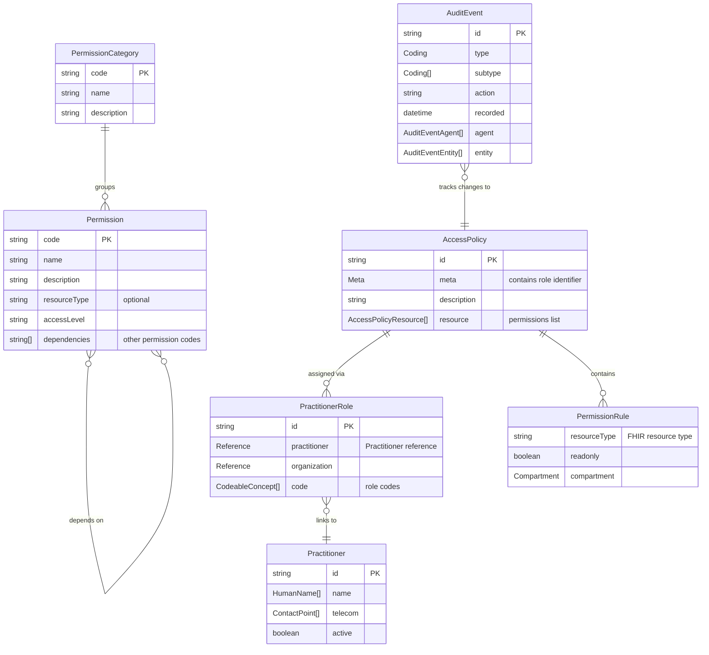
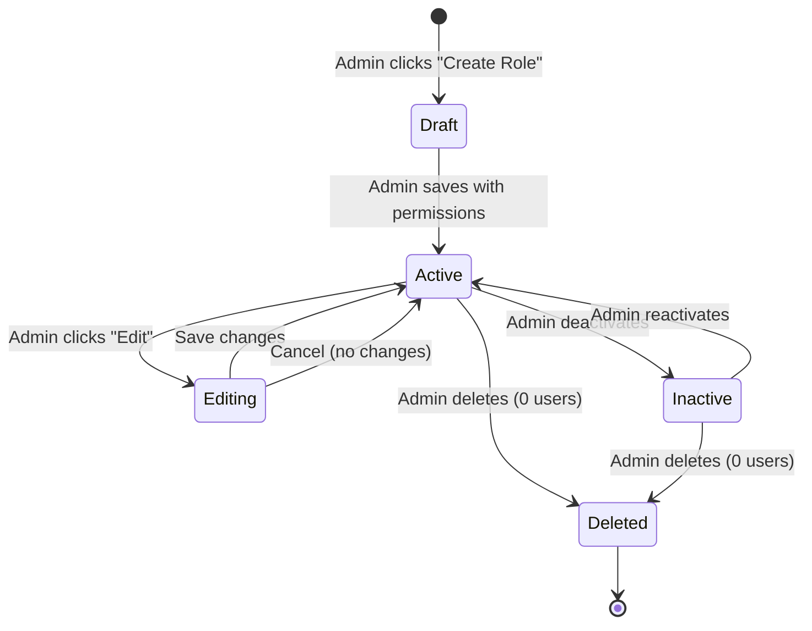
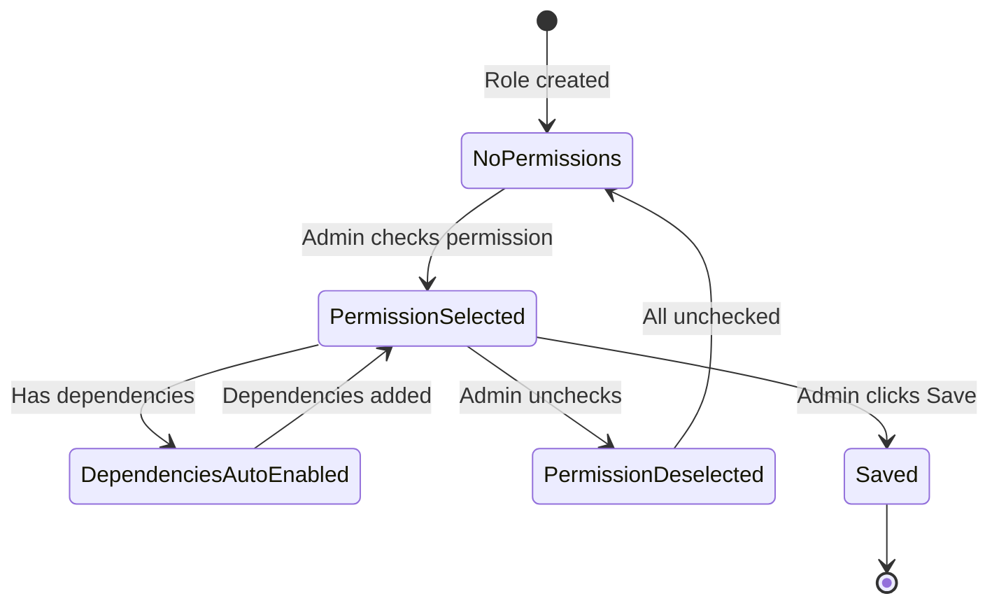

# Data Model: Role and Permission Management System

**Date**: 2025-11-20
**Feature**: Role Creation and Permission Management
**Based On**: FHIR R4 AccessPolicy, Practitioner, PractitionerRole, AuditEvent resources

## Entity Overview



---

## 1. Role Entity (FHIR AccessPolicy)

### FHIR Resource Structure

```typescript
interface RoleAccessPolicy extends AccessPolicy {
  resourceType: 'AccessPolicy';
  id?: string;
  meta: {
    versionId?: string;
    lastUpdated?: string;
    tag: [
      {
        system: 'http://medimind.ge/role-identifier';
        code: string;      // e.g., 'physician', 'nurse', 'lab-tech'
        display: string;   // e.g., 'Physician'
      },
      {
        system: 'http://medimind.ge/role-status';
        code: 'active' | 'inactive';
        display: 'Active' | 'Inactive';
      }
    ];
  };
  description?: string;  // Role description
  resource?: AccessPolicyResource[];  // Permissions
}
```

### TypeScript Interface (Frontend)

```typescript
interface RoleFormValues {
  code: string;              // Unique role code (kebab-case, e.g., 'senior-nurse')
  name: string;              // Display name
  description?: string;      // Optional description
  status: 'active' | 'inactive';
  permissions: string[];     // Array of permission codes
  createdDate?: string;      // ISO 8601 date
  lastModified?: string;     // ISO 8601 date
  userCount?: number;        // Number of assigned users (computed)
}

interface RoleRow {
  id: string;
  code: string;
  name: string;
  description?: string;
  status: 'active' | 'inactive';
  permissionCount: number;
  userCount: number;
  createdDate: string;
  lastModified: string;
}
```

### Validation Rules

- **code**: Required, unique, lowercase with hyphens only, 2-50 characters
- **name**: Required, unique (case-insensitive), 2-100 characters
- **description**: Optional, max 500 characters
- **status**: Required, enum ('active', 'inactive')
- **permissions**: Required, non-empty array for new roles

### Example

```json
{
  "resourceType": "AccessPolicy",
  "id": "role-physician-12345",
  "meta": {
    "versionId": "1",
    "lastUpdated": "2025-11-20T10:30:00Z",
    "tag": [
      {
        "system": "http://medimind.ge/role-identifier",
        "code": "physician",
        "display": "Physician"
      },
      {
        "system": "http://medimind.ge/role-status",
        "code": "active",
        "display": "Active"
      }
    ]
  },
  "description": "Medical doctor with full patient access",
  "resource": [
    {
      "resourceType": "Patient",
      "readonly": false
    },
    {
      "resourceType": "Encounter",
      "readonly": false
    },
    {
      "resourceType": "Observation",
      "readonly": false
    }
  ]
}
```

---

## 2. Permission Entity

### Structure

```typescript
interface Permission {
  code: string;              // Unique permission code (e.g., 'view-patient-demographics')
  name: string;              // Display name
  description: string;       // What this permission allows
  category: string;          // Permission category code
  resourceType?: string;     // FHIR resource type (e.g., 'Patient')
  accessLevel: 'read' | 'write' | 'delete' | 'admin';
  dependencies?: string[];   // Required permissions (codes)
}
```

### Permission Categories (6 Total)

```typescript
interface PermissionCategory {
  code: string;              // e.g., 'patient-management'
  name: string;              // e.g., 'Patient Management'
  description: string;
  displayOrder: number;      // For consistent UI ordering
  icon?: string;             // Tabler icon name
}

const permissionCategories: PermissionCategory[] = [
  {
    code: 'patient-management',
    name: 'Patient Management',
    description: 'Permissions for patient registration, demographics, and history',
    displayOrder: 1,
    icon: 'user'
  },
  {
    code: 'clinical-documentation',
    name: 'Clinical Documentation',
    description: 'Permissions for encounters, clinical notes, and medical records',
    displayOrder: 2,
    icon: 'file-text'
  },
  {
    code: 'laboratory',
    name: 'Laboratory',
    description: 'Permissions for lab orders, results, and specimen management',
    displayOrder: 3,
    icon: 'flask'
  },
  {
    code: 'billing-financial',
    name: 'Billing & Financial',
    description: 'Permissions for invoicing, payments, and insurance claims',
    displayOrder: 4,
    icon: 'currency-dollar'
  },
  {
    code: 'administration',
    name: 'Administration',
    description: 'Permissions for user management, roles, and system settings',
    displayOrder: 5,
    icon: 'settings'
  },
  {
    code: 'reports',
    name: 'Reports',
    description: 'Permissions for analytics, exports, and compliance reports',
    displayOrder: 6,
    icon: 'chart-bar'
  }
];
```

### Permission Tree (Sample)

```typescript
const permissionsTree: Record<string, Permission[]> = {
  'patient-management': [
    {
      code: 'view-patient-list',
      name: 'View Patient List',
      description: 'Access the patient registration page and view list of patients',
      category: 'patient-management',
      resourceType: 'Patient',
      accessLevel: 'read'
    },
    {
      code: 'view-patient-demographics',
      name: 'View Patient Demographics',
      description: 'View patient personal information (name, DOB, address, etc.)',
      category: 'patient-management',
      resourceType: 'Patient',
      accessLevel: 'read'
    },
    {
      code: 'edit-patient-demographics',
      name: 'Edit Patient Demographics',
      description: 'Modify patient personal information',
      category: 'patient-management',
      resourceType: 'Patient',
      accessLevel: 'write',
      dependencies: ['view-patient-demographics']
    },
    {
      code: 'create-patient',
      name: 'Create New Patient',
      description: 'Register new patients in the system',
      category: 'patient-management',
      resourceType: 'Patient',
      accessLevel: 'write',
      dependencies: ['view-patient-list']
    },
    {
      code: 'delete-patient',
      name: 'Delete Patient',
      description: 'Remove patient records from the system',
      category: 'patient-management',
      resourceType: 'Patient',
      accessLevel: 'delete',
      dependencies: ['view-patient-demographics', 'edit-patient-demographics']
    },
    {
      code: 'view-patient-history',
      name: 'Access Patient History',
      description: 'View patient visit history and encounter details',
      category: 'patient-management',
      resourceType: 'Encounter',
      accessLevel: 'read',
      dependencies: ['view-patient-demographics']
    }
  ],
  'administration': [
    {
      code: 'view-users',
      name: 'View User Accounts',
      description: 'Access the account management page and view practitioner accounts',
      category: 'administration',
      resourceType: 'Practitioner',
      accessLevel: 'read'
    },
    {
      code: 'create-user',
      name: 'Create User Accounts',
      description: 'Register new practitioner accounts',
      category: 'administration',
      resourceType: 'Practitioner',
      accessLevel: 'write',
      dependencies: ['view-users']
    },
    {
      code: 'edit-user',
      name: 'Edit User Accounts',
      description: 'Modify practitioner account details',
      category: 'administration',
      resourceType: 'Practitioner',
      accessLevel: 'write',
      dependencies: ['view-users']
    },
    {
      code: 'view-roles',
      name: 'View Roles',
      description: 'Access the role management page and view existing roles',
      category: 'administration',
      resourceType: 'AccessPolicy',
      accessLevel: 'read'
    },
    {
      code: 'create-role',
      name: 'Create Roles',
      description: 'Create new roles with permissions',
      category: 'administration',
      resourceType: 'AccessPolicy',
      accessLevel: 'write',
      dependencies: ['view-roles']
    },
    {
      code: 'edit-role',
      name: 'Edit Roles',
      description: 'Modify existing role names, descriptions, and permissions',
      category: 'administration',
      resourceType: 'AccessPolicy',
      accessLevel: 'write',
      dependencies: ['view-roles']
    },
    {
      code: 'delete-role',
      name: 'Delete Roles',
      description: 'Remove roles from the system',
      category: 'administration',
      resourceType: 'AccessPolicy',
      accessLevel: 'delete',
      dependencies: ['view-roles', 'edit-role']
    },
    {
      code: 'assign-roles',
      name: 'Assign Roles to Users',
      description: 'Add or remove roles from practitioner accounts',
      category: 'administration',
      resourceType: 'PractitionerRole',
      accessLevel: 'write',
      dependencies: ['view-roles', 'view-users']
    },
    {
      code: 'view-audit-logs',
      name: 'View Audit Logs',
      description: 'Access system audit trail and security logs',
      category: 'administration',
      resourceType: 'AuditEvent',
      accessLevel: 'read'
    }
  ]
  // ... other categories
};
```

---

## 3. Role Assignment (FHIR PractitionerRole)

### FHIR Resource Structure

```typescript
interface RolePractitionerRole extends PractitionerRole {
  resourceType: 'PractitionerRole';
  id?: string;
  active?: boolean;
  practitioner?: Reference;  // Reference to Practitioner
  organization?: Reference;  // Reference to Organization
  code?: CodeableConcept[];  // Role codes
  meta?: {
    tag?: [
      {
        system: 'http://medimind.ge/role-assignment';
        code: string;  // AccessPolicy role code (e.g., 'physician')
        display: string;
      }
    ];
  };
}
```

### Example

```json
{
  "resourceType": "PractitionerRole",
  "id": "role-assignment-123",
  "active": true,
  "practitioner": {
    "reference": "Practitioner/practitioner-456",
    "display": "Dr. Tengizi Khosvria"
  },
  "meta": {
    "tag": [
      {
        "system": "http://medimind.ge/role-assignment",
        "code": "physician",
        "display": "Physician"
      }
    ]
  }
}
```

**Note**: For multi-role support, create multiple PractitionerRole resources per practitioner (one per assigned role).

---

## 4. Audit Trail (FHIR AuditEvent)

### Structure

```typescript
interface RoleAuditEvent extends AuditEvent {
  resourceType: 'AuditEvent';
  type: Coding;  // 'rest' for FHIR operations
  subtype: Coding[];  // 'create', 'update', 'delete'
  action: 'C' | 'R' | 'U' | 'D';
  recorded: string;  // ISO 8601 timestamp
  outcome: '0' | '4' | '8' | '12';  // 0 = success
  outcomeDesc?: string;
  agent: AuditEventAgent[];
  entity: AuditEventEntity[];
}
```

### Example

```json
{
  "resourceType": "AuditEvent",
  "type": {
    "system": "http://dicom.nema.org/resources/ontology/DCM",
    "code": "110113",
    "display": "Security Alert"
  },
  "subtype": [{
    "system": "http://dicom.nema.org/resources/ontology/DCM",
    "code": "110137",
    "display": "User Security Attributes Changed"
  }],
  "action": "C",
  "recorded": "2025-11-20T10:30:00Z",
  "outcome": "0",
  "outcomeDesc": "Role 'Physician' created successfully",
  "agent": [{
    "who": {
      "reference": "Practitioner/admin-789",
      "display": "Admin User"
    },
    "requestor": true
  }],
  "entity": [{
    "what": {
      "reference": "AccessPolicy/role-physician-12345",
      "display": "Physician"
    },
    "type": {
      "system": "http://terminology.hl7.org/CodeSystem/audit-entity-type",
      "code": "2",
      "display": "System Object"
    },
    "detail": [
      {
        "type": "permissions",
        "valueString": "view-patient-demographics, edit-patient-demographics, create-patient"
      }
    ]
  }]
}
```

---

## 5. Permission Mapping to FHIR Resources

### Mapping Strategy

```typescript
interface PermissionToAccessPolicyMapping {
  permission: string;
  fhirResource: AccessPolicyResource;
}

const permissionMappings: PermissionToAccessPolicyMapping[] = [
  {
    permission: 'view-patient-demographics',
    fhirResource: {
      resourceType: 'Patient',
      readonly: true
    }
  },
  {
    permission: 'edit-patient-demographics',
    fhirResource: {
      resourceType: 'Patient',
      readonly: false
    }
  },
  {
    permission: 'view-patient-history',
    fhirResource: {
      resourceType: 'Encounter',
      readonly: true
    }
  },
  {
    permission: 'create-encounter',
    fhirResource: {
      resourceType: 'Encounter',
      readonly: false
    }
  },
  {
    permission: 'view-lab-results',
    fhirResource: {
      resourceType: 'Observation',
      criteria: '_tag=http://medimind.ge/lab-result',
      readonly: true
    }
  }
  // ... more mappings
];
```

### Permission → AccessPolicy Conversion

```typescript
function permissionsToAccessPolicy(
  roleName: string,
  roleCode: string,
  permissions: string[]
): AccessPolicy {
  const resourceMap = new Map<string, { readonly: boolean }>();

  // Aggregate permissions by resource type
  permissions.forEach(permCode => {
    const mapping = permissionMappings.find(m => m.permission === permCode);
    if (mapping) {
      const key = mapping.fhirResource.resourceType;
      const existing = resourceMap.get(key);

      // If any permission is read-write, resource is read-write
      resourceMap.set(key, {
        readonly: existing ? (existing.readonly && mapping.fhirResource.readonly) : mapping.fhirResource.readonly
      });
    }
  });

  // Convert map to AccessPolicyResource array
  const resource: AccessPolicyResource[] = Array.from(resourceMap.entries()).map(([resourceType, config]) => ({
    resourceType,
    readonly: config.readonly
  }));

  return {
    resourceType: 'AccessPolicy',
    meta: {
      tag: [
        {
          system: 'http://medimind.ge/role-identifier',
          code: roleCode,
          display: roleName
        },
        {
          system: 'http://medimind.ge/role-status',
          code: 'active',
          display: 'Active'
        }
      ]
    },
    description: `Auto-generated AccessPolicy for ${roleName} role`,
    resource
  };
}
```

---

## State Transitions

### Role Lifecycle



### Permission Selection



---

## Data Integrity Rules

1. **Role Uniqueness**: `meta.tag.code` must be unique across all AccessPolicy resources tagged as roles
2. **Role Name Uniqueness**: `meta.tag.display` must be unique (case-insensitive)
3. **Active Admin Role**: At least one active role with `create-role` and `edit-role` permissions must exist
4. **Deletion Restriction**: Cannot delete role if `userCount > 0`
5. **Permission Dependencies**: All dependencies must be enabled before dependent permission
6. **Audit Trail**: Every create/update/delete must generate AuditEvent
7. **Multi-Role Additive**: User permissions = union of all assigned role permissions

---

## Performance Considerations

- **Caching**: Cache permission tree (static data, rarely changes)
- **Pagination**: Roles table paginated at 20 roles per page
- **Search Indexing**: Index `meta.tag.code` and `meta.tag.display` for fast search
- **WebSocket**: Use Medplum subscriptions for real-time role updates
- **Eager Loading**: Fetch user counts with roles (avoid N+1 queries)

---

## Migration Strategy

**For Initial Deployment**:
1. Create default "Super Admin" role with all permissions
2. Assign "Super Admin" role to first admin user
3. Seed permission tree data (6 categories, ~200 permissions)
4. Create sample roles: Physician, Nurse, Lab Technician, Receptionist

**For Existing Deployments**:
1. Migrate existing admin users to "Super Admin" role
2. Analyze existing user permissions and map to roles
3. Preserve audit trails during migration
