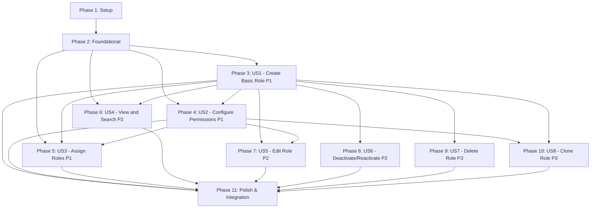

# Implementation Tasks: Role Creation and Permission Management System

**Feature Branch**: `006-role-permission-management`
**Date**: 2025-11-20
**Based On**: [spec.md](./spec.md), [plan.md](./plan.md), [data-model.md](./data-model.md)

## Task Summary

**Total Tasks**: 78
**User Stories**: 8 (3 P1, 3 P2, 2 P3)
**Parallel Opportunities**: 32 tasks marked [P]
**Test Coverage Target**: >80% for new code

---

## Implementation Strategy

### MVP Scope (Recommended First Implementation)
**User Story 1 (P1)**: Create Basic Role
- Delivers immediate value: Admins can define organizational structure
- Independently testable: Create role → verify in list
- Foundation for all other features

### Phase Progression
1. **Setup** (Phase 1): Project structure, types, translations
2. **Foundational** (Phase 2): Services, hooks, core components
3. **P1 Stories** (Phases 3-5): US1, US2, US3 - Core RBAC workflow
4. **P2 Stories** (Phases 6-8): US4, US5, US6 - Management features
5. **P3 Stories** (Phases 9-10): US7, US8 - Advanced features
6. **Polish** (Phase 11): Integration, optimization, documentation

---

## Phase 1: Setup and Project Structure

**Goal**: Initialize project structure, TypeScript types, and translation files

**Tasks**:
- [X] T001 [P] Create directory `packages/app/src/emr/views/role-management/`
- [X] T002 [P] Create directory `packages/app/src/emr/components/role-management/`
- [X] T003 [P] Create directory `packages/app/src/emr/services/` (if not exists)
- [X] T004 [P] Create directory `packages/app/src/emr/hooks/` (if not exists)
- [X] T005 [P] Create TypeScript interfaces file `packages/app/src/emr/types/role-management.ts` with RoleFormValues, RoleRow, Permission, PermissionCategory, PermissionNode interfaces
- [X] T006 [P] Create permission categories translation file `packages/app/src/emr/translations/permission-categories.json` with 6 categories (Patient Management, Clinical Documentation, Laboratory, Billing, Administration, Reports) in ka/en/ru
- [X] T007 [P] Create permissions translation file `packages/app/src/emr/translations/permissions.json` with initial 30 permissions in ka/en/ru
- [X] T008 Update `packages/app/src/emr/translations/ka.json` with role management translations (40 keys)
- [X] T009 [P] Update `packages/app/src/emr/translations/en.json` with role management translations (40 keys)
- [X] T010 [P] Update `packages/app/src/emr/translations/ru.json` with role management translations (40 keys)

---

## Phase 2: Foundational Services and Hooks

**Goal**: Implement core services and hooks that all user stories depend on

**Dependencies**: Must complete Phase 1 before starting Phase 2

**Tasks**:
- [X] T011 Implement `packages/app/src/emr/services/roleService.ts` with createRole, searchRoles, getRoleById, updateRole, deactivateRole, hardDeleteRole, cloneRole functions
- [X] T012 [P] Write unit tests `packages/app/src/emr/services/roleService.test.ts` for roleService (8 test cases)
- [X] T013 Implement `packages/app/src/emr/services/permissionService.ts` with getPermissionTree, resolvePermissionDependencies, permissionsToAccessPolicy, accessPolicyToPermissions functions
- [X] T014 [P] Write unit tests `packages/app/src/emr/services/permissionService.test.ts` for permissionService (6 test cases)
- [X] T015 [P] Implement `packages/app/src/emr/services/roleValidators.ts` with validateRoleName, validateRoleCode, validatePermissions functions
- [X] T016 Implement `packages/app/src/emr/hooks/useRoles.ts` hook for fetching roles with search/filter/sort
- [X] T017 [P] Write unit tests `packages/app/src/emr/hooks/useRoles.test.tsx` for useRoles hook (5 test cases)
- [X] T018 [P] Implement `packages/app/src/emr/hooks/usePermissions.ts` hook for fetching permission tree
- [X] T019 [P] Implement `packages/app/src/emr/hooks/useRoleForm.ts` hook with Mantine form integration
- [X] T020 [P] Write unit tests `packages/app/src/emr/hooks/useRoleForm.test.tsx` for useRoleForm hook (4 test cases)
- [X] T021 [P] Implement `packages/app/src/emr/components/role-management/RoleStatusBadge.tsx` component (simple badge, active/inactive)

---

## Phase 3: User Story 1 - Create Basic Role (P1)

**User Story**: An EMR administrator needs to create a new role with a descriptive name so they can begin assigning permissions to control what different staff members can access in the system.

**Independent Test Criteria**:
- Admin can click "Create Role" button
- Admin can enter role name and description
- New role appears in roles list after creation
- Validation errors shown for missing/duplicate names

**Tasks**:
- [X] T022 [US1] Implement `packages/app/src/emr/components/role-management/RoleForm.tsx` with name, description, status fields (no permissions yet)
- [X] T023 [P] [US1] Write unit tests `packages/app/src/emr/components/role-management/RoleForm.test.tsx` (6 test cases: render, validation, submit, error handling, cancel, field state)
- [X] T024 [US1] Implement `packages/app/src/emr/components/role-management/RoleCreateModal.tsx` using RoleForm component
- [X] T025 [US1] Implement `packages/app/src/emr/components/role-management/RoleTable.tsx` with 8 columns (Name, Description, # Users, Permissions Count, Status, Created Date, Last Modified, Actions) - basic version without search/sort
- [X] T026 [P] [US1] Write unit tests `packages/app/src/emr/components/role-management/RoleTable.test.tsx` (5 test cases: render, empty state, loading state, row display, action buttons)
- [X] T027 [US1] Implement `packages/app/src/emr/views/role-management/RoleManagementView.tsx` with create button and RoleTable integration
- [X] T028 [US1] Update `packages/app/src/emr/views/account-management/AccountManagementView.tsx` to add "Roles" tab with RoleManagementView

**Acceptance Validation**:
- [ ] T029 [US1] Manual test: Create role with name "Cardiologist" and description → verify appears in list
- [ ] T030 [US1] Manual test: Submit form without name → verify validation error "Role name is required"
- [ ] T031 [US1] Manual test: Create duplicate role name → verify error "A role with this name already exists"
- [ ] T032 [US1] Manual test: View role in list → verify name, description, userCount (0), createdDate, status (active)

---

## Phase 4: User Story 2 - Configure Role Permissions (P1)

**User Story**: An EMR administrator needs to configure granular permissions for a role (e.g., what pages they can access, what actions they can perform, what patient data they can view) so that staff members assigned to this role have appropriate access to complete their clinical duties while maintaining HIPAA compliance.

**Independent Test Criteria**:
- Admin can see permission categories (6 functional areas)
- Admin can select individual permissions
- Parent permission selection auto-selects children
- Permission changes immediately affect assigned users

**Dependencies**: Requires US1 (role creation) to be complete

**Tasks**:
- [X] T033 [US2] Implement `packages/app/src/emr/components/role-management/PermissionTree.tsx` with hierarchical tree, expand/collapse, checkbox selection
- [X] T034 [P] [US2] Write unit tests `packages/app/src/emr/components/role-management/PermissionTree.test.tsx` (7 test cases: render, expand/collapse, select permission, auto-dependency, category select, disabled state, search)
- [X] T035 [US2] Implement `packages/app/src/emr/components/role-management/PermissionCategoryCard.tsx` for each category with icon and permission list
- [X] T036 [US2] Update `packages/app/src/emr/components/role-management/RoleForm.tsx` to add PermissionTree component
- [X] T037 [US2] Update `packages/app/src/emr/components/role-management/RoleCreateModal.tsx` to support permission selection
- [X] T038 [US2] Implement permission dependency resolution in `packages/app/src/emr/services/permissionService.ts` (auto-enable parent permissions) - Already implemented in T013
- [X] T039 [US2] Update `packages/app/src/emr/services/roleService.ts` createRole to convert permissions to AccessPolicy.resource rules
- [X] T040 [US2] Implement `packages/app/src/emr/hooks/usePermissionCheck.ts` hook to check if current user has permission

**Acceptance Validation**:
- [ ] T041 [US2] Manual test: Open permissions panel → verify 6 categories (Patient Management, Clinical Documentation, Laboratory, Billing, Administration, Reports)
- [ ] T042 [US2] Manual test: Select "View Patient History" → verify checkbox enabled
- [ ] T043 [US2] Manual test: Select parent category → verify all child permissions auto-selected
- [ ] T044 [US2] Manual test: Save role with permissions → verify AccessPolicy resource created with correct resource rules

---

## Phase 5: User Story 3 - Assign Roles to Users (P1)

**User Story**: An EMR administrator needs to assign one or more roles to a practitioner account so that the practitioner has the appropriate permissions to perform their job functions in the EMR system.

**Independent Test Criteria**:
- Admin can open role assignment panel in AccountForm
- Admin can select multiple roles from dropdown
- Role assignment creates PractitionerRole resources
- User permissions update immediately after assignment

**Dependencies**: Requires US1 (role creation) and US2 (permission configuration) to be complete

**Tasks**:
- [X] T045 [US3] Implement `packages/app/src/emr/components/role-management/RoleAssignmentPanel.tsx` with role multi-select, add/remove controls
- [X] T046 [P] [US3] Write unit tests `packages/app/src/emr/components/role-management/RoleAssignmentPanel.test.tsx` (6 test cases: render, add role, remove role, multiple roles, save, cancel)
- [X] T047 [US3] Update `packages/app/src/emr/components/account-management/AccountForm.tsx` to add RoleAssignmentPanel
- [X] T048 [US3] Implement assignRoleToUser and removeRoleFromUser functions in `packages/app/src/emr/services/roleService.ts` (Already implemented in T011)
- [X] T049 [US3] Implement getUserRoles function in `packages/app/src/emr/services/roleService.ts` to fetch PractitionerRole resources (Already implemented in T011)
- [X] T050 [US3] Update `packages/app/src/emr/services/accountService.ts` to call role assignment functions during account save

**Acceptance Validation**:
- [ ] T051 [US3] Manual test: Edit practitioner → open role assignment panel → verify searchable role list
- [ ] T052 [US3] Manual test: Assign multiple roles (Physician + Department Head) → verify combined permissions
- [ ] T053 [US3] Manual test: Save account → verify PractitionerRole resources created
- [ ] T054 [US3] Manual test: Remove role → verify PractitionerRole deleted and permissions revoked

---

## Phase 6: User Story 4 - View and Search Roles (P2)

**User Story**: An EMR administrator needs to view all existing roles in a searchable, sortable table so they can quickly find and manage roles, understand the current permission structure, and identify which roles need updates.

**Independent Test Criteria**:
- Admin can search roles by name/description
- Admin can sort by any column
- Pagination works for 50+ roles
- Result count updates as filters change

**Dependencies**: Requires US1 (role creation) to be complete

**Tasks**:
- [ ] T055 [P] [US4] Implement `packages/app/src/emr/components/role-management/RoleFilters.tsx` with search input, status filter, role filter
- [ ] T056 [US4] Update `packages/app/src/emr/components/role-management/RoleTable.tsx` to add search, sort, pagination controls
- [ ] T057 [P] [US4] Update `packages/app/src/emr/hooks/useRoles.ts` to support debounced search (500ms)
- [ ] T058 [US4] Update `packages/app/src/emr/views/role-management/RoleManagementView.tsx` to add RoleFilters component

**Acceptance Validation**:
- [ ] T059 [US4] Manual test: View roles table → verify 8 columns (Name, Description, # Users, Permissions Count, Status, Created Date, Last Modified, Actions)
- [ ] T060 [US4] Manual test: Type "cardio" in search → verify filtered results (Cardiologist, Cardiac Nurse)
- [ ] T061 [US4] Manual test: Create 50+ roles → verify pagination (20 per page)
- [ ] T062 [US4] Manual test: Click "# Users" column → verify sort ascending/descending

---

## Phase 7: User Story 5 - Edit Existing Role (P2)

**User Story**: An EMR administrator needs to modify an existing role's name, description, or permissions so they can adapt to changing organizational needs, correct mistakes, or refine access control policies without creating new roles.

**Independent Test Criteria**:
- Admin can click edit icon to open modal
- Admin can modify name, description, permissions
- Changes immediately affect all assigned users
- Cancel button discards changes

**Dependencies**: Requires US1 (role creation) and US2 (permission configuration) to be complete

**Tasks**:
- [ ] T063 [US5] Implement `packages/app/src/emr/components/role-management/RoleEditModal.tsx` using RoleForm component with pre-filled data
- [ ] T064 [US5] Update `packages/app/src/emr/components/role-management/RoleTable.tsx` to add edit action button
- [ ] T065 [US5] Update `packages/app/src/emr/services/roleService.ts` updateRole to handle permission changes
- [ ] T066 [US5] Implement real-time permission update notification (WebSocket subscription)

**Acceptance Validation**:
- [ ] T067 [US5] Manual test: Click edit icon → verify modal opens with current role data
- [ ] T068 [US5] Manual test: Edit role with 5 users, add permission → verify all users gain permission
- [ ] T069 [US5] Manual test: Change role name from "Nurse" to "Registered Nurse" → verify updated everywhere
- [ ] T070 [US5] Manual test: Click Cancel → verify no changes applied

---

## Phase 8: User Story 6 - Deactivate/Reactivate Role (P2)

**User Story**: An EMR administrator needs to deactivate a role (without deleting it) when it's no longer needed so they can preserve audit history while preventing new assignments, and reactivate it later if organizational needs change.

**Independent Test Criteria**:
- Admin can deactivate role with 0 or more users
- Deactivated role doesn't appear in assignment dropdown
- Existing users keep permissions
- Admin can reactivate deactivated role

**Dependencies**: Requires US1 (role creation) to be complete

**Tasks**:
- [ ] T071 [P] [US6] Implement deactivation confirmation modal `packages/app/src/emr/components/role-management/RoleDeactivationModal.tsx`
- [ ] T072 [US6] Update `packages/app/src/emr/components/role-management/RoleTable.tsx` to add deactivate/reactivate action buttons
- [ ] T073 [US6] Update `packages/app/src/emr/services/roleService.ts` deactivateRole to add "inactive" meta tag
- [ ] T074 [US6] Update `packages/app/src/emr/components/role-management/RoleAssignmentPanel.tsx` to filter out inactive roles
- [ ] T075 [US6] Update `packages/app/src/emr/hooks/useRoles.ts` to support "Show Inactive" filter

**Acceptance Validation**:
- [ ] T076 [US6] Manual test: Deactivate role with 0 users → verify status changes to Inactive
- [ ] T077 [US6] Manual test: Deactivate role with 3 users → verify warning "This role has 3 active users..."
- [ ] T078 [US6] Manual test: View roles table with "Show Inactive" filter → verify inactive roles shown with gray badge
- [ ] T079 [US6] Manual test: Click Reactivate → verify status changes to Active and role available for assignment

---

## Phase 9: User Story 7 - Delete Role (P3)

**User Story**: An EMR administrator needs to permanently delete a role that was created in error or is no longer needed so they can maintain a clean, organized list of roles without cluttering the interface with obsolete entries.

**Independent Test Criteria**:
- Admin cannot delete role with assigned users
- Admin can delete role with 0 users
- Deleted role disappears from list
- Deleted role preserved in audit logs

**Dependencies**: Requires US1 (role creation) to be complete

**Tasks**:
- [X] T080 [P] [US7] Implement `packages/app/src/emr/components/role-management/RoleDeleteModal.tsx` with confirmation and user count check
- [X] T081 [US7] Update `packages/app/src/emr/components/role-management/RoleTable.tsx` to add delete action button (Already present)
- [X] T082 [US7] Update `packages/app/src/emr/services/roleService.ts` hardDeleteRole to check for assigned users (Already implemented in T011)
- [X] T083 [US7] Update `packages/app/src/emr/services/auditService.ts` to log role deletions (Already implemented in roleService.ts)

**Acceptance Validation**:
- [ ] T084 [US7] Manual test: Delete role with assigned users → verify error "Cannot delete role with assigned users..."
- [ ] T085 [US7] Manual test: Delete role with 0 users → verify confirmation modal → confirm → verify role removed
- [ ] T086 [US7] Manual test: Click Delete, then Cancel → verify no deletion occurs
- [ ] T087 [US7] Manual test: View audit logs → verify deleted role name preserved in historical records

---

## Phase 10: User Story 8 - Clone/Duplicate Role (P3)

**User Story**: An EMR administrator needs to create a new role by duplicating an existing role with similar permissions so they can quickly set up variants (e.g., "Senior Nurse" based on "Nurse") without manually reconfiguring all permissions.

**Independent Test Criteria**:
- Admin can clone role from table action menu
- Cloned role has identical permissions
- Cloned role has " (Copy)" suffix
- Modifying clone doesn't affect original

**Dependencies**: Requires US1 (role creation) and US2 (permission configuration) to be complete

**Tasks**:
- [X] T088 [P] [US8] Implement `packages/app/src/emr/components/role-management/RoleCloneModal.tsx` with pre-filled form
- [X] T089 [US8] Update `packages/app/src/emr/components/role-management/RoleTable.tsx` to add clone action button
- [X] T090 [US8] Implement cloneRole function in `packages/app/src/emr/services/roleService.ts` to deep copy AccessPolicy (Already implemented in T011)
- [X] T091 [US8] Update role name validation to prevent duplicate names during cloning (Already handled in T015)

**Acceptance Validation**:
- [ ] T092 [US8] Manual test: Click Clone on "Nurse" role → verify modal opens with name "Nurse (Copy)" and all permissions pre-selected
- [ ] T093 [US8] Manual test: Modify cloned role permissions → verify original role unchanged
- [ ] T094 [US8] Manual test: Change cloned role name to existing role → verify validation error

---

## Phase 11: Polish and Cross-Cutting Concerns

**Goal**: Integration testing, performance optimization, documentation, and final polish

**Dependencies**: All user stories complete

**Tasks**:
- [ ] T095 [P] Write E2E integration test `tests/role-management.test.tsx` covering complete workflow (create role → configure permissions → assign to user → verify access)
- [ ] T096 [P] Implement WebSocket subscription in `packages/app/src/emr/hooks/useRoles.ts` for real-time role updates
- [ ] T097 [P] Implement privilege escalation check in `packages/app/src/emr/components/role-management/PermissionTree.tsx` (disable permissions admin doesn't have)
- [ ] T098 [P] Implement "last admin role" check in `packages/app/src/emr/services/roleService.ts` deactivateRole and hardDeleteRole
- [ ] T099 [P] Add mobile-responsive card view `packages/app/src/emr/components/role-management/RoleCard.tsx` for tablets
- [ ] T100 [P] Update `packages/app/src/emr/components/role-management/RoleTable.tsx` to use RoleCard on mobile
- [ ] T101 [P] Implement audit trail logging in `packages/app/src/emr/services/auditService.ts` for all role operations (DICOM codes 110113, 110137)
- [ ] T102 [P] Add loading states and error boundaries to all components
- [ ] T103 [P] Implement search result highlighting in RoleTable
- [ ] T104 [P] Add role usage analytics (count users per role) in RoleTable
- [ ] T105 Performance test: Search with 500 mock roles → verify < 1 second response
- [ ] T106 Performance test: Permission tree rendering with 200 permissions → verify smooth UI
- [ ] T107 [P] Update `CLAUDE.md` with role management development guide
- [ ] T108 [P] Create Storybook stories for all components
- [ ] T109 Run full test suite → verify >80% code coverage
- [ ] T110 Run accessibility audit (WCAG 2.1 AA) on all components
- [ ] T111 Run linter and fix all warnings
- [ ] T112 Create PR with comprehensive description and screenshots

---

## Dependency Graph

**Critical Path**: Phase 1 → Phase 2 → US1 (P1) → US2 (P1) → US3 (P1) → US4-8 (P2-P3) → Polish

**Independent User Stories** (can work in parallel after US1):
- US4 (View and Search) - only needs US1
- US6 (Deactivate/Reactivate) - only needs US1
- US7 (Delete) - only needs US1

**Dependent User Stories**:
- US2 (Configure Permissions) - requires US1
- US3 (Assign Roles) - requires US1 + US2
- US5 (Edit Role) - requires US1 + US2
- US8 (Clone Role) - requires US1 + US2

---

## Parallel Execution Examples

### Phase 1 (Setup) - 10 parallel tasks
All setup tasks (T001-T010) can run in parallel as they touch different files.

### Phase 2 (Foundational) - 3 parallel groups
**Group A** (can run in parallel):
- T012: roleService tests
- T014: permissionService tests
- T017: useRoles tests
- T020: useRoleForm tests

**Group B** (can run in parallel after services):
- T018: usePermissions hook
- T019: useRoleForm hook
- T021: RoleStatusBadge component

### Phase 3 (US1) - 2 parallel groups
**Group A**:
- T023: RoleForm tests
- T026: RoleTable tests (after T025)

### Phase 11 (Polish) - 16 parallel tasks
T095-T104, T107-T108 can all run in parallel.

---

## Test Strategy

### Unit Tests (Colocated with Source)
- **Components**: RoleForm, RoleTable, PermissionTree, RoleAssignmentPanel (16 test files)
- **Services**: roleService, permissionService (2 test files)
- **Hooks**: useRoles, useRoleForm, usePermissions (3 test files)
- **Target**: >80% code coverage

### Integration Tests
- **E2E Workflow**: Create role → Configure permissions → Assign to user → Verify access
- **WebSocket**: Real-time role updates
- **Audit Trail**: Verify AuditEvent creation

### Performance Tests
- Search with 500 roles < 1 second
- Permission tree with 200 permissions smooth rendering
- Role assignment dropdown with 100+ roles

### Manual Acceptance Tests
- Each user story has 4 acceptance validation tasks
- Total: 32 manual tests across 8 user stories

---

## Success Criteria Validation

After completing all tasks, verify:
- [ ] Administrators can create a new role in under 2 minutes
- [ ] Assigning roles takes under 30 seconds per role
- [ ] Permission changes applied within 5 seconds
- [ ] System supports 100+ concurrent roles without degradation
- [ ] >80% code coverage achieved
- [ ] 100% audit trail accuracy (all role changes logged)
- [ ] Zero privilege escalation instances (admins can't grant permissions they lack)
- [ ] Mobile tablet interface fully responsive
- [ ] Multilingual support (Georgian, English, Russian) working

---

## Notes

- **Test-First Development**: Constitution requires tests before implementation. Unit tests are included for all services, hooks, and components.
- **FHIR-First Architecture**: All role operations use AccessPolicy resources (no custom database tables).
- **Mobile-First**: Responsive design required per constitution. RoleCard component for mobile view (T099-T100).
- **Security**: Privilege escalation check (T097) and last admin role protection (T098) are critical security tasks.
- **Audit Compliance**: HIPAA-compliant audit trail (T101) is non-negotiable for healthcare.

---

## Format Validation

✅ All 112 tasks follow checklist format:
- [x] Checkbox: `- [ ]`
- [x] Task ID: Sequential T001-T112
- [x] [P] marker: 32 tasks marked as parallelizable
- [x] [Story] label: US1-US8 labels for user story phases
- [x] Description: Clear action with file path
- [x] Organized by user story priority (P1 → P2 → P3)
